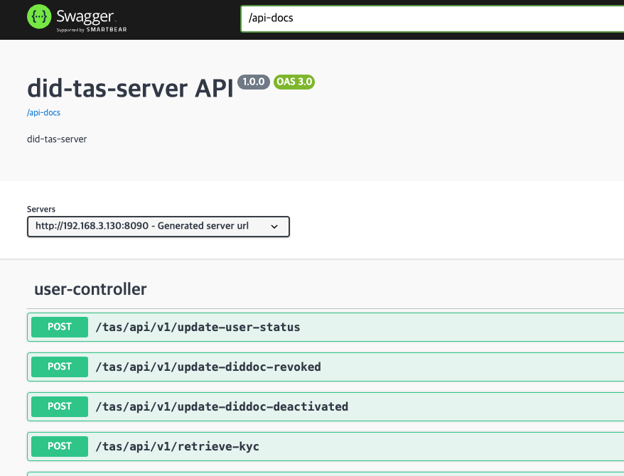
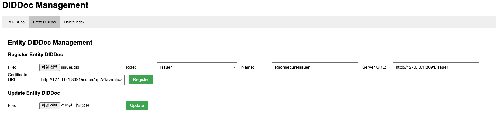
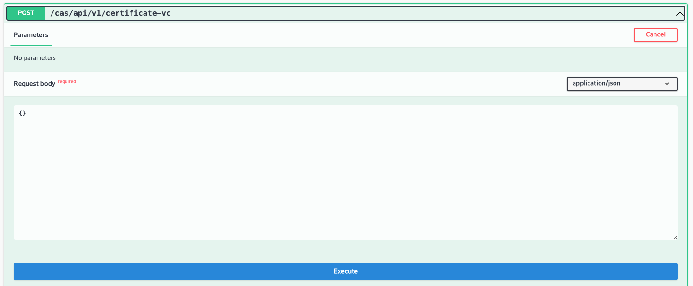
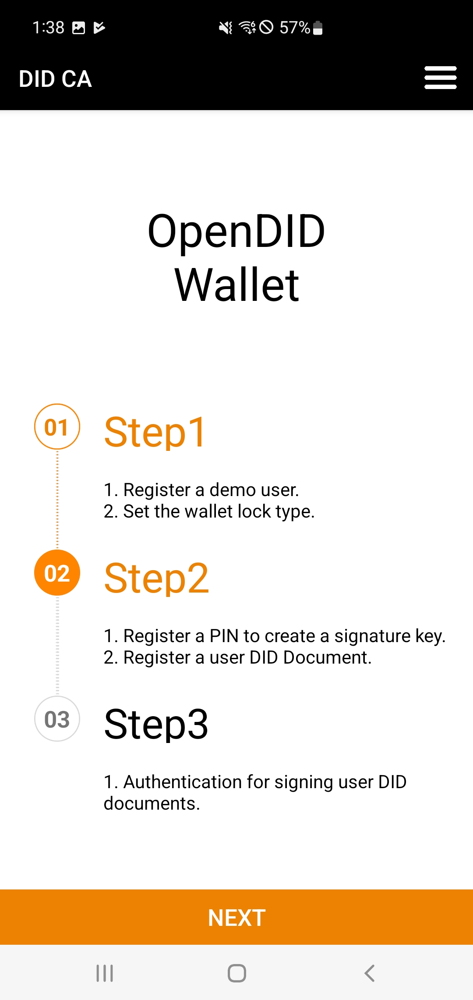
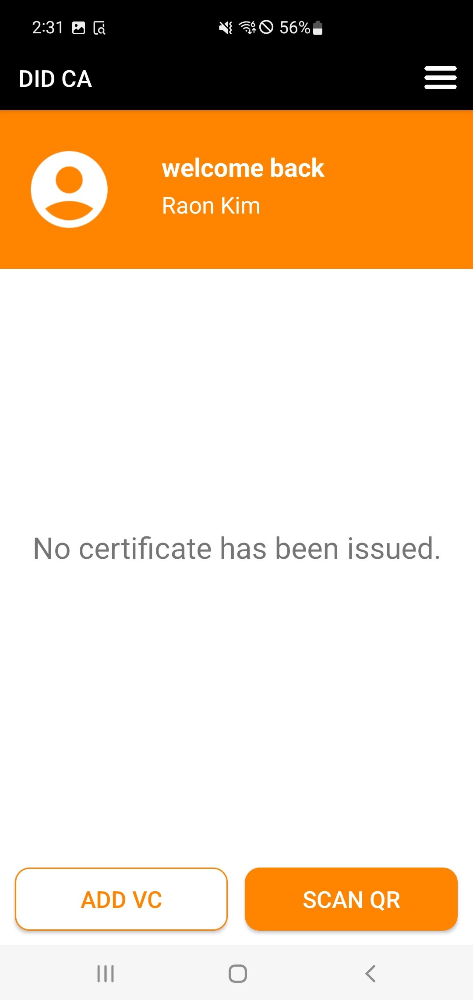
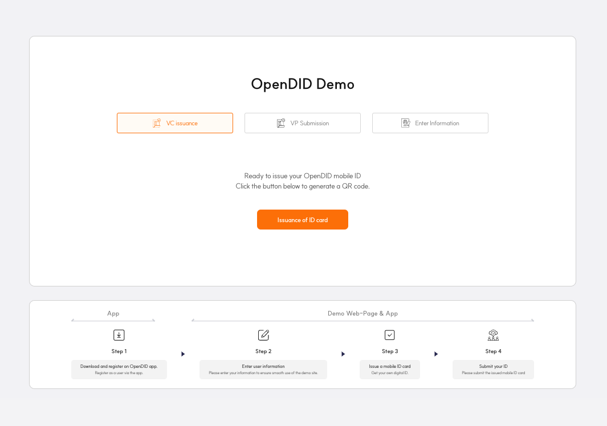
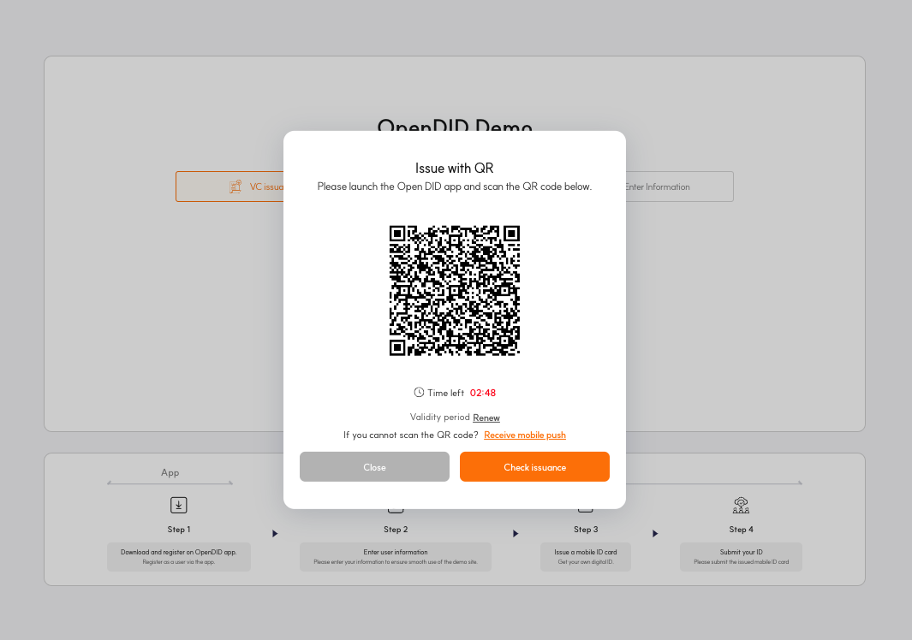
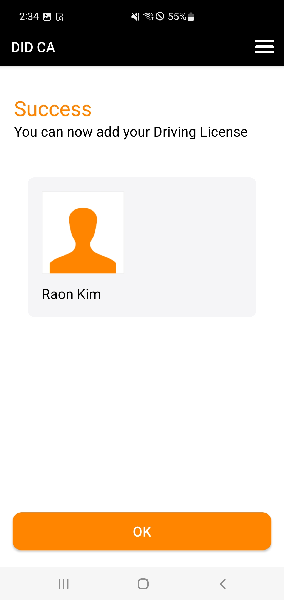
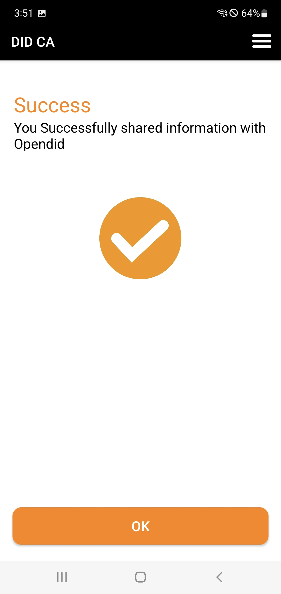

---
puppeteer:
    pdf:
        format: A4
        displayHeaderFooter: true
        landscape: false
        scale: 0.8
        margin:
            top: 1.2cm
            right: 1cm
            bottom: 1cm
            left: 1cm
    image:
        quality: 100
        fullPage: false
---

Open DID Installation Guide
==

- Date: 2024-09-07
- Version: v1.0.0

목차
==
- [1. Overview](#1-overview)
- [2. Installation Overview](#2-installation-overview)
- [3. System Requirements](#3-system-requirements)
  - [3.1. Server](#31-server)
  - [3.2. App](#32-app)
- [4. Prerequisites](#4-prerequisites)
  - [4.1. Installing Git](#41-installing-git)
  - [4.2. Installing Gradle](#42-installing-gradle)
  - [4.3. Installing cli-tool](#43-installing-cli-tool)
  - [4.4. Creating Wallet Files](#44-creating-wallet-files)
    - [4.4.1. TA Server의 Wallet 파일 생성](#441-ta-server의-wallet-파일-생성)
    - [4.4.2. Issuer Server의 Wallet 파일 생성](#442-issuer-server의-wallet-파일-생성)
    - [4.4.3. Verifier Server의 Wallet 파일 생성](#443-verifier-server의-wallet-파일-생성)
    - [4.4.4. CA Server의 Wallet 파일 생성](#444-ca-server의-wallet-파일-생성)
    - [4.4.5. Wallet Server의 Wallet 파일 생성](#445-wallet-server의-wallet-파일-생성)
  - [4.5. Adding Wallet keys](#45-adding-wallet-keys)
    - [4.5.1. TA Server의 키쌍 생성](#451-ta-server의-키쌍-생성)
    - [4.5.2. Issuer Server의 키쌍 생성](#452-issuer-server의-키쌍-생성)
    - [4.5.3. Verifier Server의 키쌍 생성](#453-verifier-server의-키쌍-생성)
    - [4.5.4. CA Server의 키쌍 생성](#454-ca-server의-키쌍-생성)
    - [4.5.5. Wallet Server의 키쌍 생성](#455-wallet-server의-키쌍-생성)
  - [4.6. Generating DID Documents](#46-generating-did-documents)
    - [4.6.1. TA Server의 DID Document 생성](#461-ta-server의-did-document-생성)
    - [4.6.2. Issuer Server의 DID Document 생성](#462-issuer-server의-did-document-생성)
    - [4.6.3. Verifier Server의 DID Document 생성](#463-verifier-server의-did-document-생성)
    - [4.6.4. CA Server의 DID Document 생성](#464-ca-server의-did-document-생성)
    - [4.6.5. Wallet Server의 DID Document 생성](#465-wallet-server의-did-document-생성)
- [5. Installation and Registration](#5-installation-and-registration)
  - [5.1. Step 1: Blockchain Installation](#51-step-1-blockchain-installation)
    - [5.1.1. Hyperledger Fabric 테스트 네트워크 설치](#511-hyperledger-fabric-테스트-네트워크-설치)
    - [5.1.2. Open DID 체인코드 배포](#512-open-did-체인코드-배포)
  - [5.2. Step 2: TA Server Installation and Registration](#52-step-2-ta-server-installation-and-registration)
    - [5.2.1. TA Server 설치 후 구동](#521-ta-server-설치-후-구동)
    - [5.2.2. TA Server의 DID Document 등록](#522-ta-server의-did-document-등록)
    - [5.2.3. TA Server의 가입증명서 발급](#523-ta-server의-가입증명서-발급)
  - [5.3. Step 3: API Gateway Installation](#53-step-3-api-gateway-installation)
    - [5.3.1. API Gateway Server 설치 후 구동](#531-api-gateway-server-설치-후-구동)
  - [5.4. Step 4: Entity Servers Installation and Registration](#54-step-4-entity-servers-installation-and-registration)
    - [5.4.1. Issuer Server Installation and Registration](#541-issuer-server-installation-and-registration)
      - [5.4.1.1. Issuer Server 설치 후 구동](#5411-issuer-server-설치-후-구동)
      - [5.4.1.2. Issuer Server의 DID Document 등록](#5412-issuer-server의-did-document-등록)
      - [5.4.1.3. Issuer Server의 가입증명서 발급](#5413-issuer-server의-가입증명서-발급)
    - [5.4.2. Verifier Server Installation and Registration](#542-verifier-server-installation-and-registration)
      - [5.4.2.1. Verifier Server 설치 후 구동](#5421-verifier-server-설치-후-구동)
      - [5.4.2.2. Verifier Server의 DID Document 등록](#5422-verifier-server의-did-document-등록)
      - [5.4.2.3. Verifier Server의 가입증명서 발급](#5423-verifier-server의-가입증명서-발급)
    - [5.4.3. CA Server Installation and Registration](#543-ca-server-installation-and-registration)
      - [5.4.3.1. CA Server 설치 후 구동](#5431-ca-server-설치-후-구동)
      - [5.4.3.2. CA Server의 DID Document 등록](#5432-ca-server의-did-document-등록)
      - [5.4.3.3. CA Server의 가입증명서 발급](#5433-ca-server의-가입증명서-발급)
    - [5.4.4. Wallet Server Installation and Registration](#544-wallet-server-installation-and-registration)
      - [5.4.4.1. Wallet Server 설치 후 구동](#5441-wallet-server-설치-후-구동)
      - [5.4.4.2. Wallet Server의 DID Document 등록](#5442-wallet-server의-did-document-등록)
      - [5.4.4.3. Wallet Server의 가입증명서 발급](#5443-wallet-server의-가입증명서-발급)
  - [5.5. Step 5: Demo Server Installation](#55-step-5-demo-server-installation)
      - [5.5.1. Demo Server 설치 후 구동](#551-demo-server-설치-후-구동)
  - [5.6. Step 6: App Installation](#56-step-6-app-installation)
    - [5.6.1. Android App Installation](#561-android-app-installation)
    - [5.6.2. iOS App Installation](#562-ios-app-installation)
- [6. Testing Guide for the OpenDID Demo Environment](#6-testing-guide-for-the-opendid-demo-environment)
  - [6.1. 사용자 등록 테스트](#61-사용자-등록-테스트)
  - [6.2. VC 발급 테스트](#62-vc-발급-테스트)
    - [6.2.1. MDL(Mobile Driver License) VC 발급 테스트](#621-mdlmobile-driver-license-vc-발급-테스트)
    - [6.2.2. National ID VC 발급 테스트](#622-national-id-vc-발급-테스트)
  - [6.3. VP 제출 테스트](#63-vp-제출-테스트)

  
# 1. Overview

Open DID의 세계에 오신 것을 환영합니다! 

Open DID를 아주 간략히 정의하면, 디지털 신원인증시스템을 제공하는 플랫폼이라고 할 수 있습니다. Open DID 플랫폼을 통해서 사회적 비용을 감소시키고, 인프라로부터 소외된 계층에게는 "인류 가치 실현을 위한 사회적 책임"을 다하고자 하는 멋진 목적을 가지고 있죠!

본 문서는 Open DID의 구성요소의 설치 과정부터 주요 기능에 대한 종합적인 검증까지의 관계를 단계별로 안내합니다. 여러분은 각 장을 순서대로 따라가면 Open DID 플랫폼을 쉽게 설치할 수 있습니다.

Open DID 플랫폼을 설치한 후에는 어떤 기능을 확인할 수 있을까요?

**첫번째,** Open DID의 각 구성요소(서버, 월렛, 사용자)를 안전하고 신뢰할 수 있는 저장소에 등록할 수 있습니다. 조금 더 자세히 설명하자면, DID(Decentralized Identifier, 분산 신원 식별자)를 사용해 블록체인 저장소에 Open DID 구성요소의 정보를 저장합니다. DID는 중앙화된 기관에 의존하지 않고, 사용자 자신이 신원 정보를 관리할 수 있도록 하는 개념이며, 블록체인은 이러한 정보를 분산된 네트워크에 기록하여, 데이터의 무결성과 보안을 보장합니다.

<br/>

**두번째,** 사용자에게 VC(Verifiable Credential)를 발급할 수 있습니다. VC를 쉽게 설명하자면, 온라인에서 발급받아 실제 생활에서도 사용할 수 있는 디지털 신분증이라고 생각하면 됩니다. 마치 학교의 학생증이나 회사의 사원증처럼, VC는 사용자의 신원이나 자격을 증명할 수 있습니다.

<br/>

**세번째,** 사용자가 VC를 바탕으로 VP(Verifiable Presentation)을 생성하여 제출할 수 있습니다. VP는 VC에서 특정 정보만 추출하여 제시하는 방식으로, 사용자가 자신의 자격이나 신원을 검증할 때 최소한의 정보를 안전하게 공유할 수 있게 합니다. 예를 들어, 사용자가 나이를 증명해야 하는 상황에서 VP를 사용하면, 전체 신원 정보를 노출하지 않고도 나이 정보만을 선택적으로 제공할 수 있습니다. 

위에서 DID, VC, VP와 같은 개념들이 생소하게 느껴질 수 있지만, 너무 걱정하지 마세요. 본 문서를 따라가는 것만으로도, Open DID의 주요 기능을 충분히 확인할 수 있으니까요.  이러한 개념들은 사용하면서 자연스럽게 익숙해질 것입니다.

> **참고 링크**
> - [DID(Decentralized Identifier)](https://www.w3.org/TR/did-core/)
> - [블록체인](https://en.wikipedia.org/wiki/Blockchain)
> - [VC(Verifiable Credential)](https://www.w3.org/TR/vc-data-model/)
> - [VP(Verifiable Presentation)](https://www.w3.org/TR/vc-data-model/#presentations)

<br/>

아래는 각 장에서 다루는 주요 내용입니다.

1. **Installation Overview**: Open DID 플랫폼의 전체 설치 과정을 안내합니다.

2. **System Requirements**: 프로젝트를 실행하기 위해 필요한 시스템 요구사항을 설명합니다. 
    - Open DID의 구성요소 (블록체인, 서버, App)를 설치하기 위한 시스템 요구사항을 설명합니다.

3. **Prerequisites**: 설치를 시작하기 전에 필요한 준비 작업을 안내합니다.
    - Git 설치 방법을 안내합니다.
    - Gradle 설치 방법을 안내합니다.
    - cli-tool 설치 방법을 안내합니다.
    - 각 서버의 Wallet 파일 생성 방법을 설명합니다.
    - 각 서버의 DID Document 생성 방법을 설명합니다.

4. **Installation and Registration**: Open DID의 각 구성 요소를 설치하고, 설치된 서버를 Open DID 시스템에 등록하는 방법을 설명합니다. 
    - 블록체인 설치 방법을 설명합니다.
    - TA 서버 설치 및 등록 방법을 설명합니다.
    - API Gateway 서버 설치 방법을 설명합니다.
    - Entity 서버(Issuer, Verifier, CA, Wallet)의 설치 및 등록 방법을 설명합니다.
    - Demo 서버의 설치 방법을 설명합니다.
    - App (Android, iOS) 설치 방법을 설명합니다.

<br/><br/>


# 2. Installation Overview

이 장에서는 Open DID 프로젝트를 구성요소와 설치 순서를 안내합니다.

Open DID 플랫폼은 반드시 정해진 순서를 따라서 설치해야만 제대로 작동할 수 있습니다.

**첫번째,** Open DID 구성요소(서버, 앱)의 정보를 저장할 저장소인 블록체인을 설치합니다. 블록체인은 모든 구성 요소의 신원 정보와 트랜잭션 기록을 분산된 네트워크에 저장하여, 데이터의 무결성과 변조 방지 기능을 제공합니다. 이는 Open DID 플랫폼의 신뢰성을 보장하는 핵심 인프라입니다. 현재 Open DID는 블록체인만을 지원하고 있지만, 앞으로는 다른 형태의 저장소도 지원할 예정입니다. 이는 플랫폼의 유연성을 높이고 다양한 환경에 대응할 수 있도록 하기 위함입니다.

**두번째,** 각 구성요소들의 정보를 블록체인에 등록하여 신뢰체인을 구축할 수 있는 역할을 하는 TA(Trust Agent) 서버를 설치합니다. TA 서버는 구성요소들이 요청한 데이터를 검증하고, 검증이 통과된 데이터를 서명하여 블록체인에 등록합니다. 이를 통해 신뢰할 수 있는 데이터가 블록체인에 저장되며, TA 서버는 이러한 신뢰 체인을 구축하는 핵심적인 역할을 수생합니다.

**세번째,** 블록체인과 직접 연동하여 정보를 조회할 수 없는 앱을 위해, 블록체인과 앱의 중계 역할을 하는 서버인 API Gateway 서버를 설치합니다. Open DID 플랫폼에서는 현재 Hyperledger 기반의 프라이빗 블록체인을 지원하고 있습니다. 프라이빗 블록체인의 특성상, 서버는 블록체인에 직접 접근하여 데이터를 조회하고 처리할 수 있지만, 앱은 보안과 프라이버시 정책으로 인해 블록체인에 직접 접근할 수 없습니다. 이 문제를 해결하기 위해 API Gateway 서버가 중간에서 블록체인과 앱 간의 데이터 요청과 응답을 처리합니다. 이를 통해 앱은 API Gateway 서버를 통해 필요한 정보를 안전하게 조회할 수 있으며, 복잡한 블록체인 구조나 프로토콜을 직접 처리할 필요가 없습니다. 또한, API Gateway 서버는 블록체인과 앱 간의 통신을 보호하는 추가적인 보안 계층 역할도 수행합니다.

**네번째,** Entity 서버들을 설치합니다. Entity 서버는 Open DID 구성 요소 중에서 핵심적인 역할을 수행하는 구성 요소를 말하며, Issuer, Verifier, CA, Wallet 서버가 포함됩니다.

- Issuer 서버는 신원 증명서(Verifiable Credential)를 발급하는 역할을 하며, 사용자에게 신뢰할 수 있는 디지털 신분증을 제공합니다.
- Verifier 서버는 제출된 신원 증명서(Verifiable Presentation)를 검증하여, 정보의 진위 여부를 확인하고 신뢰할 수 있는 인증을 제공합니다.
- CA (Certificate App) 서버는 앱의 신뢰성을 보증하는 역할을 수행합니다. 앱은 주요 기능을 요청하기 전에 토큰을 발급 받아야 하며, CA 서버는 앱이 이 토큰을 발급 받을 수 있도록 신뢰성을  보장합니다.
- Wallet 서버는 App이 보유하고 있는 월렛의 신뢰성을 보증하는 역할을 수행합니다. 앱이 사용하는 월렛도 블록체인에 등록되어야 하는데, 이 과정에서 Wallet 서버가 월렛의 신뢰성을 보장합니다.

**네번째,** 데모 서버를 설치합니다. Demo 서버는 웹 서버로, Open DID의 주요 기능인 VC 발급과 VP 제출 기능을 테스트할 수 있는 화면을 제공합니다. 이를 통해 사용자는 실제 환경과 유사한 조건에서 기능을 검증할 수 있습니다.

**다섯번째,** 앱을 설치합니다. 앱은 사용자가 Open DID 플랫폼과 상호작용하는 핵심 인터페이스로, Android와 iOS 앱을 지원합니다. 사용자는 이 앱을 통해 신원 정보 관리, VC(Verifiable Credential) 발급 및 저장, VP(Verifiable Presentation) 생성 및 제출과 같은 다양한 기능을 수행할 수 있습니다. 

<br/>
위의 내용을 표로 정리하면 다음과 같습니다. 

<br/>

 | 구성 요소            | 구성 요소 역할                                                                                           | 설치 순서 |
 | -------------------- | -------------------------------------------------------------------------------------------------------- | --------- |
 | **블록체인**         | Hyperledger Fabric 블록체인을 설치하고 체인코드를 배포합니다.                                            | 1         |
 | **TA 서버**         | Trust Agent 서버로, Open DID 내에서 서버와 사용자의 신뢰 관계를 구축하는 중추적인 역할을 합니다. | 2         |
 | **API Gateway 서버** | API Gateway 서버는 App이 블록체인으로부터 특정 데이터를 조회할 수 있게 중계합니다.                       | 3         |
 | **Issuer 서버**      | 발급 기관 서버로, 사용자가 요청한 VC(Verifiable Credential)를 발급합니다.                                | 4         |
 | **Verifier 서버**    | 검증 기관 서버로, 사용자가 제출한 VP(Verifiable Presentation)를 검증합니다.                              | 5         |
 | **CA 서버**        | 인가 앱 서버로, 인가 앱을 Open DID 내에서 사용할 수 있도록 보증하는 역할을 합니다.                | 6         |
 | **Wallet 서버**      | Wallet 서버로, 월렛을 Open DID 내에서 사용할 수 있도록 보증하는 역할을 합니다.                           | 7         |
 | **Demo 서버**        | VC 발급, VP 제출 기능을 테스트할 수 있는 환경을 제공합니다.                                              | 8         |
 | **Android 앱**       | Open DID의 Android 클라이언트 앱입니다.                                                                  | 9         |
 | **iOS 앱**           | Open DID의 iOS 클라이언트 앱입니다.                                                                      | 10        |

<br/>

위의 과정을 도식화 하면 다음과 같습니다.

```text
+---------------------------------------------------------------+
| 1. Install Blockchain and Deploy Chaincode                    |
|    +------------------------------------------------------+   |
|    | - Install Hyperledger Fabric Test Network            |   |
|    | - Deploy Chaincode                                   |   |
|    +------------------------------------------------------+   |
+---------------------------------------------------------------+
                              |
                              v
+---------------------------------------------------------------+
| 2. Install and Register TA Server                             |
+---------------------------------------------------------------+
                              |
                              v
+---------------------------------------------------------------+
| 3. Install API Gateway                                        |
+---------------------------------------------------------------+
                              |
                              v
+---------------------------------------------------------------+
| 4. Install and Register Entity Server                         |
|    +-----------------------------+                            |
|    | - Issuer Server              |                           |
|    | - Verifier Server            |                           |
|    | - CA Server                  |                           |
|    | - Wallet Server              |                           |
|    +-----------------------------+                            |
+---------------------------------------------------------------+
                              |
                              v
+---------------------------------------------------------------+
| 5. Install Demo Server                                        |
+---------------------------------------------------------------+
                              |
                              v
+---------------------------------------------------------------+
| 6. Install Apps                                               |
|    +-----------------------------+                            |
|    | - Android App                |                           |
|    | - Web Application            |                           |
|    +-----------------------------+                            |
+---------------------------------------------------------------+
```

<br/>

# 3. System Requirements
이 장에서는 Open DID 플랫폼을 설치하기 위해 필요한 요구사항을 설명합니다. 서버와 앱을 실행하기 위해서는 각 항목에서 요구하는 환경을 충족해야 합니다.

## 3.1. Server

- 언어: OpenJDK 17
- 프레임워크: Spring Boot 3.2
- 데이터베이스: PostgreSQL 16.4
- 빌드 및 의존성 관리 도구: Gradle 8.10

## 3.2. App

**■ Android**
- 언어: OpenJDK 17
- 프레임워크: Android 13.0 (API 33)
- 데이터베이스: Room 2.2.5
- 빌드 및 의존성 관리 도구: Gradle 8.2

**■ iOS**
- 언어: Swift 5
- 프레임워크: iOS 15
- 데이터베이스: Core Data
- 빌드 및 의존성 관리 도구: Xcode 15.4 이상, CocoaPods

<br />


# 4. Prerequisites

이 장에서는 Open DID 프로젝트의 구성요소를 설치하기 전, 사전에 필요한 준비 항목들을 안내합니다.

## 4.1. Installing Git

`Git`은 분산 버전 관리 시스템으로, 소스 코드의 변경 사항을 추적하고 여러 개발자 간의 협업을 지원합니다. Git은 Open DID 프로젝트의 소스 코드를 관리하고 버전 관리를 위해 필수적입니다. 

설치가 성공하면 다음 명령어를 사용하여 Git의 버전을 확인할 수 있습니다.

```bash
git --version
```

축하합니다! 이제 Open DID 구성 요소들의 소스를 다운로드할 준비가 완료되었습니다.

> **참고 링크**
> - [Git 설치 가이드](https://git-scm.com/book/en/v2/Getting-Started-Installing-Git)

<br/>

## 4.2. Installing Gradle

`Gradle`은 빌드 자동화 도구로, 다양한 프로그래밍 언어와 플랫폼을 지원합니다. Gradle은 Open DID 구성요소 중 서버의 코드를 컴파일하고 필요한 라이브러리를 관리하는 작업을 쉽게 처리해주기 때문에 필요합니다.

설치가 성공하면 다음 명령어를 사용하여 Gradle의 버전을 확인할 수 있습니다.

```bash
gradle --version
```

축하합니다! 이제 Open DID 서버 구성 요소를 빌드하고 관리할 준비가 완료되었습니다.

> **참고 링크**
> - [Gradle 설치 가이드](https://gradle.org/install/)

<br/>

## 4.3. Installing cli-tool

`cli-tool`은 Wallet과 DID Document를 쉽게 생성할 수 있도록 돕는 도구입니다. Open DID 플랫폼의 서버들은 설치 전에 **반드시** `cli-tool`을 사용하여 Wallet과 DID Document를 생성해야 합니다.

Wallet은 서버의 공개키와 개인키를 저장하는 역할을 합니다. 이 키들은 서버가 데이터를 서명하고 검증하는 데 사용됩니다.

DID Document는 분산 신원(DID)과 관련된 중요한 정보를 담고 있는 문서입니다. 이 문서에는 DID 소유자의 공개키, 인증 방법, 그리고 서비스 엔드포인트(예: 연락처 정보)가 포함됩니다. 다른 시스템이나 서비스는 이 문서를 보고 DID 소유자의 신원을 확인하고, 안전하게 소통할 수 있습니다.

Open DID의 서버는 이 DID Document를 이용해 다른 서버나 서비스와 안전하게 인증하고, 신뢰할 수 있는 통신을 수행합니다.

cli-tool의 설치 순서는 다음과 같습니다.

1. git clone 명령어를 사용하여 cli-tool의 리포지토리를 로컬 컴퓨터에 복사합니다.
    ```shell
      git clone https://github.com/OmniOneID/did-cli-tool-server.git
    ```
2. 복제한 리포지토리 폴더의 소스 폴더로 이동합니다.
    ```shell
      cd did-cli-tool-server/source/did-cli-tool-server
    ```
3. gradlew를 사용하여 소스를 빌드합니다.
    ```shell
      chmod 755 ./gradlew
      ./gradlew clean build
    ```
    > 참고
    > - gradlew은 Gradle Wrapper의 줄임말로, 프로젝트에서 Gradle을 실행하는 데 사용되는 스크립트입니다. 로컬에 Gradle이 설치되어 있지 않더라도, 프로젝트에서 지정한 버전의 Gradle을 자동으로 다운로드하고 실행할 수 있도록 해줍니다. 따라서 개발자는 Gradle 설치 여부와 상관없이 동일한 환경에서 프로젝트를 빌드할 수 있게 됩니다.
4. 빌드된 폴더로 이동하여 JAR 파일이 생성된 것을 확인합니다.
    ```shell
        cd build/libs
        ls
    ```
5. 생성된 JAR 파일을 실행하여 현재 버전을 확인합니다.
    ```shell
      java -jar did-cli-tool-server-1.0.0.jar --version
    ```
    > 참고
    > - 본 문서에서는 빌드된 JAR 파일이 'did-cli-tool-server-1.0.0.jar' 라고 가정하겠습니다.

보다 자세한 cli-tool 설치 및 사용 방법은 아래 링크를 참고해 주세요.

> **참고 링크**
> - [cli-tool guide](https://gitlab.raondevops.com/opensourcernd/source/sdk/server/did-cli-tool-server/-/blob/main/README.md)


<br/>

## 4.4. Creating Wallet Files

Open DID의 대부분의 서버는 Wallet을 소유해야 합니다. Wallet은 서버의 공개키와 개인키를 저장하는 역할을 하며, 이 키들은 서버가 데이터를 서명하고 검증하는 데 사용됩니다. Wallet의 종류는 여러 가지가 있지만, 현재는 파일 형식의 Wallet만 지원되며, 이 Wallet 파일은 cli-tool을 사용하여 생성할 수 있습니다.

Wallet 파일이 필요한 Open DID 서버 목록은 다음과 같습니다.

| 서버                | Wallet 이름 | 생성된 Wallet 파일 이름 |
| ------------------- | -------- | ----------------------- |
| **TA Server**       | tas      | tas.wallet              |
| **Issuer Server**   | issuer   | issuer.wallet           |
| **Verifier Server** | verifier | verifier.wallet         |
| **CA Server**       | cas      | cas.wallet              |
| **Wallet Server**   | wallet   | wallet.wallet           |

> **주의:**
> - Wallet 이름은 가이드를 위한 예시이며 실제 환경에 맞게 수정할 수 있습니다.

<br/>

cli-tool을 사용하여 Wallet 파일을 생성하는 방법은 다음과 같습니다. 아래 명령어가 성공적으로 수행되면 `wallet명.wallet` 파일이 생성됩니다. 

```shell
  # Wallet 파일 생성 명령 실행:
  java -jar did-cli-tool-server-1.0.0.jar walletManager createWallet -m [wallet명] -p

  # 비밀번호 입력:
  비밀번호
```
> 주의
> - 비밀번호는 서버의 설정 파일에 기록해야 하므로 반드시 기억해 두세요.

<br/>
4.4.1 ~ 4.4.5장은 위의 명령어를 사용하여, Open DID 서버의 Wallet 파일을 생성하는 방법을 안내합니다.

<br />

### 4.4.1. TA Server의 Wallet 파일 생성

TA 서버가 사용할 Wallet 파일을 생성하는 방법은 다음과 같습니다.

```shell
# Wallet 파일 생성 명령 실행:
java -jar did-cli-tool-server-1.0.0.jar walletManager createWallet -m tas -p

# 비밀번호 입력:
비밀번호
```

  > 참고
  > - 앞으로 비밀번호 입력 과정은 생략하겠습니다.

<br/>

### 4.4.2. Issuer Server의 Wallet 파일 생성
Issuer 서버가 사용할 Wallet 파일을 생성하는 방법은 다음과 같습니다.

```shell
java -jar did-cli-tool-server-1.0.0.jar walletManager createWallet -m issuer -p
```

<br/>

### 4.4.3. Verifier Server의 Wallet 파일 생성
Verifier 서버가 사용할 Wallet 파일을 생성하는 방법은 다음과 같습니다.

```shell
java -jar did-cli-tool-server-1.0.0.jar walletManager createWallet -m verifier -p
```

<br/>

### 4.4.4. CA Server의 Wallet 파일 생성
CA 서버가 사용할 Wallet 파일을 생성하는 방법은 다음과 같습니다.

```shell
java -jar did-cli-tool-server-1.0.0.jar walletManager createWallet -m cas -p
```

<br/>

### 4.4.5. Wallet Server의 Wallet 파일 생성
Wallet 서버가 사용할 Wallet 파일을 생성하는 방법은 다음과 같습니다.

```shell
java -jar did-cli-tool-server-1.0.0.jar walletManager createWallet -m wallet -p
```

<br/>


## 4.5. Adding Wallet keys

4.4장에서 생성한 Wallet에 각 서버가 사용할 키쌍을 추가합니다.
서버별로 생성해야 하는 키 ID 목록은 다음과 같습니다.

| 서버                | Wallet명 | key ID                          |
| ------------------- | -------- | ------------------------------ |
| **TA Server**       | ta       | assert, auth, invoke, keyagree |
| **Issuer Server**   | issuer   | assert, auth, invoke           |
| **Verifier Server** | verifier | assert, auth, invoke           |
| **CA Server**       | ca       | assert, auth, invoke           |
| **Wallet Server**   | wallet   | assert, auth, invoke           |

<br/>

cli-tool을 사용하여 키를 추가하는 방법은 다음과 같습니다. 아래 명령어가 성공적으로 수행되면 4.4장에서 생성한 Wallet 파일에 키쌍 정보가 추가됩니다.

```shell
# Wallet 키쌍 생성
java -jar [모듈명] walletManager addKey -m [wallet명] -i [keyId] -t [keyType] -p [password]
```
<br/>
4.5.1 ~ 4.5.5장은 위의 명령어를 사용하여, Open DID 서버의 Wallet 파일에 키쌍을 추가하는 방법을 안내합니다.

<br/>

### 4.5.1. TA Server의 키쌍 생성

TA 서버의 Wallet 파일에 키쌍을 추가하는 생성하는 방법은 다음과 같습니다.

```shell
# Wallet 키쌍 생성
java -jar did-cli-tool-server-1.0.0.jar walletManager addKey -m tas.wallet -i assert -t 1 -p
java -jar did-cli-tool-server-1.0.0.jar walletManager addKey -m tas.wallet -i auth -t 1 -p
java -jar did-cli-tool-server-1.0.0.jar walletManager addKey -m tas.wallet -i keyagree -t 1 -p
java -jar did-cli-tool-server-1.0.0.jar walletManager addKey -m tas.wallet -i invoke -t 1 -p 
```

<br/>

### 4.5.2. Issuer Server의 키쌍 생성

Issuer 서버의 Wallet 파일에 키쌍을 추가하는 생성하는 방법은 다음과 같습니다.

```shell
java -jar did-cli-tool-server-1.0.0.jar walletManager addKey -m issuer.wallet -i assert -t 1 -p
java -jar did-cli-tool-server-1.0.0.jar walletManager addKey -m issuer.wallet -i auth -t 1 -p
java -jar did-cli-tool-server-1.0.0.jar walletManager addKey -m issuer.wallet -i keyagree -t 1 -p
```

<br/>

### 4.5.3. Verifier Server의 키쌍 생성

Verifier 서버의 Wallet 파일에 키쌍을 추가하는 생성하는 방법은 다음과 같습니다.

```shell
java -jar did-cli-tool-server-1.0.0.jar walletManager addKey -m verifier.wallet -i assert -t 1 -p
java -jar did-cli-tool-server-1.0.0.jar walletManager addKey -m verifier.wallet -i auth -t 1 -p
java -jar did-cli-tool-server-1.0.0.jar walletManager addKey -m verifier.wallet -i keyagree -t 1 -p
```

<br/>

### 4.5.4. CA Server의 키쌍 생성

CA 서버의 Wallet 파일에 키쌍을 추가하는 생성하는 방법은 다음과 같습니다.

```shell
java -jar did-cli-tool-server-1.0.0.jar walletManager addKey -m cas.wallet -i assert -t 1 -p
java -jar did-cli-tool-server-1.0.0.jar walletManager addKey -m cas.wallet -i auth -t 1 -p
java -jar did-cli-tool-server-1.0.0.jar walletManager addKey -m cas.wallet -i keyagree -t 1 -p
```

<br/>

### 4.5.5. Wallet Server의 키쌍 생성

Wallet 서버의 Wallet 파일에 키쌍을 추가하는 생성하는 방법은 다음과 같습니다.

```shell
java -jar did-cli-tool-server-1.0.0.jar walletManager addKey -m wallet.wallet -i assert -t 1 -p
java -jar did-cli-tool-server-1.0.0.jar walletManager addKey -m wallet.wallet -i auth -t 1 -p
java -jar did-cli-tool-server-1.0.0.jar walletManager addKey -m wallet.wallet -i keyagree -t 1 -p
```

<br/>


## 4.6. Generating DID Documents

Open DID의 대부분의 서버들은 DID Document가 블록체인에 등록되어야 합니다.

DID Document는 cli-tool을 사용하여 생성할 수 있으며, 이때 Wallet 파일이 생성되어 있어야 합니다.

| 서버                | Wallet 파일 이름 | 생성된 DID Document 파일 이름 |
| ------------------- | ---------------- | ----------------------------- |
| **TA Server**       | tas.wallet       | tas.did                       |
| **Issuer Server**   | issuer.wallet    | issuer.did                    |
| **Verifier Server** | verifier.wallet  | verifier.did                  |
| **CA Server**       | cas.wallet       | cas.did                        |
| **Wallet Server**   | wallet.wallet    | wallet.did                    |

> **주의:**
> - DID Document 이름은 가이드를 위한 예시이며 실제 환경에 맞게 수정할 수 있습니다.

<br/>

cli-tool을 사용하여 DID Document 문서를 생성하는 방법은 다음과 같습니다. 아래 명령어가 성공적으로 수행되면 `did명.did` 파일이 생성됩니다. 

```shell
# DID Document 파일 생성:
java -jar [모듈명] did createDid -m [wallet명] -f [did명] -id [didId] -ci [contoller] -mi [서명키목록] -ai [인증키목록] -ki [키교환키목록] -ii [수행키목록] -p
```

<br/>

4.6.1 ~ 4.6.5장은 위의 명령어를 사용하여, Open DID 서버의 DID Document 파일을 생성하는 방법을 안내합니다.

<br/>

### 4.6.1. TA Server의 DID Document 생성

TA 서버의 DID Document를 생성하는 방법은 다음과 같습니다.

```shell
java -jar did-cli-tool-server-1.0.0.jar did createDid -m tas.wallet -f tas.did -id did:omn:tas -ci did:omn:tas -mi assert -ai auth -ki keyagree -ii invoke -p
```

<br/>


### 4.6.2. Issuer Server의 DID Document 생성

Issuer 서버의 DID Document를 생성하는 방법은 다음과 같습니다.

```shell
java -jar did-cli-tool-server-1.0.0.jar did createDid -m issuer.wallet -f issuer.did -id did:omn:issuer -ci did:omn:tas -mi assert -ai auth -ki keyagree -p
```

<br/>

### 4.6.3. Verifier Server의 DID Document 생성

Verifier 서버의 DID Document를 생성하는 방법은 다음과 같습니다.

```shell
java -jar did-cli-tool-server-1.0.0.jar did createDid -m verifier.wallet -f verifier.did -id did:omn:verifier -ci did:omn:tas -mi assert -ai auth -ki keyagree -p
```

<br/>

### 4.6.4. CA Server의 DID Document 생성

CA 서버의 DID Document를 생성하는 방법은 다음과 같습니다.

```shell
java -jar did-cli-tool-server-1.0.0.jar did createDid -m cas.wallet -f cas.did -id did:omn:cas -ci did:omn:tas -mi assert -ai auth -ki keyagree -p
```

<br/>

### 4.6.5. Wallet Server의 DID Document 생성

Wallet 서버의 DID Document를 생성하는 방법은 다음과 같습니다.

```shell
java -jar did-cli-tool-server-1.0.0.jar did createDid -m wallet.wallet -f wallet.did -id did:omn:wallet -ci did:omn:tas -mi assert -ai auth -ki keyagree -p
```

<br/>


# 5. Installation and Registration

이 장에서는 Open DID의 각 구성 요소를 설치하고, 설치된 서버를 Open DID 시스템에 등록하는 방법을 설명합니다. 

'Open DID 시스템 등록'이란, 설치된 서버의 DID Document를 생성하여 블록체인에 등록한 후, TA 서버를 통해 가입 증명서를 발급받는 과정을 말합니다. 이 과정은 Open DID 시스템 내에서 서버의 신뢰성을 보장하고, 안전한 통신과 인증을 위해 필수적입니다. 가입 증명서는 TA가 서명하여 VC(Verifiable Credential)로 발급되며, 이를 통해 해당 서버가 Open DID 시스템 내에서 TA 서버에 의해 보증된 신뢰 가능한 Entity임을 나타냅니다.

'Open DID 시스템 등록'이 필요한 서버 목록은 다음과 같습니다.

| 서버                   | Open DID 시스템 등록 필요 여부 |
| ---------------------- | ------------------------------ |
| **TA Server**          | O                              |
| **Issuer Server**      | O                              |
| **Verifier Server**    | O                              |
| **CA Server**          | O                              |
| **Wallet Server**      | O                              |
| **API Gateway Server** | X                              |
| **Demo Server**        | X                              |

> **참고:**
> - 등록 과정 중 각 서버들의 API를 쉽게 호출 할 수 있도록, Swagger 인터페이스를 제공하고 있습니다. 
> - Swagger의 주소는 [서버 주소]/swagger-ui/index.html 입니다.

<br/>

## 5.1. Step 1: Blockchain Installation

Open DID는 블록체인 기술로 Hyperledger Fabric을 지원합니다. Hyperledger Fabric을 설치하고 체인코드를 배포하기 위해서는 다음과 같은 단계를 거쳐야 합니다.

1. Hyperledger Fabric 테스트 네트워크 설치
2. Open DID 체인코드 배포

<br/>

### 5.1.1. Hyperledger Fabric 테스트 네트워크 설치

Hyperledger Fabric의 테스트 네트워크는 블록체인 환경을 로컬에서 쉽게 구축하여 테스트하고 개발할 수 있도록 제공되는 프리셋 네트워크입니다. 이 네트워크는 실제 운영 환경을 모방하여 체인코드 배포와 트랜잭션 검증을 안전하게 테스트할 수 있는 환경을 제공합니다.

테스트 네트워크는 Hyperledger Fabric의 주요 구성 요소인 피어(peer), 오더링 서비스(ordering service), CA 서비스 등을 로컬에서 쉽게 설정하고 구동할 수 있도록 도와줍니다. 이를 통해 개발자들은 블록체인 애플리케이션을 편리하게 배포하고 테스트할 수 있습니다.

Open DID는 Hyperledger Fabric을 기반으로 하여, 블록체인 네트워크에 데이터를 기록하고 검증하는 역할을 수행합니다. 테스트 네트워크는 이러한 환경을 손쉽게 구축할 수 있는 기본 단계로, 개발 및 테스트 시 유용하게 사용됩니다.

> **참고 링크**
> - [Hyperledger Fabric Test Network](https://hyperledger-fabric.readthedocs.io/en/latest/getting_started.html)

<br/>

### 5.1.2. Open DID 체인코드 배포
Open DID 체인코드 배포는 Hyperledger Fabric 블록체인 네트워크에 Open DID 관련 스마트 계약을 설치하는 과정입니다. 이 과정에서는 체인코드를 블록체인 네트워크에 등록하고, 네트워크에서 이를 사용할 수 있도록 설정합니다.

보다 자세한 배포 방법은 아래 아래 링크를 참고해 주세요.

> **참고 링크**
> - [did-fabric-contract guide](https://gitlab.raondevops.com/opensourcernd/source/server/did-fabric-contract/-/blob/main/source/did-fabric-contract/README.md)

> **주의:**
> 테스트 네트워크를 실행하고 체인코드를 배포할 때, 체인코드 이름을 반드시 `opendid`로 입력해주세요.
> 이후, 각 서버의 블록체인 설정 파일에서 해당 체인코드 이름을 설정해야 합니다.

<br/>


## 5.2. Step 2: TA Server Installation and Registration
TA 서버는 Trust Agent Service 서버로, Open DID 내에서 서버와 사용자의 신뢰 관계를 구축하는 중추적인 역할을 합니다.
TA 서버의 설치 및 Open DID 시스템 등록 방법은 다음과 같습니다.

<br/>

### 5.2.1. TA Server 설치 후 구동

TA 서버의 리포지토리를 사용자의 로컬 컴퓨터로 복사한 후, 서버 운영에 필요한 설정을 완료하고 서버를 구동하는 과정입니다.
보다 더 자세한 설치 방법은 아래 링크를 참고해 주세요.

이 가이드에서는 TA 서버의 접속 주소를 'http://192.168.1.1:8090' 으로 가정하여 설명하겠습니다.

> **참고 링크**
> - [Open DID TA Server Installation And Operation Guide](https://gitlab.raondevops.com/opensourcernd/source/server/did-ta-server/-/blob/main/docs/installation/OpenDID_TASServer_InstallationAndOperation_Guide.md)

<br/>

### 5.2.2. TA Server의 DID Document 등록

TA 서버의 DID Document을 블록체인에 등록하는 과정으로, 등록 과정은 다음과 같습니다.

1. 웹 브라우저에서 DID Document 등록 페이지(http://192.168.1.1:8090/diddoc.html)로 접속합니다. 

2. TAS DIDDoc 탭메뉴를 선택합니다.
3. 'Register TAS DIDDoc 영역'에서 '파일 선택' 버튼을 클릭합니다. 파일 선택 창이 나타나면 [4.6.1. TA Server의 DID Document 파일 생성](#461-ta-server의-did-document-생성)에서 생성한 TA 서버의 DID Document 파일을 선택합니다.
4. 'Register' 버튼을 클릭합니다.
5. 화면 하단의 'API Results'에 '{}'가 출력된 것을 확인합니다.

<br/>

### 5.2.3. TA Server의 가입증명서 발급

TA 서버는 DID Document를 블록체인에 등록한 후, 자신에게 가입 증명서 VC를 발급해야 합니다. 이 과정은 Open DID에서 "TAS 등록 프로토콜"이라고 하며, [TAS API](TAS API)에서 P110으로 명명되어 있습니다. 

TA Server의 가입증명서 발급 과정은 다음과 같습니다.

1. 웹 브라우저에서 TA 서버의 Swagger UI에 접속합니다. (http://192.168.1.1:8090/swagger-ui/index.html)


2. tas-controller 영역의 `[POST] /tas/api/v1/request-enroll-tas`에서 펼치기 버튼을 클릭한 후, `Try it out` 버튼을 클릭합니다.
3. Request body의 JSON에서 passowrd의 값을 'VoOyEuOyal'로 변경하고, `Execute` 버튼을 클릭합니다.


4. Responses 영역에서 HTTP 상태 코드가 200으로 출력되었는지 확인합니다.

<br/>

## 5.3. Step 3: API Gateway Installation

API Gateway Server는 App이 블록체인 서버로부터 특정 데이터를 조회할 수 있도록 중계하는 역할을 하며, Open DID 시스템에 등록할 필요는 없습니다.
API Gateway Server의 설치 방법은 다음과 같습니다.

### 5.3.1. API Gateway Server 설치 후 구동

API Gateway Server의 리포지토리를 사용자의 로컬 컴퓨터로 복사한 후, 서버 운영에 필요한 설정을 완료하고 서버를 구동하는 과정입니다.
보다 더 자세한 설치 방법은 아래 링크를 참고해 주세요.

> **참고 링크**
> - [Open API Gateway Server Installation And Operation Guide](https://gitlab.raondevops.com/opensourcernd/source/server/did-api-server/-/blob/main/docs/installation/OpenDID_APIGatewayServer_InstallationAndOperation_Guide.md)

<br/>

## 5.4. Step 4: Entity Servers Installation and Registration

Entity는 Open DID 시스템에서 특정 역할을 수행하는 구성 요소를 말합니다. Open DID의 구성 요소는 Issuer, Verifier, CA, Wallet, API Gateway 등이 있습니다. API Gateway Server를 제외한 Entity 서버들은 TA 서버와 동일한 등록 과정을 거쳐야 합니다.

### 5.4.1. Issuer Server Installation and Registration

Issuer 서버는 발급 기관 서버로, 사용자에게 VC(Verifiable Credential)를 발급하는 역할을 합니다.
Issuer 서버의 설치 및 Open DID 시스템 등록 방법은 다음과 같습니다.

#### 5.4.1.1. Issuer Server 설치 후 구동

Issuer 서버의 리포지토리를 사용자의 로컬 컴퓨터로 복사한 후, 서버 운영에 필요한 설정을 완료하고 서버를 구동하는 과정입니다.
보다 더 자세한 설치 방법은 아래 링크를 참고해 주세요.

이 가이드에서는 Issuer 서버의 접속 주소를 'http://192.168.1.1:8091' 으로 가정하여 설명하겠습니다.

> **참고 링크**
> - [Open DID Issuer Server Installation And Operation Guide](https://gitlab.raondevops.com/opensourcernd/source/server/did-issuer-server/-/blob/main/docs/installation/OpenDID_IssuerServer_InstallationAndOperation_Guide.md)

<br/>

#### 5.4.1.2. Issuer Server의 DID Document 등록

Issuer 서버의 DID Document을 블록체인에 등록하는 과정으로, 등록 과정은 다음과 같습니다.

1. TA Server의 DID Document 등록 페이지(http://192.168.1.1:8090/diddoc.html)로 접속합니다. 
2. Entity DIDDoc 탭메뉴를 선택합니다.



1. 'Register Entity DIDDoc 영역'에서 '파일 선택' 버튼을 클릭합니다. 파일 선택 창이 나타나면 [4.6.2. Issuer Server의 DID Document 파일 생성](#462-issuer-server의-did-document-생성)에서 생성한 Issuer 서버의 DID Document 파일을 선택합니다.
2. Role SelectBox에서 Issuer를 선택합니다.
3. Name에 Issuer의 이름을 입력합니다. (예: RaonSecureIssuer) 
4. Server URL에 Issuer Server의 API URL 'http://192.168.1.1:8091/issuer' 로 입력합니다.
   > **참고**: Issuer Server의 API URL은 [Issuer 서버 주소]/issuer 입니다. 
5. Certificate URL에 Issuer Server의 '가입증명서 조회 API URL'을 'http://192.168.1.1:8091/issuer/api/v1/certificate-vc' 로 입력합니다.
    > **참고**: '가입증명서 조회 API URL'은 [Issuer 서버 주소]/issuer/api/v1/certificate-vc 입니다.
6. 'Register' 버튼을 클릭합니다.
7.  화면 하단의 'API Results'에 '{}'가 출력된 것을 확인합니다.

<br/>

#### 5.4.1.3. Issuer Server의 가입증명서 발급

대부분의 Entity 서버들은 DID Document를 블록체인에 등록한 후, TA 서버로부터 가입 증명서(VC)를 발급받야 합니다. 이 과정은 Open DID에서 "Entity 등록 프로토콜"이라고 하며, [TAS API]에서 P120으로 명명되어 있습니다.

Issuer 서버의 가입증명서 발급 과정은 다음과 같습니다.

1. 웹 브라우저에서 Issuer 서버의 Swagger UI에 접속합니다. (http://192.168.1.1:8091/swagger-ui/index.html)
2. enroll-entity-controller 영역의 `[POST] /issuer/api/v1/certificate-vc`에서 펼치기 버튼을 클릭한 후, `Try it out` 버튼을 클릭합니다. `Execute` 버튼이 나타나면 클릭합니다.


3. Responses 영역에서 HTTP 상태 코드가 200으로 출력되었는지 확인합니다.

<br/>

### 5.4.2. Verifier Server Installation and Registration

Verifier Server는 검증 기관 서버로, 사용자가 제출한 VP(Verifiable Presentation)를 검증하는 역할을 합니다.
Verifier Server의 설치 및 Open DID 시스템 등록 방법은 다음과 같습니다.


#### 5.4.2.1. Verifier Server 설치 후 구동

Verifier 서버의 리포지토리를 사용자의 로컬 컴퓨터로 복사한 후, 서버 운영에 필요한 설정을 완료하고 서버를 구동하는 과정입니다.
보다 더 자세한 설치 방법은 아래 링크를 참고해 주세요.

여기에서는 Verifier 서버의 접속 주소를 'http://192.168.1.1:8092' 으로 가정하겠습니다.

> **참고 링크**
> - [Open DID Verifier Server Installation And Operation Guide](https://gitlab.raondevops.com/opensourcernd/source/server/did-verifier-server/-/blob/main/docs/installation/OpenDID_VerifierServer_InstallationAndOperation_Guide.md)

<br/>

#### 5.4.2.2. Verifier Server의 DID Document 등록

Verifier 서버의 DID Document을 블록체인에 등록하는 과정으로, 등록 과정은 다음과 같습니다.

1. TA Server의 DID Document 등록 페이지(http://192.168.1.1:8090/diddoc.html)로 접속합니다. 
2. Entity DIDDoc 탭메뉴를 선택합니다.


1. 'Register Entity DIDDoc 영역'에서 '파일 선택' 버튼을 클릭합니다. 파일 선택 창이 나타나면 [4.6.3. Verifier Server의 DID Document 파일 생성](#463-verifier-server의-did-document-생성)에서 생성한 Verifier 서버의 DID Document 파일을 선택합니다.
2. Role SelectBox에서 Verifier를 선택합니다.
3. Name에 Verifier 이름을 입력합니다. (예: RaonSecureVerifier) 
4. Server URL에 Verifier Server의 API URL 'http://192.168.1.1:8092/verifier' 로 입력합니다.
   > **참고**: Verifier Server의 API URL은 [Verifier 서버 주소]/verifier 입니다. 
5. Certificate URL에 Verifier Server의 '가입증명서 조회 API URL'을 'http://192.168.1.1:8092/verifier/api/v1/certificate-vc' 로 입력합니다.
    > **참고**: '가입증명서 조회 API URL'은 [Verifier 서버 주소]/verifier/api/v1/certificate-vc 입니다.
6. 'Register' 버튼을 클릭합니다.
7.  화면 하단의 'API Results'에 '{}'가 출력된 것을 확인합니다.

<br/>

#### 5.4.2.3. Verifier Server의 가입증명서 발급

대부분의 Entity 서버들은 DID Document를 블록체인에 등록한 후, TA 서버로부터 가입 증명서(VC)를 발급받야 합니다. 이 과정은 Open DID에서 "Entity 등록 프로토콜"이라고 하며, [TAS API]에서 P120으로 명명되어 있습니다.

Verifier 서버의 가입증명서 발급 과정은 다음과 같습니다.

1. 웹 브라우저에서 Verifier 서버의 Swagger UI에 접속합니다. (http://192.168.1.1:8092/swagger-ui/index.html)
2. enroll-entity-controller 영역의 `[POST] /verifier/api/v1/certificate-vc`에서 펼치기 버튼을 클릭한 후, `Try it out` 버튼을 클릭합니다. `Execute` 버튼이 나타나면 클릭합니다.


3. Responses 영역에서 HTTP 상태 코드가 200으로 출력되었는지 확인합니다.

<br/>

### 5.4.3. CA Server Installation and Registration

CA 서버는 인가 앱 서버로, 인가 앱을 Open DID 내에서 사용할 수 있도록 보증하는 역할을 합니다.
CA 서버의 설치 및 Open DID 시스템 등록 방법은 다음과 같습니다.

#### 5.4.3.1. CA Server 설치 후 구동

CA 서버의 리포지토리를 사용자의 로컬 컴퓨터로 복사한 후, 서버 운영에 필요한 설정을 완료하고 서버를 구동하는 과정입니다.
보다 더 자세한 설치 방법은 아래 링크를 참고해 주세요.

여기에서는 CA 서버의 접속 주소를 'http://192.168.1.1:8094' 으로 가정하겠습니다.

> **참고 링크**
> - [Open DID CA Server Installation And Operation Guide](https://gitlab.raondevops.com/opensourcernd/source/server/did-ca-server/-/blob/main/docs/installation/OpenDID_CAServer_InstallationAndOperation_Guide.md?ref_type=heads)

<br/>

#### 5.4.3.2. CA Server의 DID Document 등록

CA 서버의 DID Document을 블록체인에 등록하는 과정으로, 등록 과정은 다음과 같습니다.

1. TA Server의 DID Document 등록 페이지(http://192.168.1.1:8090/diddoc.html)로 접속합니다. 
2. Entity DIDDoc 탭메뉴를 선택합니다.


1. 'Register Entity DIDDoc 영역'에서 '파일 선택' 버튼을 클릭합니다. 파일 선택 창이 나타나면 [4.6.4. CA Server의 DID Document 파일 생성](#464-ca-server의-did-document-생성)에서 생성한 CA 서버의 DID Document 파일을 선택합니다.
2. Role SelectBox에서 AppProvider를 선택합니다.
3. Name에 CA 이름을 입력합니다. (예: RaonSecureCas) 
4. Server URL에 CA Server의 API URL 'http://192.168.1.1:8094/cas' 로 입력합니다.
   > **참고**: CA Server의 API URL은 [CA 서버 주소]/cas 입니다. 
5. Certificate URL에 CA Server의 '가입증명서 조회 API URL'을 'http://192.168.1.1:8094/cas/api/v1/certificate-vc' 로 입력합니다.
    > **참고**: '가입증명서 조회 API URL'은 [CA 서버 주소]/cas/api/v1/certificate-vc 입니다.
6. 'Register' 버튼을 클릭합니다.
7.  화면 하단의 'API Results'에 '{}'가 출력된 것을 확인합니다.

<br/>

#### 5.4.3.3. CA Server의 가입증명서 발급

대부분의 Entity 서버들은 DID Document를 블록체인에 등록한 후, TA 서버로부터 가입 증명서(VC)를 발급받야 합니다. 이 과정은 Open DID에서 "Entity 등록 프로토콜"이라고 하며, [TAS API]에서 P120으로 명명되어 있습니다.

CA 서버의 가입증명서 발급 과정은 다음과 같습니다.

1. 웹 브라우저에서 CA 서버의 Swagger UI에 접속합니다. (http://192.168.1.1:8094/swagger-ui/index.html)
2. enroll-entity-controller 영역의 `[POST] /cas/api/v1/certificate-vc`에서 펼치기 버튼을 클릭한 후, `Try it out` 버튼을 클릭합니다. `Execute` 버튼이 나타나면 클릭합니다.



3. Responses 영역에서 HTTP 상태 코드가 200으로 출력되었는지 확인합니다.

<br/>

### 5.4.4. Wallet Server Installation and Registration

Wallet 서버는 사용자의 Wallet을 Open DID 내에서 사용할 수 있도록 보증하는 역할을 합니다.
Wallet 서버의 설치 및 Open DID 시스템 등록 방법은 다음과 같습니다.

#### 5.4.4.1. Wallet Server 설치 후 구동

Wallet 서버의 리포지토리를 사용자의 로컬 컴퓨터로 복사한 후, 서버 운영에 필요한 설정을 완료하고 서버를 구동하는 과정입니다.
보다 더 자세한 설치 방법은 아래 링크를 참고해 주세요.

여기에서는 Wallet 서버의 접속 주소를 'http://192.168.1.1:8095' 으로 가정하겠습니다.

> **참고 링크**
> - [Open DID Wallet Server Installation And Operation Guide](https://gitlab.raondevops.com/opensourcernd/source/server/did-wallet-server/-/blob/main/docs/installation/OpenDID_WalletServer_InstallationAndOperation_Guide.md)

<br/>

#### 5.4.4.2. Wallet Server의 DID Document 등록

Wallet 서버의 DID Document을 블록체인에 등록하는 과정으로, 등록 과정은 다음과 같습니다.

1. TA Server의 DID Document 등록 페이지(http://192.168.1.1:8090/diddoc.html)로 접속합니다. 
2. Entity DIDDoc 탭메뉴를 선택합니다.


3. 'Register Entity DIDDoc 영역'에서 '파일 선택' 버튼을 클릭합니다. 파일 선택 창이 나타나면 '4.5.5. Wallet Server의 DID Document 파일 생성'에서 생성한 Wallet 서버의 DID Document 파일을 선택합니다.
4. Role SelectBox에서 WalletProvider를 선택합니다.
5. Name에 Wallet 이름을 입력합니다. (예: RaonSecureWallet) 
6. Server URL에 Wallet Server의 API URL 'http://192.168.1.1:8095/wallet' 로 입력합니다.
   > **참고**: Wallet Server의 API URL은 [Wallet 서버 주소]/wallet 입니다. 
7. Certificate URL에 CA Server의 '가입증명서 조회 API URL'을 'http://192.168.1.1:8095/wallet/api/v1/certificate-vc' 로 입력합니다.
    > **참고**: '가입증명서 조회 API URL'은 [Wallet 서버 주소]/wallet/api/v1/certificate-vc 입니다.
8. 'Register' 버튼을 클릭합니다.
9.  화면 하단의 'API Results'에 '{}'가 출력된 것을 확인합니다.

<br/>

#### 5.4.4.3. Wallet Server의 가입증명서 발급

대부분의 Entity 서버들은 DID Document를 블록체인에 등록한 후, TA 서버로부터 가입 증명서(VC)를 발급받야 합니다. 이 과정은 Open DID에서 "Entity 등록 프로토콜"이라고 하며, [TAS API]에서 P120으로 명명되어 있습니다.

Wallet 서버의 가입증명서 발급 과정은 다음과 같습니다.

1. 웹 브라우저에서 Wallet 서버의 Swagger UI에 접속합니다. (http://192.168.1.1:8095/swagger-ui/index.html)
2. enroll-entity-controller 영역의 `[POST] /wallet/api/v1/certificate-vc`에서 펼치기 버튼을 클릭한 후, `Try it out` 버튼을 클릭합니다.


3. Responses 영역에서 HTTP 상태 코드가 200으로 출력되었는지 확인합니다.

<br/>


## 5.5. Step 5: Demo Server Installation

Demo 서버는 웹 서버로, Open DID의 주요 기능인 VC 발급과 VP 제출 기능을 테스트할 수 있는 화면을 제공합니다. 이를 통해 사용자는 실제 환경과 유사한 조건에서 기능을 검증할 수 있습니다.
Demo 서버의 설치 및 Open DID 시스템 등록 방법은 다음과 같습니다.


#### 5.5.1. Demo Server 설치 후 구동

CA 서버의 리포지토리를 사용자의 로컬 컴퓨터로 복사한 후, 서버 운영에 필요한 설정을 완료하고 서버를 구동하는 과정입니다.
보다 더 자세한 설치 방법은 아래 링크를 참고해 주세요.

여기에서는 CA 서버의 접속 주소를 'http://192.168.1.1:8099' 으로 가정하겠습니다.

> **참고 링크**
> - [Open DID Demo Server Installation And Operation Guide](https://gitlab.raondevops.com/opensourcernd/source/server/did-demo-server/-/blob/main/docs/installation/OpenDID_DemoServer_InstallationAndOperation_Guide.md)

<br/>


## 5.6. Step 6: App Installation

OpenDID 앱은 안드로이드와 iOS 두 가지 플랫폼에서 개발 환경을 설정하여 설치할 수 있습니다.

### 5.6.1. Android App Installation

Android 앱의 리포지토리를 사용자의 로컬 컴퓨터로 복사한 후, 앱 구동에 필요한 설정을 완료하고 서버를 설치하는 과정입니다.
보다 더 자세한 설치 방법은 아래 링크를 참고해 주세요.

> **참고 링크**
> - [Open DID Android app build Guird](https://gitlab.raondevops.com/opensourcernd/source/app/did-ca-aos/-/blob/main/README.md)

<br/>

### 5.6.2. iOS App Installation

iOS 앱의 리포지토리를 사용자의 로컬 컴퓨터로 복사한 후, 앱 구동에 필요한 설정을 완료하고 서버를 설치하는 과정입니다.
보다 더 자세한 설치 방법은 아래 링크를 참고해 주세요.

> **참고 링크**
> - [Open DID iOS app build Guird](https://gitlab.raondevops.com/opensourcernd/source/app/did-ca-ios/-/blob/main/README.md)

<br/>


# 6. Testing Guide for the OpenDID Demo Environment
이 장에서는 OpenDID 데모 환경을 통해 주요 기능을 테스트하는 방법을 설명합니다. 테스트 순서는 다음과 같습니다.

1.  사용자 등록 테스트
       - 앱을 통해 Wallet의 DID Document를 생성하고 Open DID 시스템에 등록하는 테스트를 진행합니다.
       - 앱을 통해 사용자의 DID Document를 생성하고 Open DID 시스템에 등록하는 테스트를 진행합니다.
2.  VC(Verifiable Credential) 발급 테스트
      - 데모 서버에서 VC 발급 테스트를 시작하여 MDL(운전면허증) VC를 발급받는 테스트를 진행합니다.
      - 앱에서 VC 발급 테스트를 시작하여 National ID VC를 발급받는 테스트를 진행합니다.
3.  VP(Verifiable Presentation) 제출
      - 데모 서버로부터 VP 제출 요청을 앱이 수신한 후, VP를 생성하여 제출하는 테스트를 진행합니다.

<br/>

## 6.1. 사용자 등록 테스트

1. `DID CA` 앱을 실행합니다.
   
2. 'setting up your wallet' 문구가 표시되며, 앱이 자동으로 월렛을 생성하고 OpenDID 시스템에 등록되는 과정이 진행됩니다. 이 과정은 자동으로 완료되며, 별도의 사용자 입력 없이 월렛 등록이 완료됩니다.


3. 'Open DID Wallet' 화면이 나타나며, 사용자의 등록 과정을 단계별로 안내해 줍니다. 현재 Step 1을 진행 중임을 확인하고, `Next` 버튼을 클릭합니다.


4. 'User Information' 화면이 나타나며 사용자의 정보를 입력하게 됩니다. 입력 항목은 `First Name` 과 `Last Name`이며, 아래와 같은 용도로 사용됩니다:
   - 사용자의 PII를 생성할 때 salt로 사용됩니다.
   - 앱에서 발급받은 VC를 화면에 표시할 때, 사용자의 정보로 출력됩니다.


5. 사용자의 정보를 입력하고 `Save` 버튼을 클릭합니다.
   
6. 'Would you like to set the Wallet for lock type?' 라는 문구의 팝업이 화면에 나타나며, 월렛을 잠금 모드로 설정할지 물어봅니다. 여기에서는 `YES` 버튼을 클릭합니다.


7. 'Please register a Lock/Unlock PIN' 문구가 표시되며 월렛 잠금 비밀번호를 입력하는 화면이 나타납니다. 6자리의 숫자를 입력하며, 확인을 위해 한 번 더 동일한 6자리 숫자를 입력합니다.


8. 'User Information' 화면이 나타나며 현재 Step 2가 진행 중임을 확인합니다. `Next` 버튼을 클릭합니다.



9. 'Please register a PIN' 문구가 표시되며 PIN을 등록하는 화면이 나타납니다. 6자리의 숫자를 입력하며, 확인을 위해 한 번 더 동일한 6자리 숫자를 입력합니다.


10. 'Would you like to register additional fingerprints?' 문구의 팝업이 화면에 나타나며, 추가로 지문을 등록할지 물어보니다. 여기에서는 `YES` 버튼을 클릭합니다.


11. 'please input a Lock/Unlock PIN' 문구가 표시되며 PIN을 확인하는 화면이 나타납니다. 6자리의 숫자를 입력하며, 확인을 위해 한 번 더 동일한 6자리 숫자를 입력합니다.


12. 앱 OS에서 지문을 입력하는 팝업이 나타납니다. 지문을 입력하여 등록합니다.
   
13. 'User Information' 화면이 나타나며 현재 Step 3가 진행 중임을 확인합니다. `Next` 버튼을 클릭합니다.


14. 'Please input a PIN' 문구가 표시되며 PIN 키를 입력하는 화면이 나타납니다. 6자리의 숫자를 입력합니다.


15. 앱 OS에서 지문을 입력하는 팝업이 나타납니다. 지문을 입력합니다.

16. 메인 페이지로 이동한 후, 아직 등록된 VC가 없음을 확인합니다. 화면에는 'No certificate has been issued.'라는 문구가 출력됩니다.
   


<br/>

## 6.2. VC 발급 테스트

### 6.2.1. MDL(Mobile Driver License) VC 발급 테스트

1. 웹 브라우저에서 데모 서버의 메인 페이지에 접속합니다. (http://192.168.1.1:8099/home)


2. `Enter Information` 버튼을 클릭합니다.
   - `User Information`에 [6.1사용자 등록 단계](#61-사용자-등록-테스트)에서 입력한 정보와 동일하게 입력합니다.
     - 동일한 정보를 입력하지 않을 경우 MDL VC발급에 실패합니다.
   - `Identification information` 정보를 입력합니다.


3. `Save` 버튼을 클릭해 사용자 정보를 저장합니다.
   - 저장된 데이터는 MDL VC 발급에 사용되며, 다음번 테스트에는 해당 과정을 생략해도 됩니다.

4. `VC issuance` 버튼을 클릭합니다.



5. `Issuance of ID card` 버튼을 클릭합니다.
6. 'Issue with QR' 팝업이 나타나며 화면에 QR 코드가 표시됩니다.



7.  `DID CA` 앱을 실행합니다.
8.  월렛이 잠금 모드로 설정되어 있는 경우, PIN 입력 화면이 나타납니다. 잠금을 해제하기 위해 6자리의 숫자를 입력합니다.
   


9.  화면 하단의 `SCAN QR` 버튼을 클릭합니다.


10.  휴대폰의 카메라 화면이 활성화되면, QR 코드를 스캔합니다. 
11. 'Issuance certificate Information' 화면이 나타나며 발급받을 VC에 대한 정보가 출력됩니다. `OK` 버튼을 클릭합니다.


12. 지문 인증 또는 'Please input a PIN' 문구가 표시되며 PIN 키를 입력하는 화면이 나타나며, 사용자 인증을 진행합니다.
  
13. 'Success" 문구가 표시되며 VC가 발급 성공했음을 확인합니다. `OK` 버튼을 클릭합니다.



14.  메인 페이지로 이동한 후, 등록한 MDL VC가 화면에 표시된 것을 확인합니다. 


15.  해당 MDL VC를 클릭으로 상세 클레임 정보를 확인할 수 있습니다.


16. 데모 서버의 'Issue with QR' 팝업에서 `Check issuance` 버튼을 클릭합니다.
17. 'Mobile ID Issued Successfully' Alert 창이 나타납니다. `확인` 버튼을 클릭합니다.
18. 'The issuance of the mobile ID has been completed.' 문구가 팝업에 표시되며 MDL VC 발급이 성공적으로 완료되었음을 확인합니다.


<br/>

### 6.2.2. National ID VC 발급 테스트

1. `DID CA` 앱을 실행합니다.
2. 월렛이 잠금 모드로 설정되어 있는 경우, PIN 입력 화면이 나타납니다. 잠금을 해제하기 위해 6자리의 숫자를 입력합니다.<br/>
</br>

3. 화면 하단의 `ADD VC` 버튼을 클릭합니다.</br>


4. 'Add Verifiable Credentials' 화면이 나타나며, 발급 가능한 VC를 선택할 수 있습니다. 현재는 Natioanl ID VC만 발급 가능합니다. `National ID Plan`을 선택합니다.</br>


5. 'Issuance certificate Information' 화면이 나타나며 발급받을 VC에 대한 정보가 출력됩니다. `OK` 버튼을 클릭합니다.</br>


6. 'Identification Information' 화면이 나타나며, Natioanl ID VC에 들어갈 데이터를 입력할 수 있습니다. 각각 Buirthdate, Address, License Number, Issue Date를 입력해야 하며 별도의 형식은 없습니다. 모든 VC 데이터를 입력한 후, `Save` 버튼을 클릭합니다.</br>


7. 'Please input a PIN' 문구가 표시되며 PIN 키를 입력하는 화면이 나타납니다. 6자리의 숫자를 입력합니다.</br>


8. 'Success" 문구가 표시되며 VC가 발급 성공했음을 확인합니다. `OK` 버튼을 클릭합니다.</br>


9.  메인 페이지로 이동한 후, 등록한 National ID VC가 화면에 표시된 것을 확인합니다. 해당 National ID VC를 클릭합니다.</br>


10.  National ID VC의 상세 클레임이 화면에 표시된 것을 확인합니다.</br>


<br/>


## 6.3. VP 제출 테스트

1. 웹 브라우저에서 데모 서버의 메인 페이지에 접속합니다. (http://192.168.1.1:8099/home)


2. `VP Submission` 버튼을 클릭합니다.
3. `Submit your ID` 버튼을 클릭합니다.


4. 'Submit a certificate' 팝업이 나타나며 화면에 QR 코드가 표시됩니다.


5. `DID CA` 앱을 실행합니다.
   
6. 월렛이 잠금 모드로 설정되어 있는 경우, PIN 입력 화면이 나타납니다. 6자리의 숫자를 입력합니다.
   


7. 화면 하단의 `SCAN QR` 버튼을 클릭합니다.


8. 휴대폰의 카메라 화면이 활성화되면, QR 코드를 스캔합니다. 
9.  'Certificate submission guide' 화면이 나타나며 발급받은 VC에 대한 정보가 출력되고 하단에는 요구받은 Claim에 대한 목록이 노출됩니다.


10. `OK` 버튼을 클릭합니다. 
11.   'Select submission verification method' 화면이 나타나고, PIN, BIO를 선택하여 방식에 맞는 인증방식에 인증을 시도합니다.


12.    앱에서 제출처리가 완료되고, Success 화면이 노출되고, `OK`버튼을 클릭합니다.



13.   웹 브라우저에서 정상적으로 제출됐는지 확인을 위해 Submission Complete 버튼을 클릭합니다.
14.  정상적으로 제출 완료시 'ID submission completed.' Alert 창이 나타납니다. 확인 버튼을 클릭합니다
15.  'Submission of certificate completed' 문구가 나오며 제출한 Claim 정보가 출력됩니다.


<!-- References -->
[TAS API]: https://gitlab.raondevops.com/opensourcernd/source/server/did-ta-server/-/blob/main/docs/api/TAS_API.md