---
puppeteer:
    pdf:
        format: A4
        displayHeaderFooter: true
        landscape: false
        scale: 0.8
        margin:
            top: 1.2cm
            right: 1cm
            bottom: 1cm
            left: 1cm
    image:
        quality: 100
        fullPage: false
---

Open DID Installation Guide
==

- Date: 2025-05-30
- Version: v2.0.0

Table of Contents
==

<!-- TOC tocDepth:2..3 chapterDepth:2..6 -->
- [1. OpenDID Introduction](#1-opendid-introduction)
- [2. Installation Overview](#2-installation-overview)
- [3. System Requirements](#3-system-requirements)
  - [3.1. Server](#31-server)
  - [3.2. App](#32-app)
- [4. Prerequisites](#4-prerequisites)
  - [4.1. Git Installation](#41-git-installation)
  - [4.2. Gradle Installation](#42-gradle-installation)
  - [4.3. Node.js Installation](#43-nodejs-installation)
  - [4.4. Docker Installation](#44-docker-installation)
- [5. Installation and Registration](#5-installation-and-registration)
  - [5.1. Step 1: Blockchain Installation](#51-step-1-blockchain-installation)
    - [5.1.1. Running Hyperledger Besu Network and Deploying Contracts](#511-running-hyperledger-besu-network-and-deploying-contracts)
  - [5.2. Step 2: TA Installation and Registration](#52-step-2-ta-installation-and-registration)
    - [5.2.1. TA Server Installation and Operation](#521-ta-server-installation-and-operation)
    - [5.2.2. TA Server Registration](#522-ta-server-registration)
  - [5.3. Step 3: API Gateway Installation](#53-step-3-api-gateway-installation)
    - [5.3.1. API Gateway Server Installation and Operation](#531-api-gateway-server-installation-and-operation)
  - [5.4. Entity Server Installation and Operation](#54-entity-server-installation-and-operation)
    - [5.4.1. Step 4: Issuer Server Installation and Registration](#541-step-4-issuer-server-installation-and-registration)
    - [5.4.2. Step 5: Verifier Server Installation and Registration](#542-step-5-verifier-server-installation-and-registration)
    - [5.4.3. Step 6: CA Server Installation and Registration](#543-step-6-ca-server-installation-and-registration)
    - [5.4.4. Step 7: Wallet Server Installation and Registration](#544-step-7-wallet-server-installation-and-registration)
  - [5.5. Step 8: Demo Server Installation](#55-step-8-demo-server-installation)
    - [5.5.1. Demo Server Installation and Operation](#551-demo-server-installation-and-operation)
  - [5.6. Step 9: App Installation](#56-step-9-app-installation)
    - [5.6.1. Android App Installation](#561-android-app-installation)
    - [5.6.2. iOS App Installation](#562-ios-app-installation)
- [6. Admin Configuration](#6-admin-configuration)
  - [6.1. TA Admin Configuration](#61-ta-admin-configuration)
    - [6.1.1. KYC Settings](#611-kyc-settings)
  - [6.2. Issuer Admin Configuration](#62-issuer-admin-configuration)
    - [6.2.1. ZKP Namespace Registration](#621-zkp-namespace-registration)
    - [6.2.2. ZKP Credential Schema Registration](#622-zkp-credential-schema-registration)
    - [6.2.3. ZKP Credential Definition Registration](#623-zkp-credential-definition-registration)
    - [6.2.4. VC Namespace Registration](#624-vc-namespace-registration)
    - [6.2.5. VC Schema Registration](#625-vc-schema-registration)
    - [6.2.6. VC Profile Registration](#626-vc-profile-registration)
  - [6.3. Verifier Admin Configuration](#63-verifier-admin-configuration)
    - [6.3.1. Service Registration](#631-service-registration)
    - [6.3.2. VP Filter Registration](#632-vp-filter-registration)
    - [6.3.3. VP Process Registration](#633-vp-process-registration)
    - [6.3.4. VP Profile Registration](#634-vp-profile-registration)
    - [6.3.5. VP Policy Registration](#635-vp-policy-registration)
    - [6.3.6. ZKP Proof Request Registration](#636-zkp-proof-request-registration)
    - [6.3.7. ZKP Profile Registration](#637-zkp-profile-registration)
    - [6.3.8. ZKP Policy Registration](#638-zkp-policy-registration)
- [7. OpenDID Test Guide](#7-opendid-test-guide)
  - [7.1. Demo Environment Configuration](#71-demo-environment-configuration)
    - [7.1.1. Server Information Configuration](#711-server-information-configuration)
    - [7.1.2. User Information Input](#712-user-information-input)
  - [7.2. User Registration Test](#72-user-registration-test)
    - [7.2.1. Test Method](#721-test-method)
  - [7.2. VC Issuance Test](#72-vc-issuance-test)
    - [7.2.1. Driver's License VC Issuance Test](#721-drivers-license-vc-issuance-test)
    - [7.2.2. ID Card VC Issuance Test](#722-id-card-vc-issuance-test)
  - [7.3. VP Submission Test](#73-vp-submission-test)
    - [7.3.1. ID Card ZKP Credential Submission](#731-id-card-zkp-credential-submission)
    - [7.3.2. ID Card VP Submission](#732-id-card-vp-submission)
    - [7.3.3. Driver's License VP Submission](#733-drivers-license-vp-submission)

<!-- /TOC -->


# 1. OpenDID Introduction

Welcome to the world of Open DID!

To briefly define Open DID, it can be described as a platform that provides a digital identity authentication system. Through the Open DID platform, we have an admirable purpose of reducing social costs and fulfilling "social responsibility for realizing human values" for populations excluded from infrastructure.

This document provides step-by-step guidance from the installation process of Open DID components to comprehensive verification of key functionalities. By following each chapter in order, you can easily install the Open DID platform.

What features can you verify after installing the Open DID platform?

**First,** you can register each component of Open DID (server, wallet, user) in a secure and reliable storage. To explain in more detail, we use DID (Decentralized Identifier) to store Open DID component information in blockchain storage. DID is a concept that allows users to manage their own identity information without relying on centralized institutions, and blockchain records this information in a distributed network, ensuring data integrity and security.

<br/>

**Second,** you can issue VC (Verifiable Credential) to users. To explain VC simply, think of it as a digital ID card that can be issued online and used in real life. Just like a school student ID or company employee ID, VC can prove a user's identity or qualifications.

<br/>

**Third,** users can create and submit VP (Verifiable Presentation) based on VC. VP is a method of extracting and presenting only specific information from VC, allowing users to securely share minimal information when verifying their qualifications or identity. For example, when users need to prove their age, using VP allows them to selectively provide only age information without exposing their complete identity information.

The concepts like DID, VC, and VP mentioned above may feel unfamiliar, but don't worry too much. Just by following this document, you can sufficiently verify the main features of Open DID. These concepts will naturally become familiar as you use them.

> **Reference Links**
> - [DID (Decentralized Identifier)](https://www.w3.org/TR/did-core/)
> - [Blockchain](https://en.wikipedia.org/wiki/Blockchain)
> - [VC (Verifiable Credential)](https://www.w3.org/TR/vc-data-model/)
> - [VP (Verifiable Presentation)](https://www.w3.org/TR/vc-data-model/#presentations)

<br/>

Below are the main contents covered in each chapter:

1. **Installation Overview**: Provides an overview of the complete installation process for the OpenDID platform.

2. **System Requirements**: Explains the system requirements necessary to run the project.

3. **Pre-installation Checklist**: Describes the prerequisites and preparations required before starting the installation.

4. **Installation & Registration**: This document explains how to install each component of Open DID and register the installed servers to the Open DID system.

5. **Admin Configuration**: Describes how to preconfigure the essential issuance and verification policies in the Issuer and Verifier Admin Consoles, which are required for running the OpenDID test scenarios.

6. **OpenDID Test Guide**: Based on the configurations in step 5, this section guides you through step-by-step testing of user registration, VC issuance, and VP submission using the demo environment.

<br/><br/>

# 2. Installation Overview

This chapter guides you through the components and installation sequence of the OpenDID project.

The OpenDID platform must be installed in a specific order to function properly.

**First,** install the blockchain that serves as the repository for storing information about OpenDID components (servers, apps). The blockchain stores identity information and transaction records of all components in a distributed network, providing data integrity and tamper-proof functionality. This is the core infrastructure that ensures the reliability of the OpenDID platform. Currently, OpenDID supports Hyperledger Besu-based blockchain.

**Second,** install the TA (Trust Agent) server that plays a role in building a trust chain by registering information of each component on the blockchain. The TA server verifies data requested by components and signs verified data to register it on the blockchain. This ensures that trustworthy data is stored on the blockchain, and the TA server plays a crucial role in building such trust chains.

**Third,** install the API Gateway server that serves as an intermediary between the blockchain and apps.
The API Gateway standardizes access to the blockchain, provides consistent interfaces needed for various blockchain integrations, and ensures scalability and efficiency of internal systems. Note that while OpenDID is designed not to register the API Gateway Server as an Entity, it can also be registered as an Entity since there may be environments where apps must go through the API Gateway instead of communicating directly with the blockchain, depending on the situation.

**Fourth,** install Entity servers. Entity servers refer to components that perform core roles among OpenDID components, including Issuer, Verifier, CA, and Wallet servers.

- The Issuer server issues Verifiable Credentials and provides users with trustworthy digital identity certificates.
- The Verifier server verifies submitted Verifiable Presentations to confirm the authenticity of information and provide trustworthy authentication.
- The CA (Certificate App) server guarantees the trustworthiness of apps. Apps must obtain tokens before requesting major functions, and the CA server ensures trustworthiness so that apps can obtain these tokens.
- The Wallet server guarantees the trustworthiness of wallets owned by apps. Wallets used by apps must also be registered on the blockchain, and the Wallet server ensures the trustworthiness of wallets in this process.

**Fifth,** install the Demo server. The Demo server is a web server that provides screens for testing OpenDID's main functions: VC issuance and VP submission. This allows users to verify functions under conditions similar to actual environments.

**Sixth,** install the apps. Apps are the core interface through which users interact with the OpenDID platform, supporting both Android and iOS apps. Users can perform various functions through these apps, such as identity information management, VC (Verifiable Credential) issuance and storage, and VP (Verifiable Presentation) generation and submission.

<br/>
The above content can be summarized in the following table.

<br/>

| Component            | Component Role                                                                                                                                               | Installation Order |
|----------------------|---------------------------------------------------------------------------------------------------------------------------------------------------------------|------------|
| **Blockchain**         | Install Hyperledger Besu-based blockchain and deploy DID/VC related smart contracts.<br/>All OpenDID components use this blockchain as a trust repository. | 1          |
| **TA Server**          | Trust Agent server that plays a pivotal role in building trust relationships between servers and users within OpenDID.                                                             | 2          |
| **API Gateway Server** | Standardizes and mediates interactions between various blockchains and apps, ensuring scalability and efficiency.                                                                       | 3          |
| **Issuer Server**      | Issuing authority server that issues VC (Verifiable Credential) requested by users.                                                                                    | 4          |
| **Verifier Server**    | Verification authority server that verifies VP (Verifiable Presentation) submitted by users.                                                                                  | 5          |
| **CA Server**          | Certified App server that guarantees authorized apps can be used within OpenDID.                                                                           | 6          |
| **Wallet Server**      | Wallet server that guarantees wallets can be used within OpenDID.                                                                               | 7          |
| **Demo Server**        | Provides an environment for testing VC issuance and VP submission functions.                                                                                                  | 8          |
| **Android App**       | OpenDID's Android client app.                                                                                                                       | 9         |
| **iOS App**           | OpenDID's iOS client app.                                                                                                                           | 10         |

<br/>

The above process can be illustrated as follows:

```text
+---------------------------------------------------------------+
| 1. Install Blockchain and Deploy Chaincode                    |
|    +------------------------------------------------------+   |
|    | - Install Hyperledger Besu                           |   |
|    | - Deploy Chaincode                                   |   |
|    +------------------------------------------------------+   |
+---------------------------------------------------------------+
                             |
                             v
+---------------------------------------------------------------+
| 2. Install and Register TA Server                             |
+---------------------------------------------------------------+
                             |
                             v
+---------------------------------------------------------------+
| 3. Install API Gateway                                        |
+---------------------------------------------------------------+
                             |
                             v
+---------------------------------------------------------------+
| 4. Install and Register Entity Server                         |
|    +-----------------------------+                            |
|    | - Issuer Server              |                           |
|    | - Verifier Server            |                           |
|    | - CA Server                  |                           |
|    | - Wallet Server              |                           |
|    +-----------------------------+                            |
+---------------------------------------------------------------+
                             |
                             v
+---------------------------------------------------------------+
| 5. Install Demo Server                                        |
+---------------------------------------------------------------+
                             |
                             v
+---------------------------------------------------------------+
| 6. Install Apps                                               |
|    +-----------------------------+                            |
|    | - Android App                |                           |
|    | - iOS App                    |                           |
|    +-----------------------------+                            |
+---------------------------------------------------------------+
```

<br/><br/>

# 3. System Requirements
This chapter describes the requirements needed to install the Open DID platform. To run servers and apps, you must meet the environment requirements for each item.

## 3.1. Server
- Language: OpenJDK 21
- Framework: Spring Boot 3.2
- Database: PostgreSQL 16.4
- Build and Dependency Management Tool: Gradle 8.8
- Node.js 22.12.0 or higher
- Container Environment: Docker and Docker Compose must be installed and available via the command line interface (CLI)

## 3.2. App

**■ Android**
- Language: OpenJDK 21
- Framework: Android 13.0 (API 33)
- Database: Room 2.2.5
- Build and Dependency Management Tool: Gradle 8.2

**■ iOS**
- Language: Swift 5
- Framework: iOS 15
- Database: Core Data
- Build and Dependency Management Tool: Xcode 15.4 or higher, CocoaPods

<br /><br />


# 4. Prerequisites

This chapter guides you through the necessary preparation items before installing the components of the Open DID project.

## 4.1. Git Installation

`Git` is a distributed version control system that tracks changes in source code and supports collaboration among multiple developers. Git is essential for managing and version controlling the source code of the Open DID project.

After successful installation, you can check the Git version using the following command:

```bash
git --version
```

> **Reference Links**
> - [Git Installation Guide](https://git-scm.com/book/en/v2/Getting-Started-Installing-Git)

<br/>

## 4.2. Gradle Installation

`Gradle` is a build automation tool that supports various programming languages and platforms. Gradle is necessary because it easily handles compiling server code among Open DID components and managing required libraries.

After successful installation, you can check the Gradle version using the following command:

```bash
gradle --version
```

> **Reference Links**
> - [Gradle Installation Guide](https://gradle.org/install/)

<br/>

## 4.3. Node.js Installation

`Node.js` is a JavaScript runtime environment used for frontend development and build tasks of some OpenDID project components (e.g., Admin Console, demo app). Additionally, the `Hardhat` tool used for deploying smart contracts for Hyperledger Besu also operates on a Node.js basis, so it is also necessary for blockchain initial setup.

After installation is complete, you can check the versions of Node.js and npm with the following commands:

```bash
node -v
npm -v
```

> **Reference Links**
> - [Node.js Official Download Page](https://nodejs.org/)

<br/>

## 4.4. Docker Installation

`Docker` is a container-based virtualization tool, and some components of OpenDID are provided as Docker containers. Docker is used for various purposes such as server execution, blockchain environment setup, and development testing, and requires an environment where `docker` and `docker-compose` commands can be executed in the CLI.

> **Note**  
> Docker can run on various platforms, and it doesn't matter which tool you use, such as Docker Desktop, Colima, or Podman. This document assumes an environment where `docker` and `docker-compose` commands work properly.

You can verify that Docker is properly installed with the following commands:

```bash
docker --version
docker compose version
```

> **Reference Links**  
> - [Docker Installation Guide](https://docs.docker.com/get-docker/)  
> - [Docker Compose Introduction](https://docs.docker.com/compose/)

<br/><br/>

# 5. Installation and Registration

This chapter explains how to install each component of Open DID and register the installed servers to the Open DID system.

'Open DID system registration' refers to the process of creating a DID Document for the installed server, registering it on the blockchain, and then obtaining a membership certificate through the TA server. This process is essential for ensuring the trustworthiness of servers within the Open DID system and for secure communication and authentication. The membership certificate is issued as a VC (Verifiable Credential) signed by the TA, indicating that the server is a trustworthy Entity guaranteed by the TA server within the Open DID system.

The list of servers that require 'Open DID system registration' is as follows:

| Server                 | Open DID System Registration Required |
| ---------------------- | ------------------------------------- |
| **TA Server**          | O                                     |
| **Issuer Server**      | O                                     |
| **Verifier Server**    | O                                     |
| **CA Server**          | O                                     |
| **Wallet Server**      | O                                     |
| **API Gateway Server** | X                                     |
| **Demo Server**        | X                                     |

## 5.1. Step 1: Blockchain Installation

OpenDID 2.0 currently supports only **Hyperledger Besu** for blockchain integration.
Besu is an Ethereum-compatible EVM blockchain that allows you to configure a private network in a local environment and deploy smart contracts for OpenDID.

> **For installation and deployment methods, please refer to the document below**  
> [OpenDID Besu Contract - README](https://github.com/OmniOneID/did-besu-contract/blob/main/README.md)

<br/>

### 5.1.1. Running Hyperledger Besu Network and Deploying Contracts

The `did-besu-contract` repository guides you through the following procedures:

1. Run a local Besu network using Docker Compose.  
2. Execute the `deploy.sh` script to deploy smart contracts for OpenDID.  
3. Apply the contract addresses output from the deployment result to OpenDID server configurations.

<br/><br/>

## 5.2. Step 2: TA Installation and Registration

The TA server is a Trust Agent server that plays a core role in **building trust chains** within Open DID.  
The TA server verifies DID Documents submitted by Open DID system components, registers them on the blockchain, and is responsible for issuing **membership certificates**.

Therefore, the TA server **must be installed and registered first**, and subsequently, other servers can be registered as trusted entities in the OpenDID system through the TA server.

### 5.2.1. TA Server Installation and Operation

This is the process of copying the TA server repository to the user's local computer, completing the necessary configurations for server operation, and running the server.
For more detailed installation methods, please refer to the link below.

> **For detailed installation procedures, please refer to the installation guide below.**   
> - [Open DID TA Server Installation Guide](https://github.com/OmniOneID/did-ta-server/blob/release/QA-v2.0.0/docs/installation/OpenDID_TAServer_Installation_Guide.md)

<br/>

### 5.2.2. TA Server Registration

Once the TA server is running normally, you must proceed with the process of registering the TA server as an **official trusted entity** in the OpenDID system.  
This process is called **OpenDID system registration**, which means creating a DID Document for the installed server, registering it on the blockchain, and then obtaining a membership certificate through the TA server.

Upon completion of registration, the server is considered a trustworthy entity within the OpenDID system, and **prerequisites for secure communication and authentication** are fulfilled.  
In particular, the membership certificate is a **Verifiable Credential** issued with TA's signature, serving as digital credential that proves the trustworthiness of the server.

TA registration is conducted through the **TA Admin Console**.  
The registration procedure follows the operation guide below, and the main steps are as follows:

- Enter the registration password to start registration. This password must be predefined in the TA server configuration file.  
- Enter meta information such as TA server name, description, and administrator information.  
- Generate a unique DID Document and register it on the blockchain.  
- Based on the registered DID, the TA issues a membership certificate (VC) to itself.

> **For detailed registration procedures, please refer to the operation guide below.**   
> [OpenDID TA Admin Operation Guide - 3.1.1 TA Registration](https://github.com/OmniOneID/did-ta-server/blob/release/QA-v2.0.0/docs/admin/OpenDID_TAAdmin_Operation_Guide.md#311-ta-%EB%93%B1%EB%A1%9D)

Once registration is complete, you can navigate to the main page of the Admin Console and continue with the registration procedures for servers such as Issuer and Verifier.

<br/><br/>

## 5.3. Step 3: API Gateway Installation

The API Gateway Server serves as an intermediary that allows Apps to query specific data from blockchain servers, and does not need to be registered in the Open DID system. 

<br/>

### 5.3.1. API Gateway Server Installation and Operation

This is the process of copying the API Gateway Server repository to the user's local computer, completing the necessary configurations for server operation, and running the server.
For more detailed installation methods, please refer to the link below.

> **For detailed installation procedures, please refer to the installation guide below.**   
> - [Open API Gateway Server Installation and Operation Guide](https://github.com/OmniOneID/did-api-server/blob/main/docs/installation/OpenDID_APIGatewayServer_InstallationAndOperation_Guide.md)

<br/><br/>


## 5.4. Entity Server Installation and Operation

In the OpenDID system, Issuer, Verifier, CA, and Wallet servers are all Entity servers that are registered through the TA server.  
Each server must be registered in the OpenDID system after installation, and the registration procedure includes a collaborative process between TA and Entity.

### 5.4.1. Step 4: Issuer Server Installation and Registration

The Issuer server is an issuing authority server that performs the following roles:

- VC (Verifiable Credential) issuance
- ZKP (Zero-Knowledge Proof) based Credential creation and issuance

The installation and Open DID system registration method for the Issuer server is as follows.

<br/>

#### 5.4.1.1. Issuer Server Installation and Operation

This is the process of copying the Issuer server repository to the user's local computer, completing the necessary configurations for server operation, and running the server.
For more detailed installation methods, please refer to the link below.

> **For detailed installation procedures, please refer to the installation guide below.**   
> - [Open DID Issuer Server Installation Guide](https://github.com/OmniOneID/did-issuer-server/blob/main/docs/installation/OpenDID_IssuerServer_InstallationAndOperation_Guide.md)

<br/>

#### 5.4.1.2. Issuer Server Registration

After the Issuer server is running, it must be registered as a **trusted entity** within the OpenDID system.  
Entity registration is done in collaboration with the TA server and follows an **administrator approval-based registration procedure**.

The registration flow in the operational environment is as follows:

1. **Issuer administrator** creates a DID Document in the Issuer Admin Console.
2. **Sends the created DID Document to the TA administrator to request registration**.
3. **TA administrator** approves the request in the TA Admin Console and registers the DID Document on the blockchain.
4. **Issuer administrator** requests issuance of a membership certificate (VC) to finalize OpenDID system registration.

> **For detailed registration procedures, please refer to the operation guides below.**
> - [Issuer Admin Operation Guide - 3.1. Issuer Registration](https://github.com/OmniOneID/did-issuer-server/blob/release/QA-v2.0.0/docs/admin/OpenDID_IssuerAdmin_Operation_Guide.md#31-issuer-registration)
> - [TA Admin Operation Guide - 3.2.2. Entity Details](https://github.com/OmniOneID/did-ta-server/blob/release/QA-v2.0.0/docs/admin/OpenDID_TAAdmin_Operation_Guide.md#322-entity-%EC%83%81%EC%84%B8) 

<br/><br/>


### 5.4.2. Step 5: Verifier Server Installation and Registration

The Verifier server is a verification authority server that performs the following roles:

- Verification of submitted VP (Verifiable Presentation)
- ZKP (Zero-Knowledge Proof) based Credential verification

The installation and OpenDID system registration method for the Verifier server is as follows.

<br/>

#### 5.4.2.1. Verifier Server Installation and Operation

This is the process of copying the Verifier server repository to the user's local computer, completing the necessary configurations for server operation, and running the server.
For more detailed installation methods, please refer to the link below.

> **For detailed installation procedures, please refer to the installation guide below.**   
> - [Open DID Verifier Server Installation Guide](https://github.com/OmniOneID/did-verifier-server/blob/feature/yklee0911/QA-v2.0.0/fix-server-url-description/docs/installation/OpenDID_VerifierServer_Installation_Guide.md)

<br/>

#### 5.4.2.2. Verifier Server Registration

After the Verifier server is running, it must be registered as a **trusted entity** within the OpenDID system.  
Entity registration is done in collaboration with the TA server and follows an **administrator approval-based registration procedure**.

The registration flow in the operational environment is as follows:

1. **Verifier administrator** creates a DID Document in the Verifier Admin Console.
2. **Sends the created DID Document to the TA administrator to request registration**.
3. **TA administrator** approves the request in the TA Admin Console and registers the DID Document on the blockchain.
4. **Verifier administrator** requests issuance of a membership certificate (VC) to finalize OpenDID system registration.

> **For detailed registration procedures, please refer to the operation guides below.**
> - [Verifier Admin Operation Guide - 3.1.1. Verifier Registration](https://github.com/OmniOneID/did-verifier-server/blob/release/QA-v2.0.0/docs/admin/OpenDID_VerifierAdmin_Operation_Guide.md#311-verifier-registration-process)
> - [TA Admin Operation Guide - 3.2.2. Entity Details](https://github.com/OmniOneID/did-ta-server/blob/release/QA-v2.0.0/docs/admin/OpenDID_TAAdmin_Operation_Guide.md#322-entity-%EC%83%81%EC%84%B8) 

<br/><br/>

### 5.4.3. Step 6: CA Server Installation and Registration

The CA server is a certified app server that guarantees authorized apps can be used within Open DID.

The installation and OpenDID system registration method for the CA server is as follows.

<br/>

#### 5.4.3.1. CA Server Installation and Operation

This is the process of copying the CA server repository to the user's local computer, completing the necessary configurations for server operation, and running the server.
For more detailed installation methods, please refer to the link below.

> **For detailed installation procedures, please refer to the installation guide below.**   
> - [Open DID CA Server Installation Guide](https://github.com/OmniOneID/did-ca-server/blob/release/QA-v2.0.0/docs/installation/OpenDID_CAServer_Installation_Guide.md)

<br/>

#### 5.4.3.2. CA Server Registration

After the CA server is running, it must be registered as a **trusted entity** within the OpenDID system.  
Entity registration is done in collaboration with the TA server and follows an **administrator approval-based registration procedure**.

The registration flow in the operational environment is as follows:

1. **CA administrator** creates a DID Document in the CA Admin Console.
2. **Sends the created DID Document to the TA administrator to request registration**.
3. **TA administrator** approves the request in the TA Admin Console and registers the DID Document on the blockchain.
4. **CA administrator** requests issuance of a membership certificate (VC) to finalize OpenDID system registration.

> **For detailed registration procedures, please refer to the operation guides below.**
> - [CA Admin Operation Guide - 3.1. CA Registration](https://github.com/OmniOneID/did-ca-server/blob/release/QA-v2.0.0/docs/admin/OpenDID_CAAdmin_Operation_Guide.md#311-ca-%EB%93%B1%EB%A1%9D)
> - [TA Admin Operation Guide - 3.2.2. Entity Details](https://github.com/OmniOneID/did-ta-server/blob/release/QA-v2.0.0/docs/admin/OpenDID_TAAdmin_Operation_Guide.md#322-entity-%EC%83%81%EC%84%B8) 

<br/><br/>


### 5.4.4. Step 7: Wallet Server Installation and Registration 

The Wallet server plays a role in **guaranteeing trust** so that user's Wallets can be used within OpenDID.  
The Wallet server **signs and guarantees** the DID Document of Wallets used by apps, thereby supporting the registration of those Wallets as trustworthy entities on the blockchain.

The installation and OpenDID system registration method for the Wallet server is as follows.

<br/>

#### 5.4.4.1. Wallet Server Installation and Operation

This is the process of copying the Wallet server repository to the user's local computer, completing the necessary configurations for server operation, and running the server.
For more detailed installation methods, please refer to the link below.

> **For detailed installation procedures, please refer to the installation guide below.**   
> - [Open DID Wallet Server Installation Guide](https://github.com/OmniOneID/did-wallet-server/blob/release/QA-v2.0.0/docs/installation/OpenDID_WalletServer_Installation_Guide.md)

<br/>

#### 5.4.4.2. Wallet Server Registration

After the Wallet server is running, it must be registered as a **trusted entity** within the OpenDID system.  
Entity registration is done in collaboration with the TA server and follows an **administrator approval-based registration procedure**.

The registration flow in the operational environment is as follows:

1. **Wallet administrator** creates a DID Document in the Wallet Admin Console.
2. **Sends the created DID Document to the TA administrator to request registration**.
3. **TA administrator** approves the request in the TA Admin Console and registers the DID Document on the blockchain.
4. **Wallet administrator** requests issuance of a membership certificate (VC) to finalize OpenDID system registration.

> **For detailed registration procedures, please refer to the operation guides below.**
> - [Wallet Admin Operation Guide - 3.1. Wallet Registration](https://github.com/OmniOneID/did-wallet-server/blob/main/docs/admin/OpenDID_WalletAdmin_Operation_Guide.md#31-wallet-service-registration)
> - [TA Admin Operation Guide - 3.2.2. Entity Details](https://github.com/OmniOneID/did-ta-server/blob/release/QA-v2.0.0/docs/admin/OpenDID_TAAdmin_Operation_Guide.md#322-entity-%EC%83%81%EC%84%B8) 

<br/><br/>

## 5.5. Step 8: Demo Server Installation

The Demo server is a web server that provides screens for testing OpenDID's main functions: **VC issuance and VP submission**.  
Users can directly verify key functions under conditions similar to actual environments through the Demo.

The Demo server provides the following functions:

- **VC Issuance Scenario Testing**: Users can load VC issuance policies (VC Plan) configured in the Issuer Admin Console, select them directly, and receive VCs.
- **VP Submission Scenario Testing**: Based on VP verification policies configured in the Verifier Admin Console, users can submit VPs and verify the verification results.

<br/>

### 5.5.1. Demo Server Installation and Operation

This is the process of copying the CA server repository to the user's local computer, completing the necessary configurations for server operation, and running the server.
For more detailed installation methods, please refer to the link below.

> **For detailed installation procedures, please refer to the installation guide below.**   
> - [Open DID Demo Server Installation and Operation Guide](https://github.com/OmniOneID/did-demo-server/blob/main/docs/installation/OpenDID_DemoServer_InstallationAndOperation_Guide.md)

<br/><br/>

## 5.6. Step 9: App Installation

The CA (Client Agent) app is a client application that users use to participate in the OpenDID system.  
The CA app plays a role in performing identity-related tasks that users directly manage, such as creating user DIDs and storing or submitting VCs (Verifiable Credentials).

OpenDID apps are developed to work on Android and iOS platforms, and can be installed by setting up the development environment for each platform and then building the source code.  

### 5.6.1. Android App Installation

The Android app is developed based on Android Studio and can be installed by referring to the guide in the GitHub repository below.

<br/>

> **For detailed registration procedures, please refer to the operation guide below.**
> - [Open DID Android CA Guide](https://github.com/OmniOneID/did-ca-aos/blob/release/QA-v2.0.0/README.md)

<br/>

### 5.6.2. iOS App Installation

The iOS app is developed based on Swift and Xcode and can be installed by referring to the guide in the repository below.

<br/>

> **For detailed registration procedures, please refer to the operation guide below.**
> - [Open DID iOS CA Guide](https://github.com/OmniOneID/did-ca-ios/blob/release/QA-v2.0.0/README.md)

<br/><br/>


# 6. Admin Configuration

To proceed with VC issuance and VP submission testing through the Demo server, preliminary configuration is required in the Admin Console of each server.
This chapter guides the configuration items that must be performed in the TA, Issuer, and Verifier Admin Consoles with examples.

> - This document explains based on example values identical to actual configuration screens so that Demo testing can be executed immediately.
> - Only modify items that vary by environment such as IP addresses to match your actual environment, and the rest can be entered as-is for normal test progression.

Each configuration must be completed before Demo testing.

## 6.1. TA Admin Configuration

In the TA admin, basic configuration is performed to handle user registration.  

### 6.1.1. KYC Settings

The KYC Settings menu is a configuration function for querying identity information (PII: Personally Identifiable Information) required when issuing user DIDs from a pre-integrated KYC server. The OpenDID system does not provide KYC server functionality itself, and   **the CA server serves dual roles as a KYC server**, so CA server information must be entered in this configuration.

For Demo testing, configure as follows for KYC server settings for user registration.

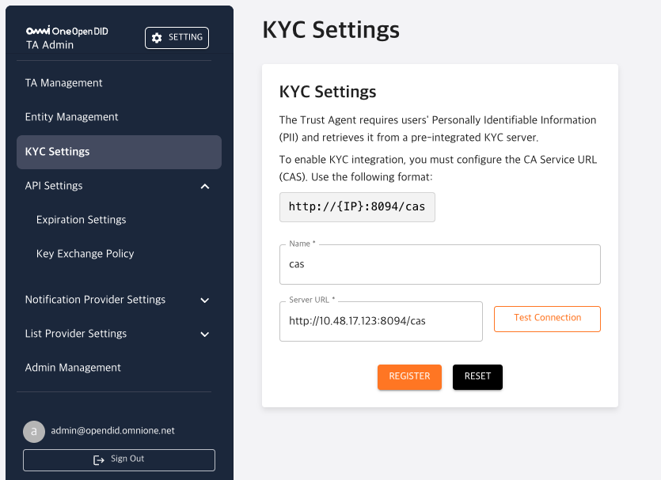

<br/>

> **For detailed registration procedures, please refer to the operation guide below.**
> - [TA Admin Operation Guide - 3.3 KYC Settings](https://github.com/OmniOneID/did-ta-server/blob/release/QA-v2.0.0/docs/admin/OpenDID_TAAdmin_Operation_Guide.md#33-kyc-settings)

<br/>

## 6.2. Issuer Admin Configuration

In the Issuer server, the following configurations must be pre-configured for general VC issuance and ZKP-based Credential issuance functions.
Configuration is performed through the VC Management and ZKP Management menus of the Issuer Admin Console, and each item is directly connected to VC issuance and ZKP-based verification functions.

> **Notes**
> - The configuration order should **configure ZKP-related items first**, then set general VC-related items.  
> - This is because VC issuance has a structure that simultaneously issues ZKP Credentials, and the **ZKP Credential Definition to be used in the VC issuance profile (Issue Profile) must be specified in advance**.

<br/>

### 6.2.1. ZKP Namespace Registration

To issue ZKP Credentials, **ZKP Namespace** must be registered first.  
ZKP Namespace is a unit that defines attributes to be included in ZKP Credentials and later becomes the foundation for **ZKP Credential Schema**.

In particular, since there is a structure that issues ZKP Credentials simultaneously with general VC issuance,  
ZKP Namespace configuration must be registered first to pre-configure the ZKP Profile to be used in the VC Issue Profile.

For Demo testing, register the following ZKP Namespace to configure **ZKP Credentials for ID card information**.

<br/>

**[ID Card Namespace Registration]**

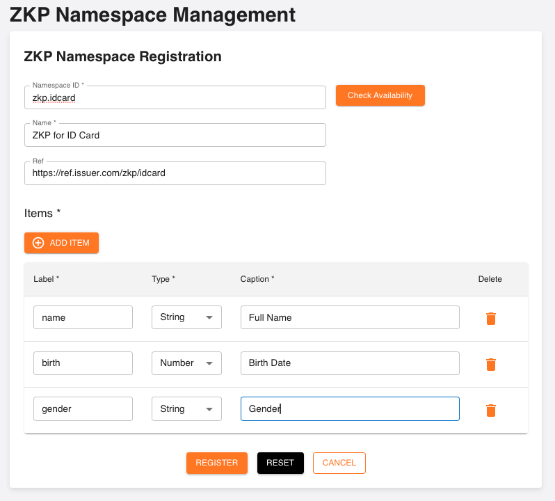

This is a namespace representing user ID card information.

<br/>

> **For detailed registration procedures, please refer to the operation guide below.**
> - [Issuer Admin Operation Guide - ZKP Namespace Registration](https://github.com/OmniOneID/did-issuer-server/blob/release/QA-v2.0.0/docs/admin/OpenDID_IssuerAdmin_Operation_Guide.md#-namespace-registration-1)

<br/><br/>

### 6.2.2. ZKP Credential Schema Registration

To define ZKP Credentials, **Credential Schema** configured with attributes based on ZKP Namespace must be registered first.  
Credential Schema determines the structure of Credential Definitions to be created later and is referenced in ZKP Profiles.

For Demo testing, register the ID card ZKP Credential Schema as follows based on the previously registered `zkp.idcard` namespace.

<br/>

**[ID Card ZKP Credential Schema Registration]**

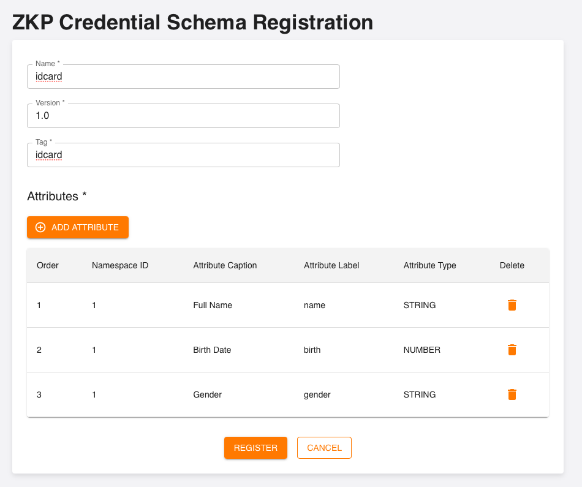

This is a ZKP Credential Schema configured based on attributes defined in the `zkp.idcard` namespace.

<br/>

> **For detailed registration procedures, please refer to the operation guide below.**
> - [Issuer Admin Operation Guide - Credential Schema Registration](https://github.com/OmniOneID/did-issuer-server/blob/release/QA-v2.0.0/docs/admin/OpenDID_IssuerAdmin_Operation_Guide.md#-credential-schema-registration)

<br/><br/>

### 6.2.3. ZKP Credential Definition Registration

Credential Definition is **the step to prepare for actual ZKP Credential issuance**, creating internal data based on previously created Credential Schema including  
**issuance key pairs (public key/private key)**, **attribute-namespace mapping information**, **signature algorithm configuration**, etc.  

For Demo testing, register the ID card Credential Definition as follows.

<br/>

**[ID Card ZKP Credential Definition Registration]**

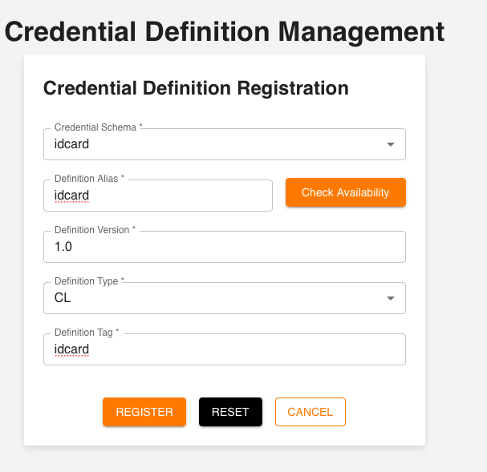

<br/>

> **For detailed registration procedures, please refer to the operation guide below.**
> - [Issuer Admin Operation Guide - Credential Definition Registration](https://github.com/OmniOneID/did-issuer-server/blob/release/QA-v2.0.0/docs/admin/OpenDID_IssuerAdmin_Operation_Guide.md#-credential-definition-registration)

<br/><br/>

### 6.2.4. VC Namespace Registration

To issue VCs, **VC Namespace** must be registered first.  
VC Namespace plays a role in **defining claims to be included in VCs by logical group units** and is **referenced when registering VC schemas later**.

To perform Demo testing normally, both of the following VC namespaces must be registered.

<br/>

**[ID Card Namespace Registration]**


This is a namespace representing user ID card information.

<br/>

**[Driver's License Namespace Registration]**


This is a namespace containing driver's license information.

<br/>

> **For detailed registration procedures, please refer to the operation guide below.**
> - [Issuer Admin Operation Guide - Namespace Registration](https://github.com/OmniOneID/did-issuer-server/blob/release/QA-v2.0.0/docs/admin/OpenDID_IssuerAdmin_Operation_Guide.md#-namespace-registration)

<br/><br/>

### 6.2.5. VC Schema Registration

In the **VC Schema Management** menu, you can register schemas that define the data structure of Verifiable Credentials to be actually issued.  
Schemas are configured by referencing previously defined namespaces, and **Issue Profiles** will set VC issuance policies based on these schemas.

For Demo testing, **ID card VC schema** and **driver's license VC schema** must be registered respectively.

To perform Demo testing normally, both of the following VC schemas must be registered.

**[ID Card VC Schema Registration]**


This is a basic identity VC containing user name, gender, and birth date information.

<br/>

**[Driver's License VC Schema Registration]**


This is a driving qualification VC containing driver's license number and issuance date information.

<br/>

> **For detailed registration procedures, please refer to the operation guide below.**
> - [Issuer Admin Operation Guide - VC Schema Registration](https://github.com/OmniOneID/did-issuer-server/blob/release/QA-v2.0.0/docs/admin/OpenDID_IssuerAdmin_Operation_Guide.md#-vc-schema-registration)

<br/><br/>

### 6.2.6. VC Profile Registration

**Issue Profile Management** is a menu for defining and managing profiles (Issue Profile) to be used when issuing VCs.  
Issue Profiles configure VC Schema and issuance policy information into a single issuance plan, which is referenced during actual VC issuance.

> **Important Notes**   
> To issue ZKP Credentials together, you must **enable ZKP issuance** in the Issue Profile and select a Credential Definition.  
> Therefore, ZKP-related configurations must be completed first before Issue Profile configuration is possible.

For Demo testing, configure the Issue Profile for ID card VC issuance as follows:

<br/>

**[ID Card VC Issue Profile Registration]**

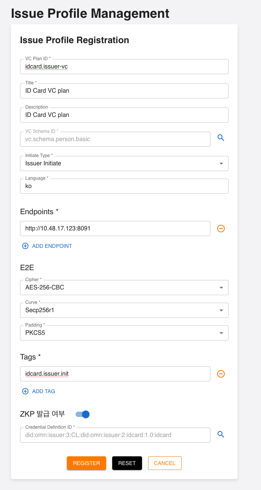

<br/>

- **Features**
 - ZKP Credentials are issued simultaneously with regular VCs.
 - Can be issued through the Demo website.

<br/>

**[Driver's License VC Issue Profile Registration]**

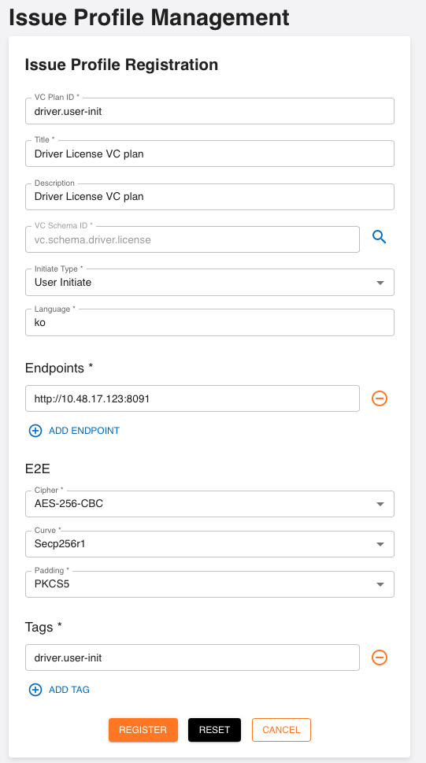

<br/>

- **Features**
 - Only regular VCs are issued, ZKP Credentials are not included.
 - Users directly request issuance through the OpenDID client app.

<br/>

> **For detailed registration procedures, please refer to the operation guide below.**
> - [Issuer Admin Operation Guide - Issue Profile Registration](https://github.com/OmniOneID/did-issuer-server/blob/release/QA-v2.0.0/docs/admin/OpenDID_IssuerAdmin_Operation_Guide.md#-issue-profile-registration)

<br/><br/>

## 6.3. Verifier Admin Configuration 

In the Verifier admin, policies for verifying VPs submitted by users must be pre-configured.
Since both general VC-based VP submission and ZKP Credential-based submission are supported, policies appropriate for each method must be set up to perform Demo testing smoothly.

### 6.3.1. Service Registration

**Service Configuration** is an item for registering **service-level settings** that will verify users' VP submission requests.  

Verifier must pre-define which service, from which device, through which submission mode (Submission Mode), and by which method (Verification Type, e.g., general, ZKP) to verify submitted VPs.

For Demo testing, the following service registrations are required:

- **Service that verifies ID card VCs** (general VC verification)
- **Service that verifies ID card ZKP Credentials** (ZKP-based VP verification)
- **Service that verifies driver's license VCs** (general VC verification)

<br/>

**[Service Registration for Receiving ID Card VC Submissions]**

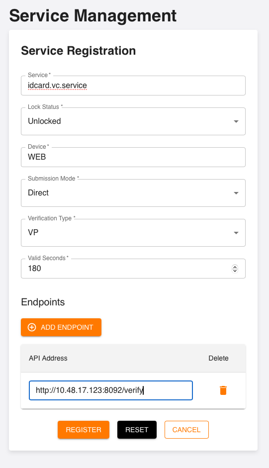

<br/>

**[Service Registration for Receiving ID Card ZKP Credential Submissions]**

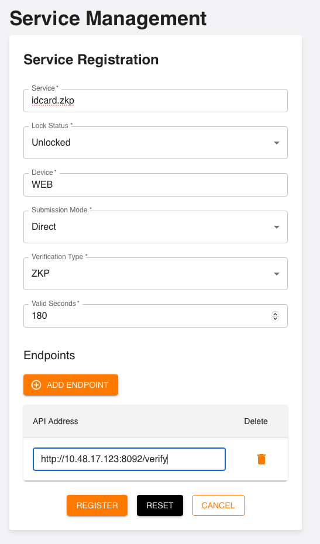

<br/>

**[Service Registration for Receiving Driver's License VC Submissions]**


<br/>

> **For detailed registration procedures, please refer to the operation guide below.**
> - [Verifier Admin Operation Guide - 3.2.2 Service Register](https://github.com/OmniOneID/did-verifier-server/blob/release/QA-v2.0.0/docs/admin/OpenDID_VerifierAdmin_Operation_Guide.md#322-service-registration--modification)

<br/><br/>

### 6.3.2. VP Filter Registration

In the **Filter Management** menu, you can define **filter policies** to check whether submitted VPs meet specific conditions.  
Each filter sets required claims, display claims, allowed issuers, etc., and is reused in Profiles.

For Demo testing, the following VP Filter registrations are required:

<br/>

**[ID Card VP Filter Registration]**


<br/>

**[Driver's License VP Filter Registration]**

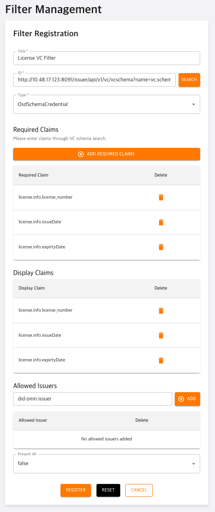

<br/>

> **For detailed registration procedures, please refer to the operation guide below.**
> - [Verifier Admin Operation Guide - 3.3.1.2. Filter Register](https://github.com/OmniOneID/did-verifier-server/blob/release/QA-v2.0.0/docs/admin/OpenDID_VerifierAdmin_Operation_Guide.md#3312-filter-registration--modification)

<br/><br/>

### 6.3.3. VP Process Registration

In the **Process Management** menu, you can define **processing methods (E2E encryption, authentication methods, etc.)** to be used during VP verification.  
Defined Processes are **reused when configuring VP Policies** along with Filters.

For Demo testing, you can register one process as below and reuse it in all VP verification policies.

**[Basic Process Registration]**

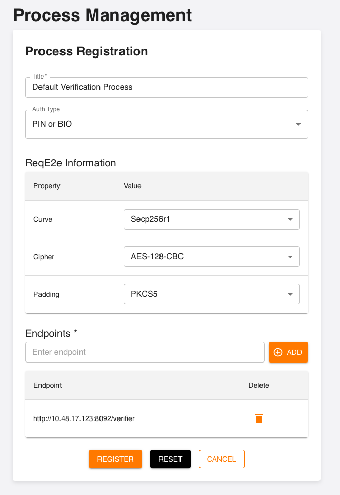

<br/>

> **For detailed registration procedures, please refer to the operation guide below.**
> - [Verifier Admin Operation Guide - 3.3.2.2. Process Register](https://github.com/OmniOneID/did-verifier-server/blob/release/QA-v2.0.0/docs/admin/OpenDID_VerifierAdmin_Operation_Guide.md#3322-process-registration--modification)

<br/><br/>

### 6.3.4. VP Profile Registration

In the Profile Management menu, you can manage VP profile information.  
Profiles reference previously configured Filter and Process information to configure VP processing policies suitable for specific verification purposes.

For Demo testing, register the following two profiles:

<br/>

**[ID Card VP Profile Registration]**


<br/>

**[Driver's License VP Profile Registration]**

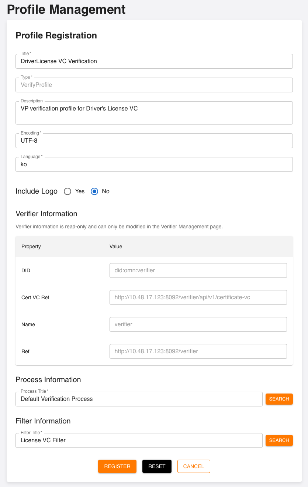

<br/>

> **For detailed registration procedures, please refer to the operation guide below.**
> - [Verifier Admin Operation Guide - 3.3.3.2 Profile Register](https://github.com/OmniOneID/did-verifier-server/blob/release/QA-v2.0.0/docs/admin/OpenDID_VerifierAdmin_Operation_Guide.md#3332-profile-registration--modification)

<br/><br/>

### 6.3.5. VP Policy Registration

In the Policy Management menu, you can comprehensively manage overall VP policies.  
By connecting profiles and service settings to be applied during VP submission, they are configured as practical verification policies.

For Demo testing, the following two policies for ID card and driver's license submission must be registered:

<br/>

**[ID Card VP Policy Registration]**

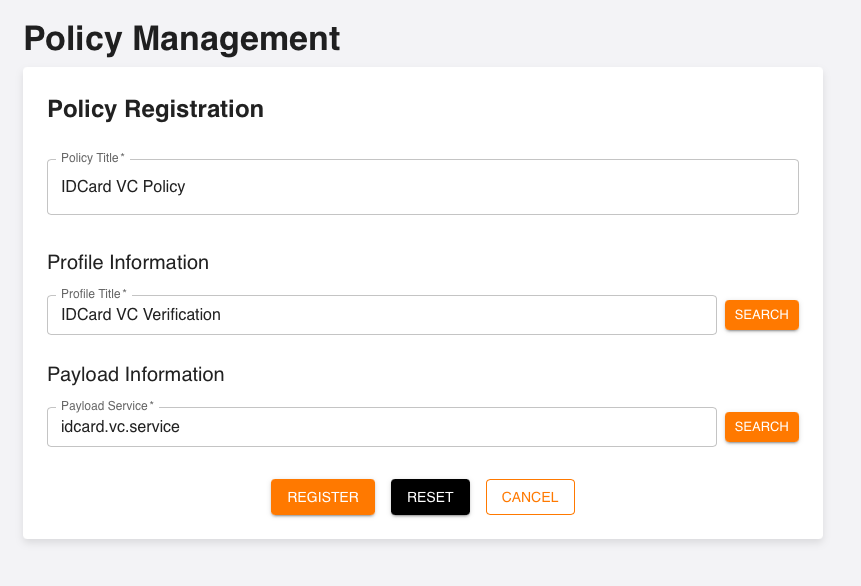

<br/>

**[Driver's License VP Policy Registration]**


<br/>

> **For detailed registration procedures, please refer to the operation guide below.**
> - [Verifier Admin Operation Guide - 3.3.4.2 Policy Register](https://github.com/OmniOneID/did-verifier-server/blob/release/QA-v2.0.0/docs/admin/OpenDID_VerifierAdmin_Operation_Guide.md#3342-policy-registration)

<br/><br/>

### 6.3.6. ZKP Proof Request Registration

Proof Request is an item that defines proof conditions that verifiers require from provers (users).  
Based on attributes or predicates of ZKP Credentials, necessary proofs can be requested.

For Demo testing, Proof Request for verifying ID card ZKP Credentials must be registered as follows:

<br/>

**[ID Card ZKP Credential Proof Request Registration]**

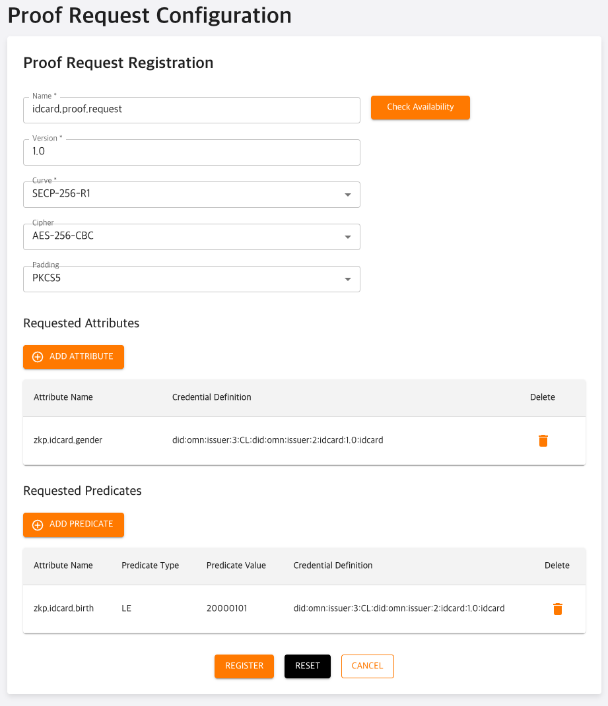

<br/>

> **For detailed registration procedures, please refer to the operation guide below.**
> - [Verifier Admin Operation Guide - 3.4.1.1 Proof Request Register](https://github.com/OmniOneID/did-verifier-server/blob/release/QA-v2.0.0/docs/admin/OpenDID_VerifierAdmin_Operation_Guide.md#3411-proof-request-register)

<br/><br/>

### 6.3.7. ZKP Profile Registration

ZKP Profile is a **verification profile** used when Verifier verifies ZKP-based proofs.  
This profile includes information about the Proof Request to be used and output format (language, encoding, etc.),  
and verification is performed by referencing this profile during ZKP-based VP submission.

For Demo testing, ID card ZKP Profile must be registered as follows:

<br/>

**[ID Card ZKP Profile Registration]**


<br/>

> **For detailed registration procedures, please refer to the operation guide below.**
> - [Verifier Admin Operation Guide - 3.4.2.1 ZKP Profile Register](https://github.com/OmniOneID/did-verifier-server/blob/release/QA-v2.0.0/docs/admin/OpenDID_VerifierAdmin_Operation_Guide.md#3421-zkp-profile-register)

<br/><br/>

### 6.3.8. ZKP Policy Registration

In the **ZKP Policy Management** menu, you can register final verification policies for ZKP-based VP submissions.  
ZKP Policy is configured by connecting one ZKP profile with the service (Payload) to which the proof will be applied.  
For Demo testing, a policy for verification of ID card Credentials submitted via ZKP method must be registered.

For Demo testing, ID card ZKP Profile must be registered as follows:

<br/>

**[ID Card ZKP Policy Registration]**

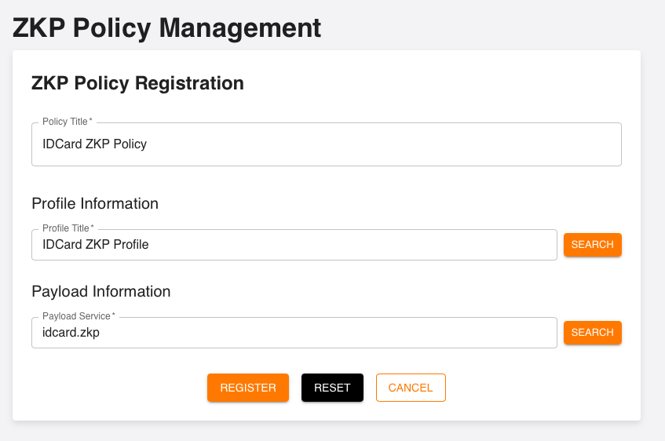

<br/>

> **For detailed registration procedures, please refer to the operation guide below.**
> - [Verifier Admin Operation Guide - 3.4.3.1 ZKP Policy Register](https://github.com/OmniOneID/did-verifier-server/blob/release/QA-v2.0.0/docs/admin/OpenDID_VerifierAdmin_Operation_Guide.md#3431-zkp-policy-register)

<br/><br/>

# 7. OpenDID Test Guide

This chapter guides how to test the main functions of OpenDID - user registration, VC issuance, and VP submission - in a Demo environment.  
Testing is conducted using both the web-based **OpenDID Demo page** and mobile **OpenDID App**.

Through the Demo page, you can directly verify various VC issuance scenarios and VP submission flows,  
allowing you to intuitively understand the overall operation process of the OpenDID system.

> **Important**   
> The tests in this chapter assume that **all Admin configurations in Chapter 6 have been completed**.  
> If Admin configurations are incomplete or some VC Plans/Policies are missing, tests may not proceed normally.

Below is the Demo main screen.

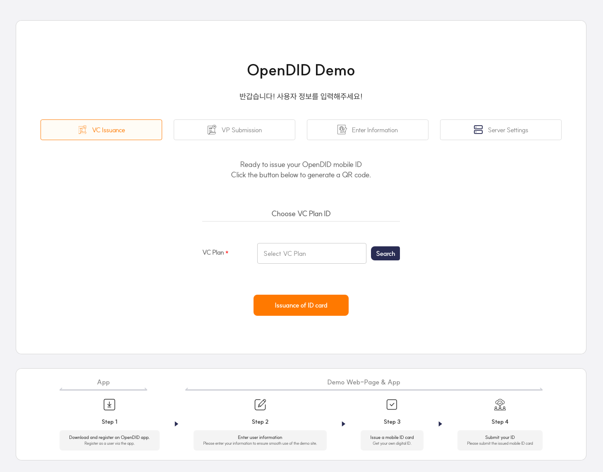

<br/>

## 7.1. Demo Environment Configuration

To test VC issuance and VP submission functions through the Demo page, 
**server information** and **user information** must be configured first on that page.  

This chapter guides the basic environment configuration procedures for Demo testing.  
After saving the configuration, the Demo server must be restarted for normal operation.

### 7.1.1. Server Information Configuration

To properly test VC issuance and VP submission in the Demo environment, **TAS / Issuer / CA / Verifier server addresses must be entered correctly**.  
This information can be configured in the **Server Settings** tab of the Demo page.

> **Important Notes**  
> - After saving server information, the Demo server must be **restarted** for the configuration to be applied.  
>   (This is planned to be improved to apply without restart in the future.)

Below is a screen with all server information entered.

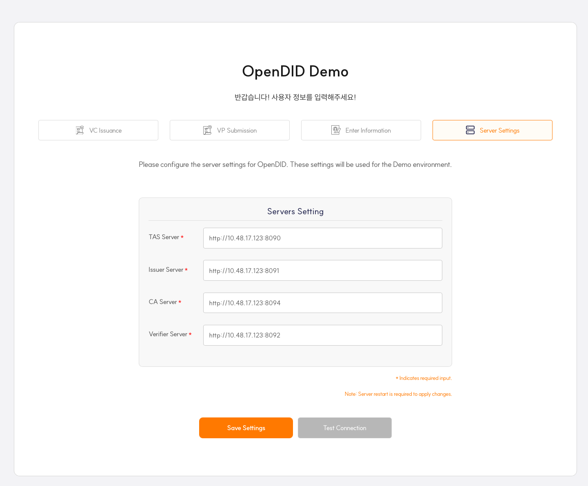

<br/><br/>

### 7.1.2. User Information Input  

For VC and ZKP Credential issuance, user information must be entered first on the Demo page.  
This information is configured based on the structure of **VC schema** and **ZKP Credential schema** previously set in the Issuer Admin Console,  
and users directly input values corresponding to each claim.

Below is a screen with all user information and claims entered:

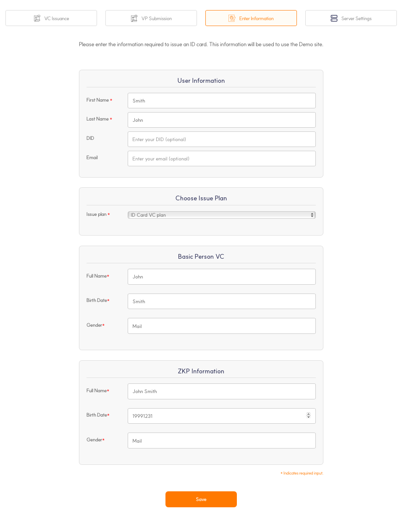

<br/><br/>

## 7.2. User Registration Test

User registration is a process that is automatically performed when the DID CA app is first executed. In this process, two registrations occur sequentially:

1. Wallet registration: Register the DID Document of the digital wallet to be used by the user in the OpenDID system
2. User registration: Register the user's DID Document in the OpenDID system

In each registration process, the corresponding DID Document is created and registered in the Open DID system.

### 7.2.1. Test Method

1. Run the `DID CA` app.
  
2. The message 'setting up your wallet' is displayed, and the app automatically starts the process of creating a wallet and registering it in the OpenDID system.  
  This process is completed automatically without user input.


<br/>

3. The 'Open DID Wallet' screen appears and guides the user registration process step by step. Confirm that Step 1 is currently in progress and click the `Next` button.

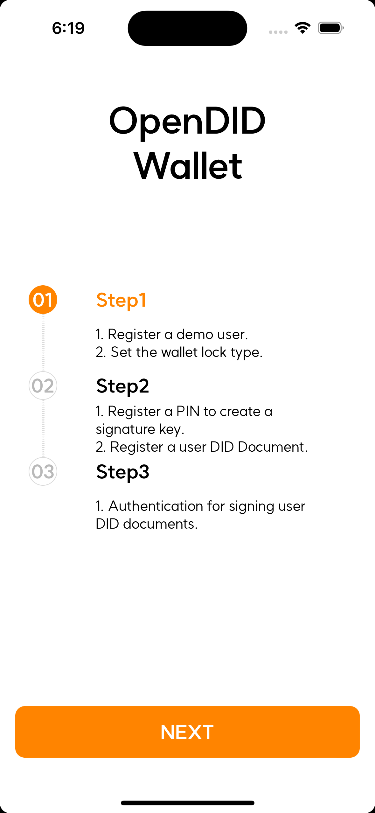

<br/>

4. In the 'User Information' screen, enter the user's information.  
  At this time, you must enter the same name as set in [7.1.2. User Information Input](#712-user-information-input).


<br/>

5. Enter the user's information and click the `Save` button.

6. A popup with the message 'Would you like to set the Wallet for lock type?' appears on the screen, asking if you want to set the wallet to lock mode. Click the `YES` button here.

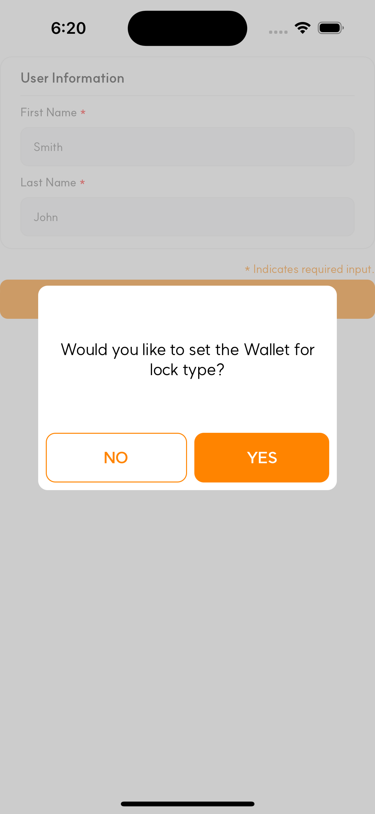

<br/>

7. The message 'Please register a Lock/Unlock PIN' is displayed and a screen to enter the wallet lock password appears. Enter 6 digits, and enter the same 6 digits once more for confirmation.

8. The 'Open DID Wallet' screen appears and confirms that Step 2 is currently in progress. Click the `Next` button.

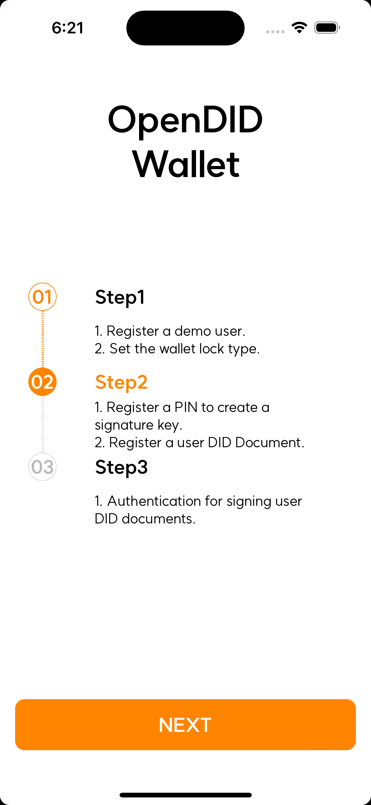

<br/>

9. The message 'Please input a PIN' is displayed and a screen to register a PIN appears. Enter 6 digits, and enter the same 6 digits once more for confirmation.


<br/>

10. A popup with the message 'Would you like to additionally register biometric authentication?' appears on the screen, asking if you want to additionally register biometric authentication. Click the `YES` button here.

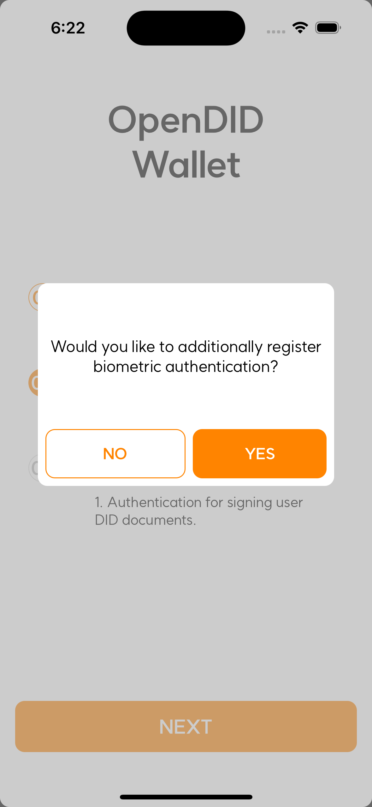

<br/>

11. A popup for entering fingerprint appears in the app OS. Enter and register your fingerprint.

12. The 'Open DID Wallet' screen appears and confirms that Step 3 is currently in progress. Click the `Next` button.


<br/>

13. The message 'Please input a PIN' is displayed and a screen to enter the PIN key appears. Enter 6 digits.


15. A popup for entering fingerprint appears in the app OS. Enter your fingerprint.
   
16. After moving to the main page, confirm that no VCs have been registered yet. The message 'No certificate has been issued.' is displayed on the screen.
  


<br/><br/>

## 7.2. VC Issuance Test

In the OpenDID system, there are two ways to receive Verifiable Credential (VC) issuance.

- **Issuer-initiated method**: VC issuance starts from the Issuer side, and users start VC issuance by scanning a QR code provided by the Issuer with the App.
- **User-initiated method**: VC issuance starts from the user side, and users directly start VC issuance from the app.

In this chapter, we test the process of receiving two representative VCs used in the demo environment, each issued in different ways.

- **ID card VC** is issued using the **Issuer-initiated method**. In the demo, administrators generate issuance QR codes in the Admin Console to provide to users.
- **Driver's license VC** is issued using the **User-initiated method**. Users select driver's license VC in the app and directly request issuance.

> Note: In the process of receiving ID card VC issuance, **ZKP Credential** based on that VC is also issued together, which is used for subsequent ZKP-based verification.

Now let's test the issuance procedures for each VC.

<br/>

### 7.2.1. Driver's License VC Issuance Test

1. Run the `DID CA` app. If the wallet is set to lock mode, a PIN input screen appears. Enter 6 digits to unlock.

2. Click the `ADD VC` button at the bottom of the screen.


<br/>

3. The 'Add Verifiable Credentials' screen appears, and you can select issuable VCs. Select 'Driver License VC plan'.


<br/>

4. The 'Issuance certificate Information' screen appears and displays information about the VC to be issued. Click the `OK` button.</br>


<br/>

5. The 'Driver License VC' screen appears and you can directly input claims. After entering all claims, click the `Save` button.


<br/>

6. Fingerprint authentication or a screen displaying 'Please input a PIN' for PIN key input appears, and user authentication proceeds.

7. The message 'Success' is displayed, confirming successful VC issuance. Click the `OK` button.

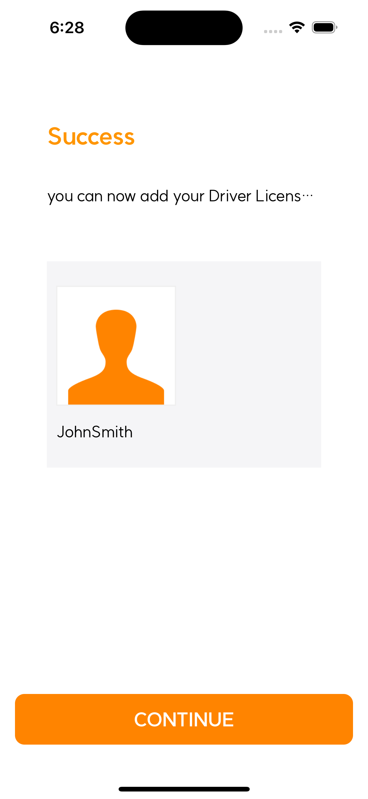

<br/>

8. After moving to the main page, confirm that the registered Driver License ID VC is displayed on the screen.

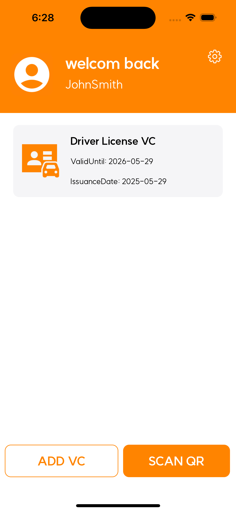

<br/>

9. You can click on the driver's license VC to check detailed claim information.

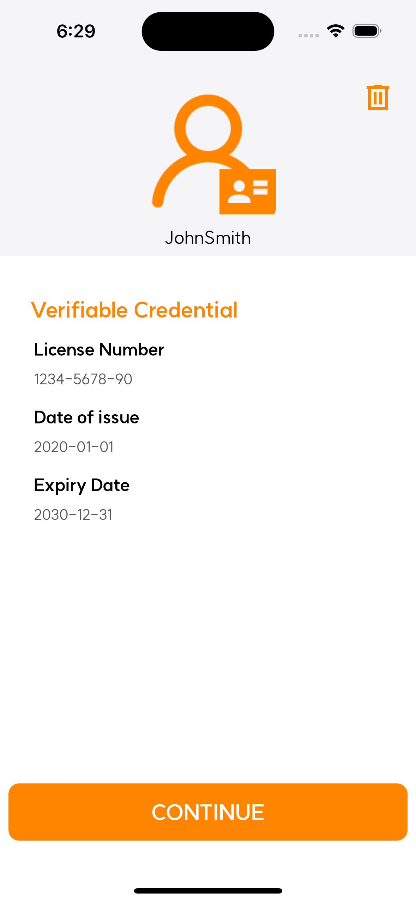

<br/><br/>

### 7.2.2. ID Card VC Issuance Test

1. Access the demo server's main page in a web browser and select the `VC Issuance` tab menu.


<br/>

2. Click the `Search` button, select `ID Card VC plan` in the Select VC Plan popup, and click the `Select` button.


<br/>

3. Click the `Issuance of ID card` button.


<br/>

4. Confirm that the `Issue with QR` popup appears.

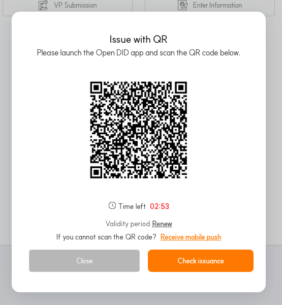

<br/>

5. Run the `DID CA` app. If the wallet is set to lock mode, a PIN input screen appears. Enter 6 digits to unlock.

6. Click the SCAN QR button at the bottom of the screen.


<br/>

7. When the phone's camera screen is activated, scan the QR code.

8. The 'Issuance certificate Information' screen appears and displays information about the VC to be issued. Click the `OK` button.


<br/>

9. Fingerprint authentication or a screen displaying 'Please input a PIN' for PIN key input appears, and user authentication proceeds.

10. The message 'Success' is displayed, confirming successful VC issuance. Click the `OK` button.


<br/>

11. After moving to the main page, confirm that the registered ID card VC is displayed on the screen. The message `ZKP included` is also displayed, confirming that ZKP Credential was also issued together.


<br/>

12. You can click on the ID card VC to check detailed claim information.

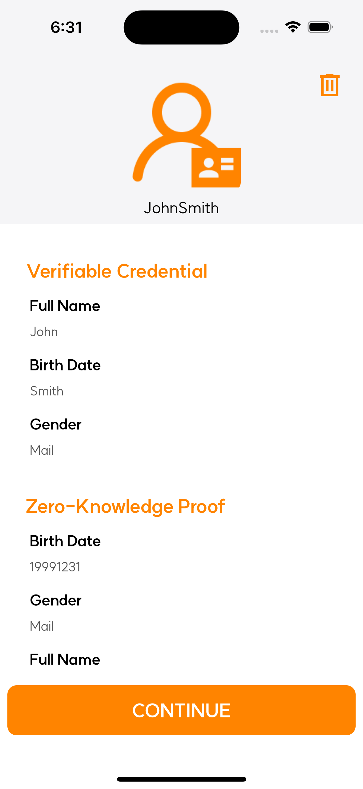

<br/>

13. Click the Check issuance button in the 'Issue with QR' popup of the demo server.

14. A popup appears indicating that issuance is complete. Click the `확인` button.

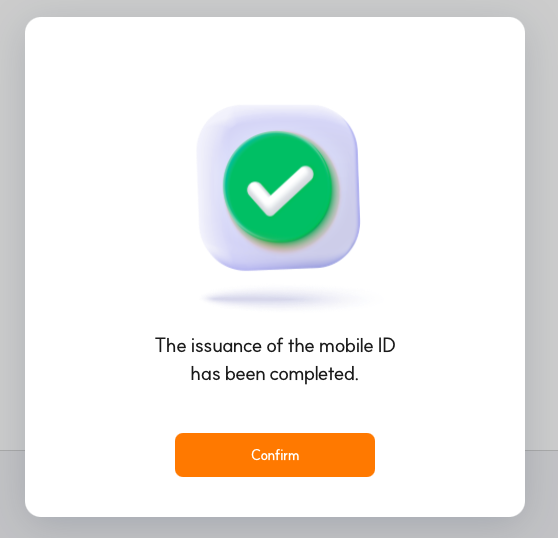

<br/><br/>

## 7.3. VP Submission Test

Verifiable Presentation (VP) is a method by which users submit Verifiable Credentials (VCs) they possess to third parties, used in situations such as authentication or verification.

In this chapter, we test the process of submitting VPs using three types of VCs issued earlier:

- ID card VC
- ID card ZKP Credential
- Driver's license VC

In the current demo environment, **VP submission is only possible by scanning QR codes provided by the demo in the app**.  
Therefore, users scan QR codes in the app, then select the required VC or ZKP Credential to create and submit VP.

<br/>

### 7.3.1. ID Card ZKP Credential Submission

1. Access the demo server's main page in a web browser and select the `VP Submission` tab menu.


<br/>

2. Click the `Search` button, select `IDCard ZKP Policy` in the Select VC Plan popup, and click the `Select` button.


<br/>

3. Click the `Submit your ID` button.


<br/>

4. Confirm that the `Submit a certificate` popup appears.

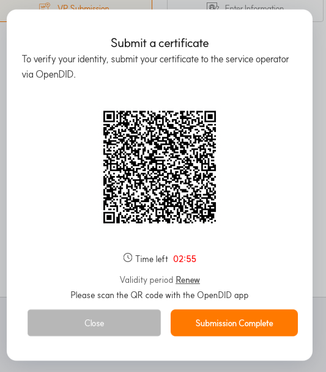

<br/>

5. Run the `DID CA` app. If the wallet is set to lock mode, a PIN input screen appears. Enter 6 digits to unlock.

6. Click the SCAN QR button at the bottom of the screen.


<br/>

7. When the phone's camera screen is activated, scan the QR code.

8. The 'Certificate submission guide' screen appears, displaying information about the issued VC, with a list of required Claims shown at the bottom. Click the `OK` button.

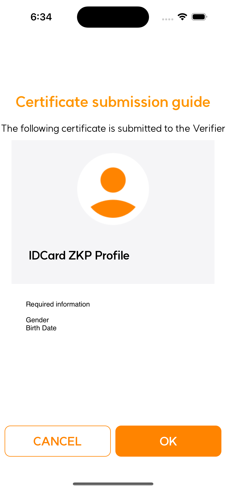

<br/>

9. Select each claim to set whether to submit it. You can hide that item by clicking the `eye` icon.

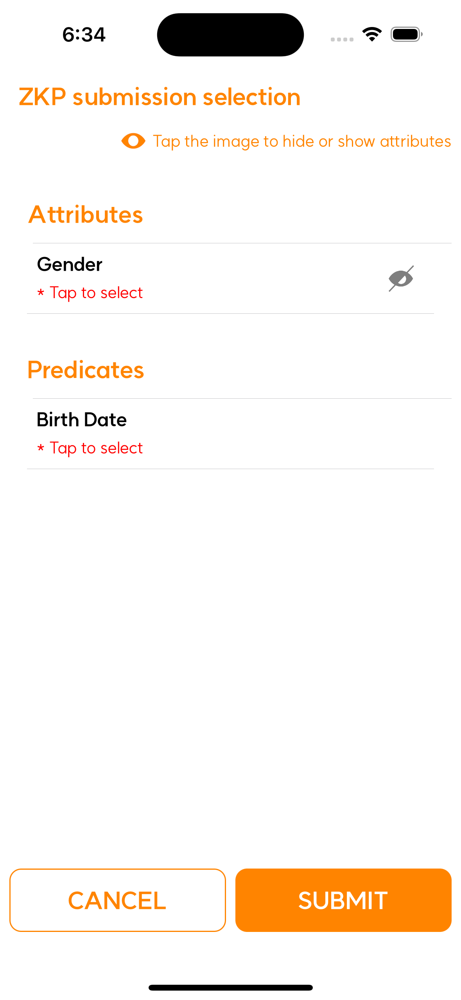

<br/>

10. When you select a claim to submit, a selection window appears where you can check the actual value of that item.

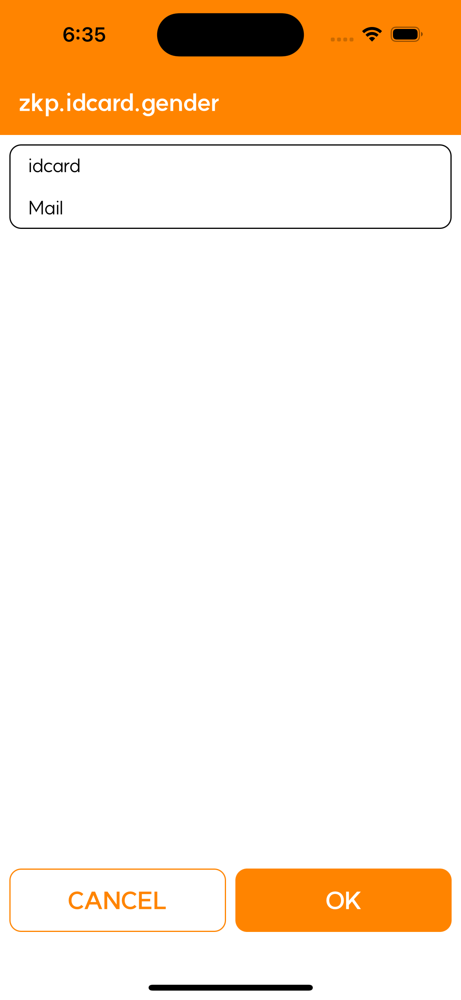

<br/>

11. Once you have selected all claims to submit, click the `SUBMIT` button at the bottom of the screen to submit the VP.


<br/>

12. The 'Select submission verification method' screen appears, and you select PIN or BIO to attempt authentication with the appropriate authentication method.

13. Upon completion of submission, the `Certificate submitted` screen is displayed.


14. Click the `Submission Complete` button in the `Submit a certificate` popup of the demo server.

15. A popup appears indicating that submission is complete. Click the `Confirm` button.

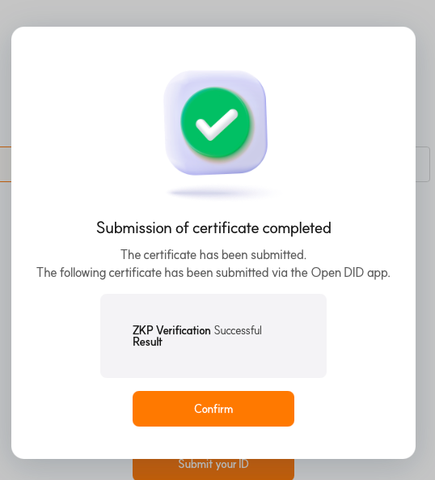

<br/><br/>

### 7.3.2. ID Card VP Submission

1. Access the demo server's main page in a web browser and select the `VP Submission` tab menu.

2. Click the `Search` button, select `IDCard VC Policy` in the Select VC Plan popup, and click the `Select` button.

3. Click the `Submit your ID` button.

4. Confirm that the `Submit a certificate` popup appears.

5. Run the `DID CA` app. If the wallet is set to lock mode, a PIN input screen appears. Enter 6 digits to unlock.

6. Click the SCAN QR button at the bottom of the screen.

7. When the phone's camera screen is activated, scan the QR code.

8. The `Certificate submission guide` screen appears, displaying information about the issued VC, with a list of required Claims shown at the bottom. Click the `OK` button.

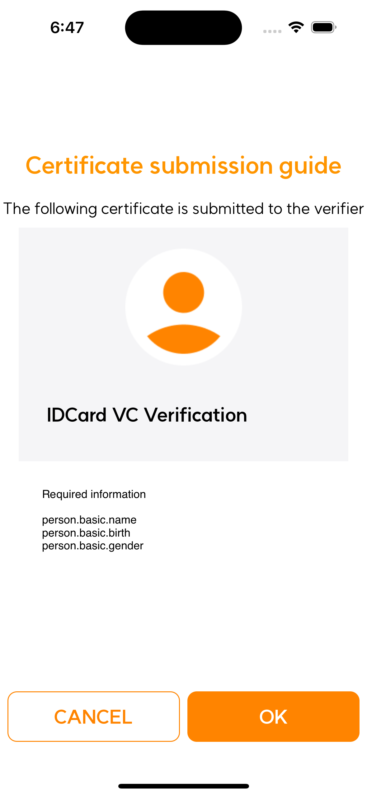

<br/>

9. The `Select submission verification method` screen appears, and you select PIN or BIO to attempt authentication with the appropriate authentication method.

10. Upon completion of submission, the `Certificate submitted` screen is displayed.


11. Click the `Submission Complete` button in the `Submit a certificate` popup of the demo server.

15. A popup appears indicating that submission is complete. Click the `Confirm` button.


<br/><br/>

### 7.3.3. Driver's License VP Submission

1. Access the demo server's main page in a web browser and select the `VP Submission` tab menu.

2. Click the `Search` button, select `DriverLicense VC Policy` in the Select VC Plan popup, and click the `Select` button.

3. Click the `Submit your ID` button.

4. Confirm that the `Submit a certificate` popup appears.
  
5. Run the `DID CA` app. If the wallet is set to lock mode, a PIN input screen appears. Enter 6 digits to unlock.

6. Click the SCAN QR button at the bottom of the screen.

7. When the phone's camera screen is activated, scan the QR code.

8. The `Certificate submission guide` screen appears, displaying information about the issued VC, with a list of required Claims shown at the bottom. Click the `OK` button.

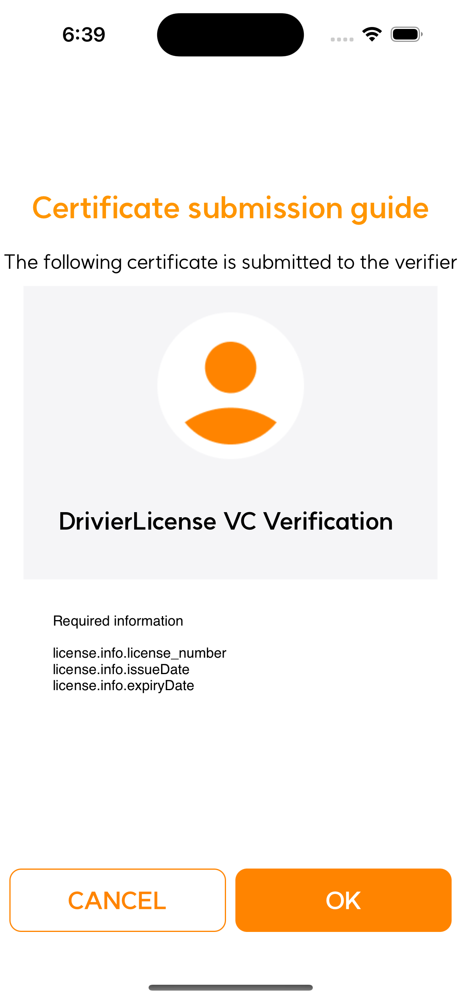

<br/>

9. The `Select submission verification method` screen appears, and you select PIN or BIO to attempt authentication with the appropriate authentication method.

10. Upon completion of submission, the `Certificate submitted` screen is displayed.


<br/>

11. Click the `Submission Complete` button in the `Submit a certificate` popup of the demo server.

15. A popup appears indicating that submission is complete. Click the `Confirm` button.

