---
puppeteer:
    pdf:
        format: A4
        displayHeaderFooter: true
        landscape: false
        scale: 0.8
        margin:
            top: 1.2cm
            right: 1cm
            bottom: 1cm
            left: 1cm
    image:
        quality: 100
        fullPage: false
---

Open DID Installation Guide
==

- Date: 2025-05-30
- Version: v2.0.0

목차
==

<!-- TOC tocDepth:2..3 chapterDepth:2..6 -->

- [1. OpenDID 소개](#1-opendid-소개)
- [2. 설치 개요](#2-설치-개요)
- [3. 시스템 요구사항](#3-시스템-요구사항)
  - [3.1. Server](#31-server)
  - [3.2. App](#32-app)
- [4. 사전 준비](#4-사전-준비)
  - [4.1. Git 설치](#41-git-설치)
  - [4.2. Gradle 설치](#42-gradle-설치)
  - [4.3. Node.js 설치](#43-nodejs-설치)
  - [4.4. Docker 설치](#44-docker-설치)
- [5. 설치 및 등록](#5-설치-및-등록)
  - [5.1. Step 1: Blockchain 설치](#51-step-1-blockchain-설치)
    - [5.1.1. Hyperledger Besu 네트워크 실행 및 컨트랙트 배포](#511-hyperledger-besu-네트워크-실행-및-컨트랙트-배포)
  - [5.2. Step 2: TA 설치 및 등록](#52-step-2-ta-설치-및-등록)
    - [5.2.1. TA Server 설치 후 구동](#521-ta-server-설치-후-구동)
    - [5.2.2. TA Server 등록](#522-ta-server-등록)
  - [5.3. Step 3: API Gateway 설치](#53-step-3-api-gateway-설치)
    - [5.3.1. API Gateway Server 설치 후 구동](#531-api-gateway-server-설치-후-구동)
  - [5.4. Entity 서버 설치 및 구동](#54-entity-서버-설치-및-구동)
    - [5.4.1. Step 4: Issuer Server 설치 및 등록](#541-step-4-issuer-server-설치-및-등록)
    - [5.4.2. Step 5: Verifier Server 설치 및 등록](#542-step-5-verifier-server-설치-및-등록)
    - [5.4.3. Step 6: CA Server 설치 및 등록](#543-step-6-ca-server-설치-및-등록)
    - [5.4.4. Step 7: Wallet Server 설치 및 등록](#544-step-7-wallet-server-설치-및-등록)
  - [5.5. Step 8: Demo Server 설치](#55-step-8-demo-server-설치)
    - [5.5.1. Demo Server 설치 후 구동](#551-demo-server-설치-후-구동)
  - [5.6. Step 9: App 설치](#56-step-9-app-설치)
    - [5.6.1. Android App 설치](#561-android-app-설치)
    - [5.6.2. iOS App 설치](#562-ios-app-설치)
- [6. 어드민 설정](#6-어드민-설정)
  - [6.1. TA 어드민 설정](#61-ta-어드민-설정)
    - [6.1.1. KYC 설정](#611-kyc-설정)
  - [6.2. Issuer 어드민 설정](#62-issuer-어드민-설정)
    - [6.2.1. ZKP Namespace 등록](#621-zkp-namespace-등록)
    - [6.2.2. ZKP Credential Schema 등록](#622-zkp-credential-schema-등록)
    - [6.2.3. ZKP Credential Definition 등록](#623-zkp-credential-definition-등록)
    - [6.2.4. VC Namespace 등록](#624-vc-namespace-등록)
    - [6.2.5. VC 스키마 등록](#625-vc-스키마-등록)
    - [6.2.6. VC 프로파일 등록](#626-vc-프로파일-등록)
  - [6.3. Verifier 어드민 설정](#63-verifier-어드민-설정)
    - [6.3.1. 서비스 등록](#631-서비스-등록)
    - [6.3.2. VP Filter 등록](#632-vp-filter-등록)
    - [6.3.3. VP Process 등록](#633-vp-process-등록)
    - [6.3.4. VP Profile 등록](#634-vp-profile-등록)
    - [6.3.5. VP Policy 등록](#635-vp-policy-등록)
    - [6.3.6. ZKP Proof Requeset 등록](#636-zkp-proof-requeset-등록)
    - [6.3.7. ZKP Profile 등록](#637-zkp-profile-등록)
    - [6.3.8. ZKP Policy 등록](#638-zkp-policy-등록)
- [7. OpenDID 테스트 가이드](#7-opendid-테스트-가이드)
  - [7.1. 데모 환경 설정](#71-데모-환경-설정)
    - [7.1.1. 서버 정보 설정](#711-서버-정보-설정)
    - [7.1.2. 사용자 정보 입력](#712-사용자-정보-입력)
  - [7.2. 사용자 등록 테스트](#72-사용자-등록-테스트)
    - [7.2.1. 테스트 방법](#721-테스트-방법)
  - [7.2. VC 발급 테스트](#72-vc-발급-테스트)
    - [7.2.1. 운전면허증 VC 발급 테스트](#721-운전면허증-vc-발급-테스트)
    - [7.2.2. 신분증 VC 발급 테스트](#722-신분증-vc-발급-테스트)
  - [7.3. VP 제출 테스트](#73-vp-제출-테스트)
    - [7.3.1. 신분증 ZKP Credential 제출](#731-신분증-zkp-credential-제출)
    - [7.3.2. 신분증 VP 제출](#732-신분증-vp-제출)
    - [7.3.3. 운전면허증 VP 제출](#733-운전면허증-vp-제출)

<!-- /TOC -->


# 1. OpenDID 소개

Open DID의 세계에 오신 것을 환영합니다! 

Open DID를 간략히 정의하면, 디지털 신원 인증 시스템을 제공하는 플랫폼이라고 할 수 있습니다. Open DID 플랫폼을 통해서 사회적 비용을 감소시키고, 인프라로부터 소외된 계층에게는 "인류 가치 실현을 위한 사회적 책임"을 다하고자 하는 멋진 목적을 가지고 있습니다.

본 문서는 Open DID의 구성요소의 설치 과정부터 주요 기능에 대한 종합적인 검증까지의 관계를 단계별로 안내합니다. 여러분은 각 장을 순서대로 따라가면 Open DID 플랫폼을 쉽게 설치할 수 있습니다.

Open DID 플랫폼을 설치한 후에는 어떤 기능을 확인할 수 있을까요?

**첫 번째,** Open DID의 각 구성요소(서버, 월렛, 사용자)를 안전하고 신뢰할 수 있는 저장소에 등록할 수 있습니다. 좀 더 자세히 설명하면, DID(Decentralized Identifier, 분산 신원 식별자)를 사용해 블록체인 저장소에 Open DID 구성요소의 정보를 저장합니다. DID는 중앙화된 기관에 의존하지 않고, 사용자 자신이 신원 정보를 관리할 수 있도록 하는 개념이며, 블록체인은 이러한 정보를 분산된 네트워크에 기록하여, 데이터의 무결성과 보안을 보장합니다.

<br/>

**두 번째,** 사용자에게 VC(Verifiable Credential)를 발급할 수 있습니다. VC를 쉽게 설명하자면, 온라인에서 발급받아 실제 생활에서도 사용할 수 있는 디지털 신분증이라고 생각하면 됩니다. 마치 학교의 학생증이나 회사의 사원증처럼, VC는 사용자의 신원이나 자격을 증명할 수 있습니다.

<br/>

**세 번째,** 사용자가 VC를 바탕으로 VP(Verifiable Presentation)을 생성하여 제출할 수 있습니다. VP는 VC에서 특정 정보만 추출하여 제시하는 방식으로, 사용자가 자신의 자격이나 신원을 검증할 때 최소한의 정보를 안전하게 공유할 수 있게 합니다. 예를 들어, 사용자가 나이를 증명해야 하는 상황에서 VP를 사용하면, 전체 신원 정보를 노출하지 않고도 나이 정보만을 선택적으로 제공할 수 있습니다. 

위에서 DID, VC, VP와 같은 개념들이 생소하게 느껴질 수 있지만, 너무 걱정하지 마세요. 본 문서를 따라가는 것만으로도, Open DID의 주요 기능을 충분히 확인할 수 있습니다.  이러한 개념들은 사용하면서 자연스럽게 익숙해질 것입니다.

> **참고 링크**
> - [DID(Decentralized Identifier)](https://www.w3.org/TR/did-core/)
> - [블록체인](https://en.wikipedia.org/wiki/Blockchain)
> - [VC(Verifiable Credential)](https://www.w3.org/TR/vc-data-model/)
> - [VP(Verifiable Presentation)](https://www.w3.org/TR/vc-data-model/#presentations)

<br/>

아래는 각 장에서 다루는 주요 내용입니다.

1. **설치 개요**: Open DID 플랫폼의 전체 설치 과정을 안내합니다.

2. **시스템 요구사항**: 프로젝트를 실행하기 위해 필요한 시스템 요구사항을 설명합니다. 

3. **사전 준비**: 설치를 시작하기 전에 필요한 준비 작업을 안내합니다.
   
4. **설치 및 등록**: Open DID의 각 구성 요소를 설치하고, 설치된 서버를 Open DID 시스템에 등록하는 방법을 설명합니다. 

5. **어드민 설정**: OpenDID 데모 테스트를 수행하기 위해 필수적인 Issuer 및 Verifier의 발급 및 검증 정책을 Admin Console에서 사전에 구성하는 방법을 설명합니다.

6. **OpenDID 테스트 가이드**: 데모 환경을 통해 사용자 등록, VC 발급, VP 제출 과정을 테스트하는 방법을 안내합니다.


<br/><br/>

# 2. 설치 개요

이 장에서는 OpenDID 프로젝트의 구성 요소와 설치 순서를 안내합니다.

OpenDID 플랫폼은 반드시 정해진 순서를 따라서 설치해야만 제대로 작동할 수 있습니다.

**첫 번째,** OpenDID 구성요소(서버, 앱)의 정보를 저장할 저장소인 블록체인을 설치합니다. 블록체인은 모든 구성 요소의 신원 정보와 트랜잭션 기록을 분산된 네트워크에 저장하여, 데이터의 무결성과 변조 방지 기능을 제공합니다. 이는 OpenDID 플랫폼의 신뢰성을 보장하는 핵심 인프라입니다. 현재 OpenDID는 Hyperledger Besu 기반 퍼블릭 블록체인을 지원합니다.

**두 번째,** 각 구성 요소들의 정보를 블록체인에 등록하여 신뢰체인을 구축할 수 있는 역할을 하는 TA(Trust Agent) 서버를 설치합니다. TA 서버는 구성 요소들이 요청한 데이터를 검증하고, 검증이 통과된 데이터를 서명하여 블록체인에 등록합니다. 이를 통해 신뢰할 수 있는 데이터가 블록체인에 저장되며, TA 서버는 이러한 신뢰 체인을 구축하는 핵심적인 역할을 수행합니다.

**세 번째,** 블록체인과 앱 간의 중계 역할을 하는 API Gateway 서버를 설치합니다. OpenDID 2.0에서는 현재 Ethereum 기반의 퍼블릭 블록체인인 Hyperledger Besu를 지원합니다. 퍼블릭 블록체인이라 하더라도, 앱이 직접 블록체인과 통신하는 구조는 다양한 문제를 야기할 수 있습니다. 예를 들어, 블록체인마다 상이한 인터페이스를 지원하거나, 트랜잭션 처리 방식이 다를 수 있으며, 불필요한 노출이나 과도한 네트워크 비용이 발생할 수 있습니다. 이러한 문제를 해결하기 위해 OpenDID는 API Gateway 서버를 통해 블록체인과 앱 간의 상호작용을 추상화합니다.  
API Gateway는 블록체인에 대한 접근을 표준화하고, 다양한 블록체인 연동 시 필요한 인터페이스를 일관되게 제공하며, 내부 시스템의 확장성과 효율성을 보장합니다.

**네 번째,** Entity 서버들을 설치합니다. Entity 서버는 OpenDID 구성 요소 중에서 핵심적인 역할을 수행하는 구성 요소를 말하며, Issuer, Verifier, CA, Wallet 서버가 포함됩니다.

- Issuer 서버는 신원 증명서(Verifiable Credential)를 발급하는 역할을 하며, 사용자에게 신뢰할 수 있는 디지털 신분증을 제공합니다.
- Verifier 서버는 제출된 신원 증명서(Verifiable Presentation)를 검증하여, 정보의 진위 여부를 확인하고 신뢰할 수 있는 인증을 제공합니다.
- CA (Certificate App) 서버는 앱의 신뢰성을 보증하는 역할을 수행합니다. 앱은 주요 기능을 요청하기 전에 토큰을 발급 받아야 하며, CA 서버는 앱이 이 토큰을 발급 받을 수 있도록 신뢰성을 보장합니다.
- Wallet 서버는 앱이 보유하고 있는 월렛의 신뢰성을 보증하는 역할을 수행합니다. 앱이 사용하는 월렛도 블록체인에 등록되어야 하는데, 이 과정에서 Wallet 서버가 월렛의 신뢰성을 보장합니다.

**다섯 번째,** 데모 서버를 설치합니다. Demo 서버는 웹 서버로, OpenDID의 주요 기능인 VC 발급과 VP 제출 기능을 테스트할 수 있는 화면을 제공합니다. 이를 통해 사용자는 실제 환경과 유사한 조건에서 기능을 검증할 수 있습니다.

**여섯 번째,** 앱을 설치합니다. 앱은 사용자가 OpenDID 플랫폼과 상호작용하는 핵심 인터페이스로, Android와 iOS 앱을 지원합니다. 사용자는 이 앱을 통해 신원 정보 관리, VC(Verifiable Credential) 발급 및 저장, VP(Verifiable Presentation) 생성 및 제출과 같은 다양한 기능을 수행할 수 있습니다. 

<br/>
위의 내용을 표로 정리하면 다음과 같습니다.

<br/>

| 구성 요소            | 구성 요소 역할                                                                                                                                               | 설치 순서 |
|----------------------|---------------------------------------------------------------------------------------------------------------------------------------------------------------|------------|
| **블록체인**         | Hyperledger Besu 기반의 퍼블릭 블록체인을 설치하고, DID/VC 관련 스마트 계약을 배포합니다.<br/>OpenDID의 모든 구성 요소는 이 블록체인을 신뢰 저장소로 사용합니다. | 1          |
| **TA 서버**          | Trust Agent 서버로, OpenDID 내에서 서버와 사용자의 신뢰 관계를 구축하는 중추적인 역할을 합니다.                                                             | 2          |
| **API Gateway 서버** | 다양한 블록체인과 앱 간 상호작용을 표준화하고 중계하여, 확장성과 효율성을 보장합니다.                                                                       | 3          |
| **Issuer 서버**      | 발급 기관 서버로, 사용자가 요청한 VC(Verifiable Credential)를 발급합니다.                                                                                    | 4          |
| **Verifier 서버**    | 검증 기관 서버로, 사용자가 제출한 VP(Verifiable Presentation)를 검증합니다.                                                                                  | 5          |
| **CA 서버**          | 인가 앱 서버로, 인가 앱을 OpenDID 내에서 사용할 수 있도록 보증하는 역할을 합니다.                                                                           | 6          |
| **Wallet 서버**      | Wallet 서버로, 월렛을 OpenDID 내에서 사용할 수 있도록 보증하는 역할을 합니다.                                                                               | 7          |
| **Demo 서버**        | VC 발급, VP 제출 기능을 테스트할 수 있는 환경을 제공합니다.                                                                                                  | 8          |
| **Android 앱**       | OpenDID의 Android 클라이언트 앱입니다.                                                                                                                       | 9         |
| **iOS 앱**           | OpenDID의 iOS 클라이언트 앱입니다.                                                                                                                           | 10         |

<br/>

위의 과정을 도식화하면 다음과 같습니다.

```text
+---------------------------------------------------------------+
| 1. Install Blockchain and Deploy Chaincode                    |
|    +------------------------------------------------------+   |
|    | - Install Hyperledger Besu                           |   |
|    | - Deploy Chaincode                                   |   |
|    +------------------------------------------------------+   |
+---------------------------------------------------------------+
                              |
                              v
+---------------------------------------------------------------+
| 2. Install and Register TA Server                             |
+---------------------------------------------------------------+
                              |
                              v
+---------------------------------------------------------------+
| 3. Install API Gateway                                        |
+---------------------------------------------------------------+
                              |
                              v
+---------------------------------------------------------------+
| 4. Install and Register Entity Server                         |
|    +-----------------------------+                            |
|    | - Issuer Server              |                           |
|    | - Verifier Server            |                           |
|    | - CA Server                  |                           |
|    | - Wallet Server              |                           |
|    +-----------------------------+                            |
+---------------------------------------------------------------+
                              |
                              v
+---------------------------------------------------------------+
| 5. Install Demo Server                                        |
+---------------------------------------------------------------+
                              |
                              v
+---------------------------------------------------------------+
| 6. Install Apps                                               |
|    +-----------------------------+                            |
|    | - Android App                |                           |
|    | - iOS App                    |                           |
|    +-----------------------------+                            |
+---------------------------------------------------------------+
```

<br/><br/>


# 3. 시스템 요구사항
이 장에서는 Open DID 플랫폼을 설치하기 위해 필요한 요구사항을 설명합니다. 서버와 앱을 실행하기 위해서는 각 항목에서 요구하는 환경을 충족해야 합니다.

## 3.1. Server
- 언어: OpenJDK 21
- 프레임워크: Spring Boot 3.2
- 데이터베이스: PostgreSQL 16.4
- 빌드 및 의존성 관리 도구: Gradle 8.8
- Node.js 22.12.0 이상

## 3.2. App

**■ Android**
- 언어: OpenJDK 17
- 프레임워크: Android 13.0 (API 33)
- 데이터베이스: Room 2.2.5
- 빌드 및 의존성 관리 도구: Gradle 8.2

**■ iOS**
- 언어: Swift 5
- 프레임워크: iOS 15
- 데이터베이스: Core Data
- 빌드 및 의존성 관리 도구: Xcode 15.4 이상, CocoaPods

<br />

# 4. 사전 준비

이 장에서는 Open DID 프로젝트의 구성요소를 설치하기 전, 사전에 필요한 준비 항목들을 안내합니다.

## 4.1. Git 설치

`Git`은 분산 버전 관리 시스템으로, 소스 코드의 변경 사항을 추적하고 여러 개발자 간의 협업을 지원합니다. Git은 Open DID 프로젝트의 소스 코드를 관리하고 버전 관리를 위해 필수적입니다. 

설치가 성공하면 다음 명령어를 사용하여 Git의 버전을 확인할 수 있습니다.

```bash
git --version
```

> **참고 링크**
> - [Git 설치 가이드](https://git-scm.com/book/en/v2/Getting-Started-Installing-Git)

<br/>

## 4.2. Gradle 설치

`Gradle`은 빌드 자동화 도구로, 다양한 프로그래밍 언어와 플랫폼을 지원합니다. Gradle은 Open DID 구성요소 중 서버의 코드를 컴파일하고 필요한 라이브러리를 관리하는 작업을 쉽게 처리해주기 때문에 필요합니다.

설치가 성공하면 다음 명령어를 사용하여 Gradle의 버전을 확인할 수 있습니다.

```bash
gradle --version
```

> **참고 링크**
> - [Gradle 설치 가이드](https://gradle.org/install/)

<br/>

## 4.3. Node.js 설치

`Node.js`는 JavaScript 런타임 환경으로, OpenDID 프로젝트의 일부 구성요소(예: Admin Console, 데모 앱)의 프론트엔드 개발 및 빌드 작업에 사용됩니다. 또한, Hyperledger Besu용 스마트 계약을 배포할 때 사용하는 `Hardhat` 도구도 Node.js 기반으로 동작하므로, 블록체인 초기 설정을 위해서도 필요합니다.

설치가 완료되면 아래 명령어로 Node.js와 npm의 버전을 확인할 수 있습니다.

```bash
node -v
npm -v
```

> **참고 링크**
> - [Node.js 공식 다운로드 페이지](https://nodejs.org/)

<br/>

## 4.4. Docker 설치

`Docker`는 컨테이너 기반의 가상화 도구로, OpenDID 구성 요소 중 일부는 Docker 컨테이너로 제공됩니다. 서버 실행, 블록체인 환경 구축, 개발 테스트 등 다양한 목적으로 Docker가 사용되며, `docker` 및 `docker-compose` 명령어가 CLI에서 실행 가능한 환경이 요구됩니다.

> **주의**  
> Docker는 다양한 플랫폼에서 실행될 수 있으며, Docker Desktop, Colima, Podman 등 어떤 도구를 사용하든 관계없습니다. 본 문서에서는 `docker` 및 `docker-compose` 명령어가 정상적으로 동작하는 환경을 전제로 설명합니다.

Docker가 정상적으로 설치되었는지 아래 명령어로 확인할 수 있습니다:

```bash
docker --version
docker compose version
```

> **참고 링크**  
> - [Docker 설치 가이드](https://docs.docker.com/get-docker/)  
> - [Docker Compose 소개](https://docs.docker.com/compose/)

<br/><br/>

# 5. 설치 및 등록

이 장에서는 Open DID의 각 구성 요소를 설치하고, 설치된 서버를 Open DID 시스템에 등록하는 방법을 설명합니다. 

'Open DID 시스템 등록'이란, 설치된 서버의 DID Document를 생성하여 블록체인에 등록한 후, TA 서버를 통해 가입 증명서를 발급받는 과정을 말합니다. 이 과정은 Open DID 시스템 내에서 서버의 신뢰성을 보장하고, 안전한 통신과 인증을 위해 필수적입니다. 가입 증명서는 TA가 서명하여 VC(Verifiable Credential)로 발급되며, 이를 통해 해당 서버가 Open DID 시스템 내에서 TA 서버에 의해 보증된 신뢰 가능한 Entity임을 나타냅니다.

'Open DID 시스템 등록'이 필요한 서버 목록은 다음과 같습니다.

| 서버                   | Open DID 시스템 등록 필요 여부 |
| ---------------------- | ------------------------------ |
| **TA Server**          | O                              |
| **Issuer Server**      | O                              |
| **Verifier Server**    | O                              |
| **CA Server**          | O                              |
| **Wallet Server**      | O                              |
| **API Gateway Server** | X                              |
| **Demo Server**        | X                              |

## 5.1. Step 1: Blockchain 설치

OpenDID 2.0은 블록체인 연동을 위해 현재 **Hyperledger Besu**만을 지원합니다.
Besu는 Ethereum 호환 EVM 블록체인으로, 로컬 환경에서 프라이빗 네트워크를 구성하고 OpenDID용 스마트 컨트랙트를 배포할 수 있습니다.

> **설치 및 배포 방법은 아래 문서를 참고하세요**  
> [OpenDID Besu Contract - README](https://github.com/OmniOneID/did-besu-contract/blob/develop/README_ko.md)

<br/>

### 5.1.1. Hyperledger Besu 네트워크 실행 및 컨트랙트 배포

`did-besu-contract` 리포지토리에서는 다음과 같은 절차를 안내합니다:

1. Docker Compose를 이용해 로컬 Besu 네트워크를 실행합니다.  
2. `deploy.sh` 스크립트를 실행하여 OpenDID용 스마트 컨트랙트를 배포합니다.  
3. 배포 결과로 출력된 컨트랙트 주소를 OpenDID 서버 설정에 반영합니다.

<br/><br/>

## 5.2. Step 2: TA 설치 및 등록

TA 서버는 Trust Agent 서버로, Open DID 내에서 **신뢰 체인을 구축**하는 핵심 역할을 수행합니다.  
TA 서버는 Open DID 시스템의 구성 요소가 제출한 DID Document를 검증하고 블록체인에 등록하며, **가입 증명서**를 발급하는 역할을 담당합니다.

따라서 TA 서버는 **반드시 가장 먼저 설치 및 등록**되어야 하며, 이후 다른 서버들은 TA 서버를 통해 OpenDID 시스템에 신뢰 주체로 등록될 수 있습니다.

### 5.2.1. TA Server 설치 후 구동

TA 서버의 리포지토리를 사용자의 로컬 컴퓨터로 복사한 후, 서버 운영에 필요한 설정을 완료하고 서버를 구동하는 과정입니다.
보다 더 자세한 설치 방법은 아래 링크를 참고해 주세요.

> **상세한 설치 절차는 아래 설치 가이드를 참고하세요.**   
> - [Open DID TA Server 설치 가이드](https://github.com/OmniOneID/did-ta-server/blob/release/QA-v2.0.0/docs/installation/OpenDID_TAServer_Installation_Guide_ko.md)

<br/>

### 5.2.2. TA Server 등록

TA 서버가 정상적으로 구동되었다면, 이제 OpenDID 시스템에 TA 서버를 **정식 신뢰 주체**로 등록하는 과정을 진행해야 합니다.  
이 과정을 **OpenDID 시스템 등록**이라 하며, 설치된 서버의 DID Document를 생성하여 블록체인에 등록한 후, TA 서버를 통해 가입 증명서를 발급받는 절차를 의미합니다.

등록이 완료되면 해당 서버는 OpenDID 시스템 내에서 신뢰할 수 있는 엔터티로 간주되며, **보안 통신 및 인증을 위한 전제 조건**이 충족됩니다.  
특히, 가입 증명서는 TA가 서명하여 발급한 **Verifiable Credential**로서, 해당 서버의 신뢰성을 증명하는 디지털 자격 증명입니다.

TA 등록은 **TA Admin Console**을 통해 진행됩니다.  
등록 절차는 아래 운영 가이드에 따라 진행되며, 주요 단계는 다음과 같습니다:

- 등록용 비밀번호를 입력하여 등록을 시작합니다. 이 비밀번호는 TA 서버 설정 파일에 사전 정의되어 있어야 합니다.  
- TA 서버의 이름, 설명, 관리자 정보 등 메타 정보를 입력합니다.  
- 고유 DID Document를 생성한 후, 이를 블록체인에 등록합니다.  
- 등록된 DID를 기반으로, TA 스스로에게 가입 증명서(VC)를 발급합니다.

> **상세한 등록 절차는 아래 운영 가이드를 참고하세요.**   
> [OpenDID TA Admin 운영 가이드 - 3.1.1 TA 등록](https://github.com/OmniOneID/did-ta-server/blob/release/QA-v2.0.0/docs/admin/OpenDID_TAAdmin_Operation_Guide_ko.md#311-ta-%EB%93%B1%EB%A1%9D)

등록이 완료되면 Admin Console의 메인 페이지로 이동할 수 있으며, 이후 Issuer, Verifier 등의 서버 등록 절차를 계속 진행할 수 있습니다.

<br/><br/>

## 5.3. Step 3: API Gateway 설치

API Gateway Server는 App이 블록체인 서버로부터 특정 데이터를 조회할 수 있도록 중계하는 역할을 하며, Open DID 시스템에 등록할 필요는 없습니다. 

<br/>

### 5.3.1. API Gateway Server 설치 후 구동

API Gateway Server의 리포지토리를 사용자의 로컬 컴퓨터로 복사한 후, 서버 운영에 필요한 설정을 완료하고 서버를 구동하는 과정입니다.
보다 더 자세한 설치 방법은 아래 링크를 참고해 주세요.

> **상세한 설치 절차는 아래 설치 가이드를 참고하세요.**   
> - [Open API Gateway Server 설치 및 운영 가이드](https://github.com/OmniOneID/did-issuer-server/blob/release/QA-v2.0.0/docs/installation/OpenDID_IssuerServer_Installation_Guide_ko.md)

<br/><br/>


## 5.4. Entity 서버 설치 및 구동

OpenDID 시스템에서 Issuer, Verifier, CA, Wallet 서버는 모두 TA 서버를 통해 등록되는 Entity 서버입니다.  
각 서버는 설치 후 OpenDID 시스템에 등록되어야 하며, 등록 절차는 TA와 Entity 간의 협력 과정을 포함합니다.

### 5.4.1. Step 4: Issuer Server 설치 및 등록

Issuer 서버는 발급 기관 서버로, 다음과 같은 역할을 수행합니다:

- VC(Verifiable Credential) 발급
- ZKP(Zero-Knowledge Proof) 기반 Credential 생성 및 발급

Issuer 서버의 설치 및 Open DID 시스템 등록 방법은 다음과 같습니다.

<br/>

#### 5.4.1.1. Issuer Server 설치 후 구동

Issuer 서버의 리포지토리를 사용자의 로컬 컴퓨터로 복사한 후, 서버 운영에 필요한 설정을 완료하고 서버를 구동하는 과정입니다.
보다 더 자세한 설치 방법은 아래 링크를 참고해 주세요.

> **상세한 설치 절차는 아래 설치 가이드를 참고하세요.**   
> - [Open DID Issuer Server 설치 가이드](https://github.com/OmniOneID/did-issuer-server/blob/main/docs/installation/OpenDID_IssuerServer_InstallationAndOperation_Guide.md)

<br/>

#### 5.4.1.2. Issuer Server 등록

Issuer 서버가 구동된 이후에는, OpenDID 시스템 내에서 **신뢰 주체(Entity)**로 등록해야 합니다.  
Entity 등록은 TA 서버와 협력하여 이루어지며, **관리자 승인 기반 등록 절차**를 따릅니다.

운영 환경에서의 등록 흐름은 다음과 같습니다:

1. **Issuer 관리자**가 Issuer Admin Console에서 DID Document를 생성합니다.
2. 생성된 DID Document를 **TA 관리자에게 전송하여 등록을 요청**합니다.
3. **TA 관리자**가 TA Admin Console에서 해당 요청을 승인하고, 블록체인에 DID Document를 등록합니다.
4. **Issuer 관리자**는 가입 증명서(VC) 발급을 요청하여 OpenDID 시스템 등록을 최종 완료합니다.

> **상세한 등록 절차는 아래 운영 가이드를 참고하세요.**
> - [Issuer Admin 운영 가이드 - 3.1. Issuer Registration](https://github.com/OmniOneID/did-issuer-server/blob/release/QA-v2.0.0/docs/admin/OpenDID_IssuerAdmin_Operation_Guide_ko.md#31-issuer-registration)
> - [TA Admin 운영 가이드 - 3.2.2. Entity 상세](https://github.com/OmniOneID/did-ta-server/blob/release/QA-v2.0.0/docs/admin/OpenDID_TAAdmin_Operation_Guide_ko.md#322-entity-%EC%83%81%EC%84%B8) 

<br/><br/>


### 5.4.2. Step 5: Verifier Server 설치 및 등록

Verifier 서버는 검증 기관 서버로, 다음과 같은 역할을 수행합니다:

- 제출된 VP(Verifiable Presentation) 검증
- ZKP(Zero-Knowledge Proof) 기반 Credential 검증

Verifier 서버의 설치 및 OpenDID 시스템 등록 방법은 다음과 같습니다.

<br/>

#### 5.4.2.1. Verifier Server 설치 후 구동

Verifier 서버의 리포지토리를 사용자의 로컬 컴퓨터로 복사한 후, 서버 운영에 필요한 설정을 완료하고 서버를 구동하는 과정입니다.
보다 더 자세한 설치 방법은 아래 링크를 참고해 주세요.

> **상세한 설치 절차는 아래 설치 가이드를 참고하세요.**   
> - [Open DID Verifier Server 설치 가이드](https://github.com/OmniOneID/did-verifier-server/blob/feature/yklee0911/QA-v2.0.0/fix-server-url-description/docs/installation/OpenDID_VerifierServer_Installation_Guide_ko.md)

<br/>

#### 5.4.2.2. Verifier Server 등록

Verifier 서버가 구동된 이후에는, OpenDID 시스템 내에서 **신뢰 주체(Entity)**로 등록해야 합니다.  
Entity 등록은 TA 서버와 협력하여 이루어지며, **관리자 승인 기반 등록 절차**를 따릅니다.

운영 환경에서의 등록 흐름은 다음과 같습니다:

1. **Verifier 관리자**가 Verifier Admin Console에서 DID Document를 생성합니다.
2. 생성된 DID Document를 **TA 관리자에게 전송하여 등록을 요청**합니다.
3. **TA 관리자**가 TA Admin Console에서 해당 요청을 승인하고, 블록체인에 DID Document를 등록합니다.
4. **Verifier 관리자**는 가입 증명서(VC) 발급을 요청하여 OpenDID 시스템 등록을 최종 완료합니다.

> **상세한 등록 절차는 아래 운영 가이드를 참고하세요.**
> - [Verifier Admin 운영 가이드 - 3.1.1. Verifier Registration](https://github.com/OmniOneID/did-verifier-server/blob/release/QA-v2.0.0/docs/admin/OpenDID_VerifierAdmin_Operation_Guide_ko.md#311-verifier-%EB%93%B1%EB%A1%9D)
> - [TA Admin 운영 가이드 - 3.2.2. Entity 상세](https://github.com/OmniOneID/did-ta-server/blob/release/QA-v2.0.0/docs/admin/OpenDID_TAAdmin_Operation_Guide_ko.md#322-entity-%EC%83%81%EC%84%B8) 

<br/><br/>

### 5.4.3. Step 6: CA Server 설치 및 등록

CA 서버는 인가 앱 서버로, 인가 앱을 Open DID 내에서 사용할 수 있도록 보증하는 역할을 합니다.

CA 서버의 설치 및 OpenDID 시스템 등록 방법은 다음과 같습니다.

<br/>

#### 5.4.3.1. CA Server 설치 후 구동

CA 서버의 리포지토리를 사용자의 로컬 컴퓨터로 복사한 후, 서버 운영에 필요한 설정을 완료하고 서버를 구동하는 과정입니다.
보다 더 자세한 설치 방법은 아래 링크를 참고해 주세요.

> **상세한 설치 절차는 아래 설치 가이드를 참고하세요.**   
> - [Open DID CA Server 설치 가이드](https://github.com/OmniOneID/did-ca-server/blob/release/QA-v2.0.0/docs/installation/OpenDID_CAServer_Installation_Guide_ko.md)

<br/>

#### 5.4.3.2. CA Server 등록

CA 서버가 구동된 이후에는, OpenDID 시스템 내에서 **신뢰 주체(Entity)**로 등록해야 합니다.  
Entity 등록은 TA 서버와 협력하여 이루어지며, **관리자 승인 기반 등록 절차**를 따릅니다.

운영 환경에서의 등록 흐름은 다음과 같습니다:

1. **CA 관리자**가 CA Admin Console에서 DID Document를 생성합니다.
2. 생성된 DID Document를 **TA 관리자에게 전송하여 등록을 요청**합니다.
3. **TA 관리자**가 TA Admin Console에서 해당 요청을 승인하고, 블록체인에 DID Document를 등록합니다.
4. **CA 관리자**는 가입 증명서(VC) 발급을 요청하여 OpenDID 시스템 등록을 최종 완료합니다.

> **상세한 등록 절차는 아래 운영 가이드를 참고하세요.**
> - [CA Admin 운영 가이드 - 3.1. CA 등록](https://github.com/OmniOneID/did-ca-server/blob/release/QA-v2.0.0/docs/admin/OpenDID_CAAdmin_Operation_Guide_ko.md#311-ca-%EB%93%B1%EB%A1%9D)
> - [TA Admin 운영 가이드 - 3.2.2. Entity 상세](https://github.com/OmniOneID/did-ta-server/blob/release/QA-v2.0.0/docs/admin/OpenDID_TAAdmin_Operation_Guide_ko.md#322-entity-%EC%83%81%EC%84%B8) 

<br/><br/>


### 5.4.4. Step 7: Wallet Server 설치 및 등록 

Wallet 서버는 사용자의 Wallet을 OpenDID 내에서 사용할 수 있도록 **신뢰를 보증**하는 역할을 합니다.  
Wallet 서버는 앱에서 사용하는 Wallet의 DID Document를 **서명하여 보증**하며, 이를 통해 해당 Wallet이 신뢰 가능한 주체로서 블록체인에 등록될 수 있도록 지원합니다.

Wallet 서버의 설치 및 OpenDID 시스템 등록 방법은 다음과 같습니다.

<br/>

#### 5.4.4.1. Wallet Server 설치 후 구동

Wallet 서버의 리포지토리를 사용자의 로컬 컴퓨터로 복사한 후, 서버 운영에 필요한 설정을 완료하고 서버를 구동하는 과정입니다.
보다 더 자세한 설치 방법은 아래 링크를 참고해 주세요.

> **상세한 설치 절차는 아래 설치 가이드를 참고하세요.**   
> - [Open DID Wallet Server 설치 가이드](https://github.com/OmniOneID/did-wallet-server/blob/release/QA-v2.0.0/docs/installation/OpenDID_WalletServer_Installation_Guide_ko.md)

<br/>

#### 5.4.4.2. Wallet Server 등록

Wallet 서버가 구동된 이후에는, OpenDID 시스템 내에서 **신뢰 주체(Entity)**로 등록해야 합니다.  
Entity 등록은 TA 서버와 협력하여 이루어지며, **관리자 승인 기반 등록 절차**를 따릅니다.

운영 환경에서의 등록 흐름은 다음과 같습니다:

1. **Wallet 관리자**가 Wallet Admin Console에서 DID Document를 생성합니다.
2. 생성된 DID Document를 **TA 관리자에게 전송하여 등록을 요청**합니다.
3. **TA 관리자**가 TA Admin Console에서 해당 요청을 승인하고, 블록체인에 DID Document를 등록합니다.
4. **Wallet 관리자**는 가입 증명서(VC) 발급을 요청하여 OpenDID 시스템 등록을 최종 완료합니다.

> **상세한 등록 절차는 아래 운영 가이드를 참고하세요.**
> - [Wallet Admin 운영 가이드 - 3.1. Wallet Registration](https://github.com/OmniOneID/did-wallet-server/blob/develop/docs/admin/OpenDID_WalletAdmin_Operation_Guide_ko.md#31-wallet-service-registration)
> - [TA Admin 운영 가이드 - 3.2.2. Entity 상세](https://github.com/OmniOneID/did-ta-server/blob/release/QA-v2.0.0/docs/admin/OpenDID_TAAdmin_Operation_Guide_ko.md#322-entity-%EC%83%81%EC%84%B8) 

<br/><br/>

## 5.5. Step 8: Demo Server 설치

Demo 서버는 웹 서버로, OpenDID의 주요 기능인 **VC 발급과 VP 제출** 기능을 테스트할 수 있는 화면을 제공합니다.  
사용자는 Demo를 통해 실제 환경과 유사한 조건에서 주요 기능을 직접 검증할 수 있습니다.

Demo 서버는 다음과 같은 기능을 제공합니다:

- **VC 발급 시나리오 테스트**: Issuer Admin Console에서 설정한 VC 발급 정책(VC Plan)을 불러와 사용자가 직접 선택하고 VC를 발급받을 수 있습니다.
- **VP 제출 시나리오 테스트**: Verifier Admin Console에서 설정한 VP 검증 정책을 기반으로, 사용자가 VP를 제출하고 검증 결과를 확인할 수 있습니다.

<br/>

### 5.5.1. Demo Server 설치 후 구동

CA 서버의 리포지토리를 사용자의 로컬 컴퓨터로 복사한 후, 서버 운영에 필요한 설정을 완료하고 서버를 구동하는 과정입니다.
보다 더 자세한 설치 방법은 아래 링크를 참고해 주세요.

> **상세한 설치 절차는 아래 설치 가이드를 참고하세요.**   
> - [Open DID Demo Server 설치 및 운영 가이드](https://github.com/OmniOneID/did-demo-server/blob/main/docs/installation/OpenDID_DemoServer_InstallationAndOperation_Guide.md)

<br/><br/>

## 5.6. Step 9: App 설치

CA(Client Agent) 앱은 사용자가 OpenDID 시스템에 참여하기 위해 사용하는 클라이언트 애플리케이션입니다.  
CA 앱은 사용자의 DID를 생성하고, VC(Verifiable Credential)를 저장하거나 제출하는 등 사용자가 직접 관리하는 신원 관련 작업을 수행하는 역할을 합니다.

OpenDID 앱은 Android와 iOS 플랫폼에서 동작하도록 개발되어 있으며, 각 플랫폼별로 개발 환경을 설정한 후 소스 코드를 빌드하여 설치할 수 있습니다.  

### 5.6.1. Android App 설치

Android 앱은 Android Studio를 기반으로 개발되었으며, 아래 GitHub 저장소의 가이드를 참고하여 설치할 수 있습니다.

<br/>

> **상세한 등록 절차는 아래 운영 가이드를 참고하세요.**
> - [Open DID Android CA 가이드](https://github.com/OmniOneID/did-ca-aos/blob/release/QA-v2.0.0/README_ko.md)

<br/>

### 5.6.2. iOS App 설치

iOS 앱은 Swift 및 Xcode를 기반으로 개발되었으며, 아래 저장소의 가이드를 참고하여 설치할 수 있습니다.

<br/>

> **상세한 등록 절차는 아래 운영 가이드를 참고하세요.**
> - [Open DID iOS CA 가이드](https://github.com/OmniOneID/did-ca-ios/blob/release/QA-v2.0.0/README_ko.md)

<br/><br/>


# 6. 어드민 설정

Demo 서버를 통해 VC 발급 및 VP 제출 테스트를 진행하려면, 각 서버의 Admin Console에서 사전 설정이 필요합니다.
이 장에서는 TA, Issuer, Verifier Admin Console에서 수행해야 할 설정 항목을 예시와 함께 안내합니다.

> - 이 문서에서는 Demo 테스트를 바로 실행할 수 있도록, 실제 설정 화면과 동일한 예시 값을 기준으로 설명합니다.
> - IP 주소 등 환경에 따라 달라지는 항목만 실제 환경에 맞게 수정하고, 나머지는 그대로 입력해도 테스트가 정상적으로 진행됩니다.

각 설정은 반드시 Demo 테스트 이전에 완료되어야 합니다.

## 6.1. TA 어드민 설정

TA 어드민에서는 사용자 등록을 처리하기 위한 기본 설정을 수행합니다.  

### 6.1.1. KYC 설정

KYC Settings 메뉴는 사용자의 DID 발급 시 필요한 신원 정보(PII: Personally Identifiable Information)를 사전에 연동된 KYC 서버로부터 조회하기 위한 설정 기능입니다. OpenDID 시스템은 자체적으로 KYC 서버 기능을 제공하지 않으며,   **CA 서버가 KYC 서버의 역할을 겸임**하고 있으므로, 이 설정에서는 CA 서버의 정보를 입력해야 합니다.

Demo 테스트에서는 사용자 등록을 위한 KYC 서버 설정을 위해 다음과 같이 설정합니다.

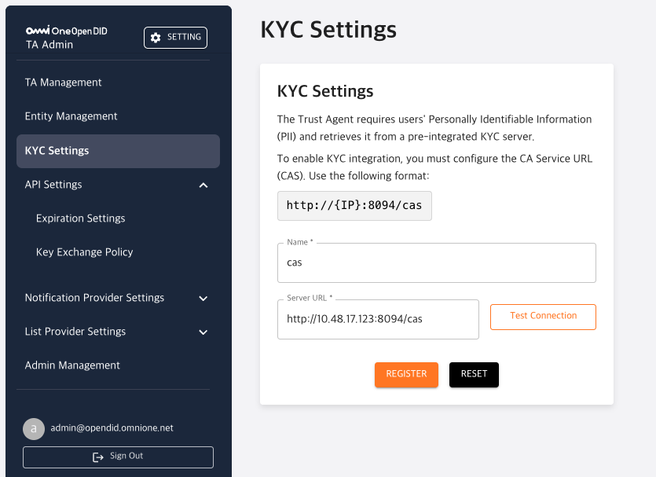

<br/>

> **상세한 등록 절차는 아래 운영 가이드를 참고하세요.**
> - [TA Admin 운영 가이드 - 3.3 KYC Settings](https://github.com/OmniOneID/did-ta-server/blob/release/QA-v2.0.0/docs/admin/OpenDID_TAAdmin_Operation_Guide_ko.md#33-kyc-settings)

<br/>

## 6.2. Issuer 어드민 설정

Issuer 서버에서는 일반 VC 발급 및 ZKP 기반 Credential 발급 기능을 위해 다음과 같은 설정을 사전에 구성해야 합니다.
설정은 Issuer Admin Console의 VC Management 및 ZKP Management 메뉴를 통해 수행되며, 각 항목은 VC 발급 및 ZKP 기반 검증 기능과 직접적으로 연결됩니다.

> **참고사항**
> - 설정 순서는 **ZKP 관련 항목을 먼저 구성**한 뒤, 일반 VC 관련 항목을 설정해야 합니다.  
> - 이는 VC 발급 시 ZKP Credential을 동시에 발급하는 구조이며, VC 발급 프로파일(Issue Profile)에서 사용할 **ZKP Credential Definition을 사전에 지정**해야 하기 때문입니다.

<br/>

### 6.2.1. ZKP Namespace 등록

ZKP Credential 발급을 위해서는 먼저 **ZKP Namespace**를 등록해야 합니다.  
ZKP Namespace는 ZKP Credential에 포함될 속성을 정의하는 단위로, 이후 **ZKP Credential Schema**의 기반이 됩니다.

특히, 일반 VC 발급과 동시에 ZKP Credential도 함께 발급하는 구조이므로,  
VC Issue Profile에서 사용할 ZKP Profile을 미리 구성하기 위해 ZKP Namespace 설정부터 등록해야 합니다.

Demo 테스트에서는 **신분증 정보를 위한 ZKP Credential**을 구성하기 위해 아래와 같은 ZKP Namespace를 등록합니다.

<br/>

**[신분증 Namespace 등록]**

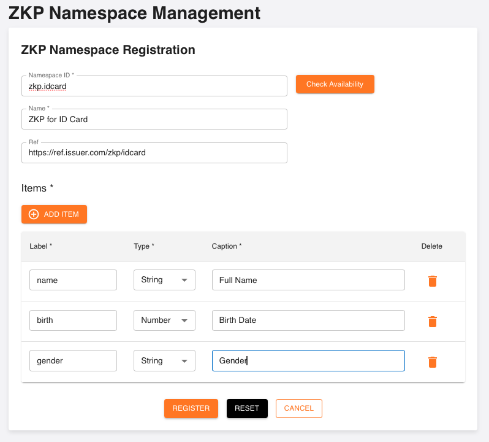

사용자의 신분증 정보를 표현하는 네임스페이스입니다.

<br/>

> **상세한 등록 절차는 아래 운영 가이드를 참고하세요.**
> - [Issuer Admin 운영 가이드 - ZKP Namespace 등록](https://github.com/OmniOneID/did-issuer-server/blob/release/QA-v2.0.0/docs/admin/OpenDID_IssuerAdmin_Operation_Guide_ko.md#-namespace-%EB%93%B1%EB%A1%9D-1)

<br/><br/>

### 6.2.2. ZKP Credential Schema 등록


ZKP Credential을 정의하려면, ZKP Namespace를 기반으로 속성을 구성한 **Credential Schema**를 먼저 등록해야 합니다.  
Credential Schema는 이후 생성할 Credential Definition의 구조를 결정하며, ZKP Profile에서 참조됩니다.

Demo 테스트에서는 앞서 등록한 `zkp.idcard` 네임스페이스를 기반으로 신분증 ZKP Credential Schema를 아래와 같이 등록합니다.

<br/>

**[신분증 ZKP Credential Schema 등록]**

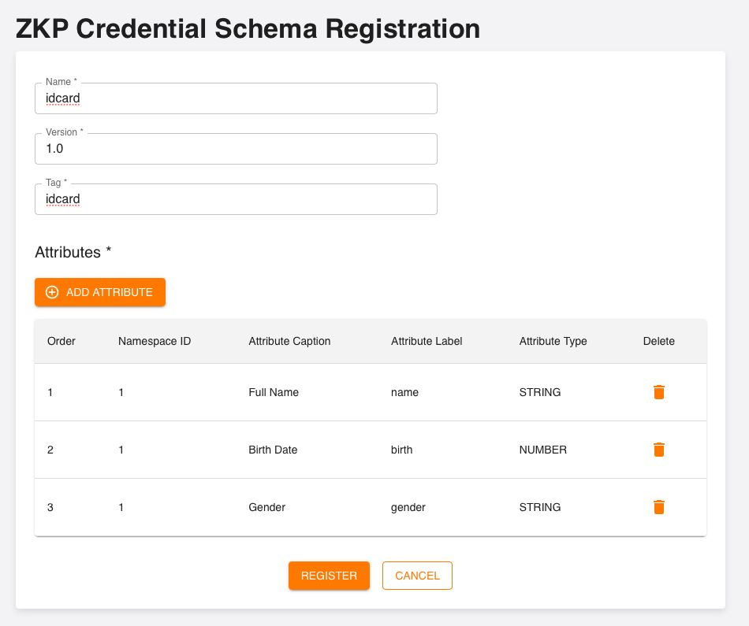

`zkp.idcard` 네임스페이스에서 정의한 속성들을 기반으로 구성한 ZKP Credential Schema입니다.

<br/>

> **상세한 등록 절차는 아래 운영 가이드를 참고하세요.**
> - [Issuer Admin 운영 가이드 - Credential Schema 등록](https://github.com/OmniOneID/did-issuer-server/blob/release/QA-v2.0.0/docs/admin/OpenDID_IssuerAdmin_Operation_Guide_ko.md#-credential-schema-%EB%93%B1%EB%A1%9D)

<br/><br/>


### 6.2.3. ZKP Credential Definition 등록

Credential Definition은 **ZKP Credential을 실제 발급할 수 있도록 준비하는 단계**로, 이전에 생성한 Credential Schema를 기반으로  
**발급 키 쌍(공개키/비공개키)**, **속성-네임스페이스 매핑 정보**, **서명 알고리즘 구성** 등을 포함하는 내부 데이터를 생성합니다.  

Demo 테스트에서는 신분증 Credential Definition을 아래와 같이 등록합니다.

<br/>

**[신분증 ZKP Credential Definition 등록]**

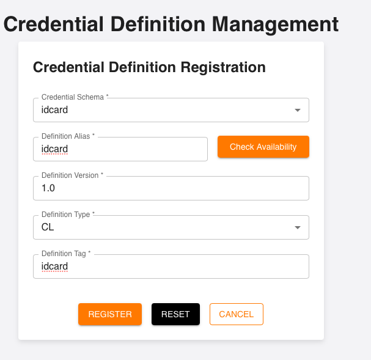

<br/>

> **상세한 등록 절차는 아래 운영 가이드를 참고하세요.**
> - [Issuer Admin 운영 가이드 - Credential Definition 등록](https://github.com/OmniOneID/did-issuer-server/blob/release/QA-v2.0.0/docs/admin/OpenDID_IssuerAdmin_Operation_Guide_ko.md#-credential-definition-%EB%93%B1%EB%A1%9DD)
 
<br/><br/>

### 6.2.4. VC Namespace 등록

VC 발급을 위해서는 먼저 **VC Namespace**를 등록해야 합니다.  
VC Namespace는 VC에 포함될 클레임을 **논리적 그룹 단위로 정의**하는 역할을 하며, 이후 **VC 스키마 등록 시 참조**됩니다.

Demo 테스트를 정상적으로 수행하기 위해서는 아래와 같이 두 개의 VC 네임스페이스를 모두 등록해야 합니다.

<br/>

**[신분증 네임스페이스 등록]**

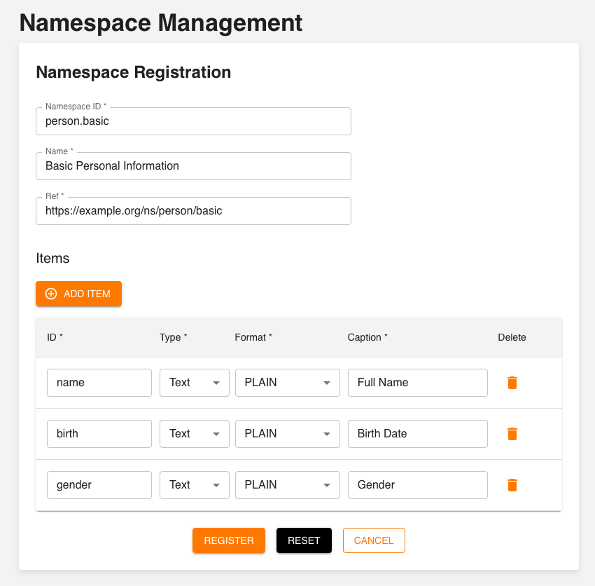

사용자의 신분증 정보를 표현하는 네임스페이스입니다.

<br/>

**[운전면허증 네임스페이스 등록]**

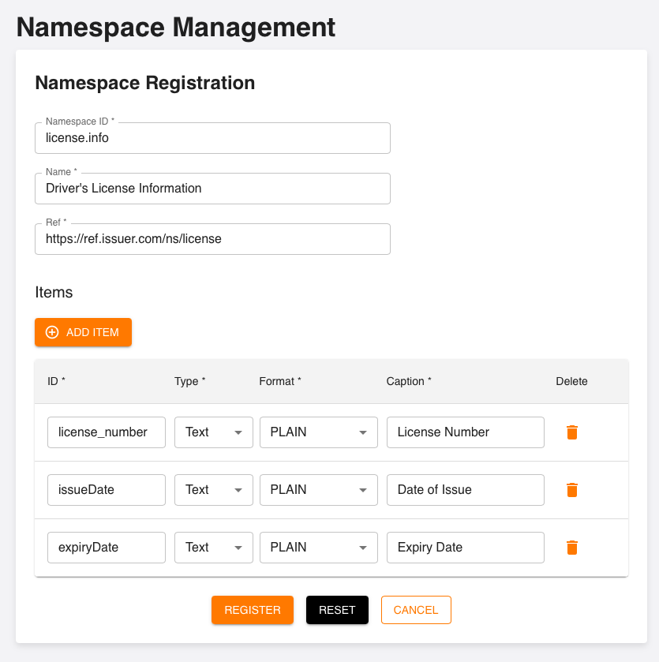

운전면허증 정보를 포함하는 네임스페이스입니다.

<br/>

> **상세한 등록 절차는 아래 운영 가이드를 참고하세요.**
> - [Issuer Admin 운영 가이드 - Namespace 등록](https://github.com/OmniOneID/did-issuer-server/blob/release/QA-v2.0.0/docs/admin/OpenDID_IssuerAdmin_Operation_Guide_ko.md#-namespace-%EB%93%B1%EB%A1%9D)

<br/><br/>

### 6.2.5. VC 스키마 등록

**VC Schema Management** 메뉴에서는 실제 발급될 Verifiable Credential의 데이터 구조를 정의하는 스키마를 등록할 수 있습니다.  
스키마는 앞서 정의한 네임스페이스를 참조하여 구성되며, **Issue Profile**에서 해당 스키마를 기반으로 VC 발급 정책을 설정하게 됩니다.

Demo 테스트를 위해서는 **신분증 VC 스키마**와 **운전면허증 VC 스키마**를 각각 등록해야 합니다.

Demo 테스트를 정상적으로 수행하기 위해서는 아래와 같이 두 개의 VC 스키마를 모두 등록해야 합니다.

**[신분증 VC 스키마 등록]**

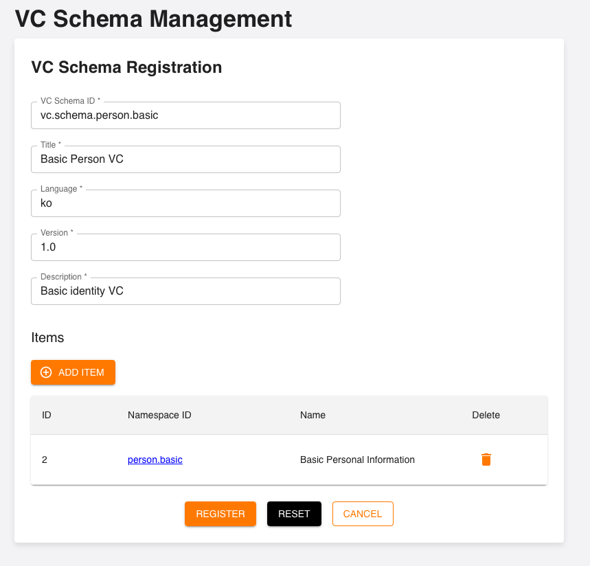

사용자의 이름, 성별, 생년월일 정보를 포함한 기본 신원 VC입니다.

<br/>

**[운전면허증 VC 스키마 등록]**

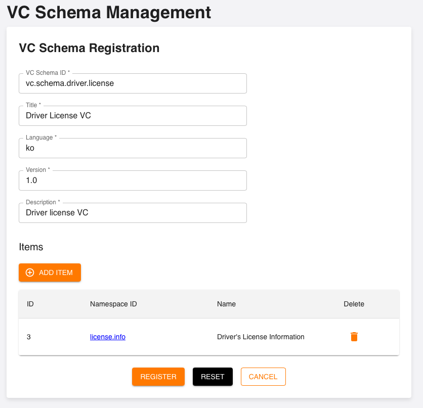

운전면허번호와 발급일자 등의 정보를 포함한 운전 자격 VC입니다.

<br/>

> **상세한 등록 절차는 아래 운영 가이드를 참고하세요.**
> - [Issuer Admin 운영 가이드 - VC Schema 등록](https://github.com/OmniOneID/did-issuer-server/blob/release/QA-v2.0.0/docs/admin/OpenDID_IssuerAdmin_Operation_Guide_ko.md#-vc-schema-%EB%93%B1%EB%A1%9D)

<br/><br/>

### 6.2.6. VC 프로파일 등록

**Issue Profile Management**는 VC 발급 시 사용할 프로파일(Issue Profile)을 정의하고 관리하는 메뉴입니다.  
Issue Profile은 VC Schema와 발급 정책 정보를 하나의 발급 플랜으로 구성하여, 실제 VC 발급 시 참조됩니다.

> **주의사항**   
> ZKP Credential을 함께 발급하려면, 해당 Issue Profile에서 **ZKP 발급 여부를 활성화하고**, Credential Definition을 선택해야 합니다.  
> 따라서 ZKP 관련 설정이 먼저 완료되어 있어야 Issue Profile 구성이 가능합니다.

Demo 테스트에서는 신분증 VC 발급을 위한 Issue Profile을 아래와 같이 구성합니다:

<br/>

**[신분증 VC Issue Profile 등록]**

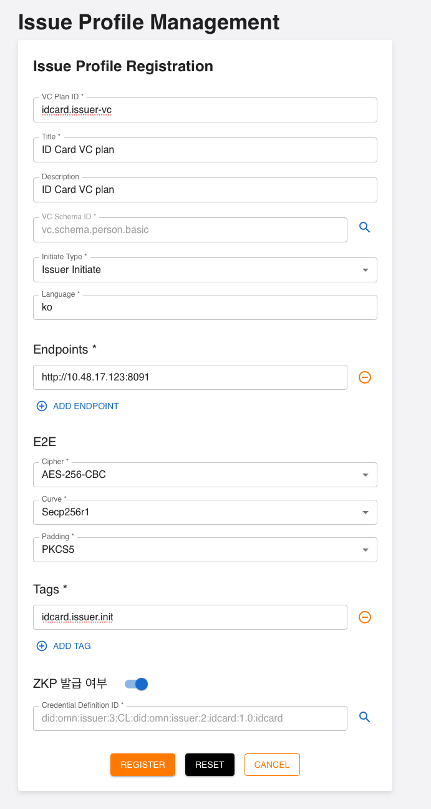

<br/>

- **특징**
  - 일반 VC와 함께 ZKP Credential도 동시에 발급됩니다.
  - Demo 웹사이트를 통해 발급할 수 있습니다.

<br/>

**[운전면허증 VC Issue Profile 등록]**

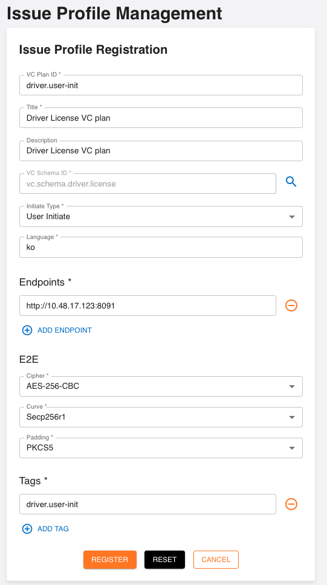

<br/>

- **특징**
  - 일반 VC만 발급되며, ZKP Credential은 포함되지 않습니다.
  - OpenDID 클라이언트 앱을 통해 사용자가 직접 발급을 요청합니다

<br/>

> **상세한 등록 절차는 아래 운영 가이드를 참고하세요.**
> - [Issuer Admin 운영 가이드 - Issue Profile 등록](https://github.com/OmniOneID/did-issuer-server/blob/release/QA-v2.0.0/docs/admin/OpenDID_IssuerAdmin_Operation_Guide_ko.md#-issue-profile-%EB%93%B1%EB%A1%9D)

<br/><br/>

## 6.3. Verifier 어드민 설정 

Verifier 어드민에서는 사용자로부터 제출받은 VP를 검증하기 위한 정책을 사전에 구성해야 합니다.
일반 VC 기반의 VP 제출과 ZKP Credential 기반의 제출을 모두 지원하므로, 각 방식에 맞는 정책을 설정해 두어야 Demo 테스트를 원활하게 수행할 수 있습니다.

### 6.3.1. 서비스 등록

**Service Configuration**은 사용자의 VP 제출 요청을 검증할 **서비스 단위 설정**을 등록하는 항목입니다.  

Verifier는 어떤 서비스에서, 어떤 기기(Device)로, 어떤 제출 방식(Submission Mode)을 통해 들어온 VP를, 어떤 방식(Verification Type, 예: 일반,ZKP)으로 검증할지 사전에 정의해야 합니다.

Demo 테스트에서는 다음과 같은 서비스 등록이 필요합니다:

- **신분증 VC를 검증하는 서비스** (일반 VC 검증)
- **신분증 ZKP Credential을 검증하는 서비스** (ZKP 기반 VP 검증)
- **운전면허증 VC를 검증하는 서비스** (일반 VC 검증)

<br/>

**[신분증 VC를 제출 받는 서비스 등록]**

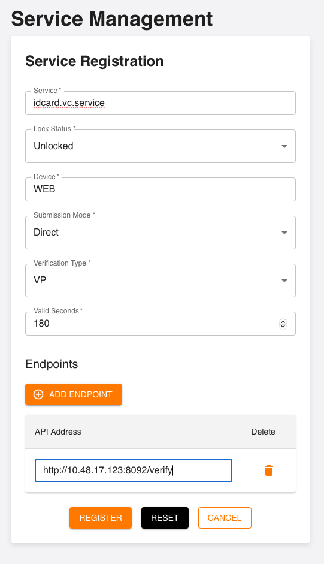

<br/>

**[신분증 ZKP Credential을 제출 받는 서비스 등록]**

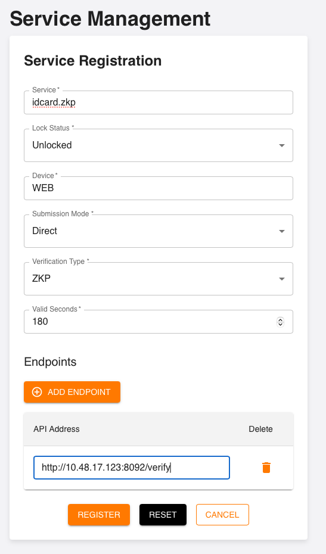

<br/>

**[운전면허증 VC를 제출 받는 서비스 등록]**

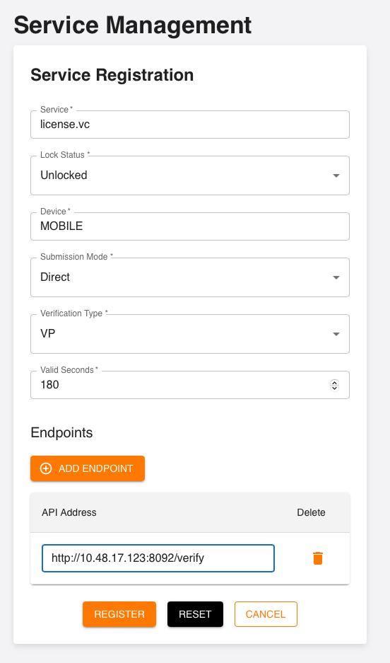

<br/>

> **상세한 등록 절차는 아래 운영 가이드를 참고하세요.**
> - [Verifier Admin 운영 가이드 - 3.2.1.1. Service Register](https://github.com/OmniOneID/did-verifier-server/blob/release/QA-v2.0.0/docs/admin/OpenDID_VerifierAdmin_Operation_Guide_ko.md#3211-service-register)

<br/><br/>

### 6.3.2. VP Filter 등록

**Filter Management** 메뉴에서는 제출된 VP가 특정 조건을 만족하는지 확인하기 위한 **필터 정책**을 정의할 수 있습니다.  
각 필터는 요구되는 클레임(Required Claims), 표시할 클레임(Display Claims), 허용된 발급자(Allowed Issuers) 등을 설정하며, Profile에서 재사용됩니다.

Demo 테스트에서는 다음과 같은 VP Filter 등록이 필요합니다:

<br/>

**[신분증 VP Filer 등록]**

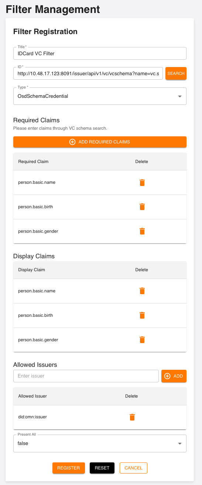

<br/>

**[운전면허증 VP Filer 등록]**

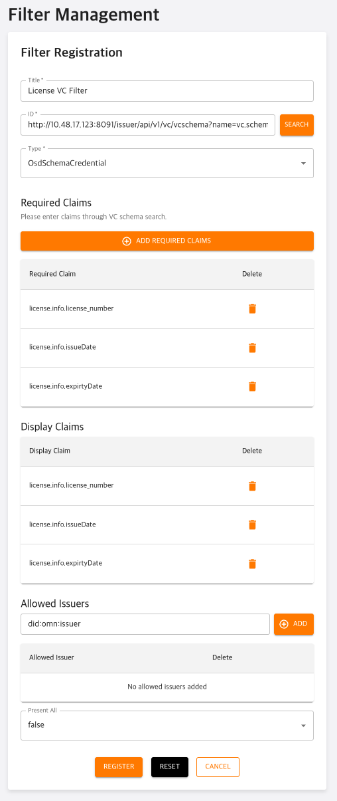

<br/>

> **상세한 등록 절차는 아래 운영 가이드를 참고하세요.**
> - [Verifier Admin 운영 가이드 - 3.2.2.1. Filter Register](https://github.com/OmniOneID/did-verifier-server/blob/release/QA-v2.0.0/docs/admin/OpenDID_VerifierAdmin_Operation_Guide_ko.md#3221-filter-register)

<br/><br/>


### 6.3.3. VP Process 등록

**Process Management** 메뉴에서는 VP 검증 시 사용할 **처리 방식(E2E 암호화, 인증 방식 등)** 을 정의할 수 있습니다.  
정의된 Process는 Filter와 함께 **VP Policy 구성 시 재사용** 됩니다.

Demo 테스트에서는 아래와 같은 프로세스를 1건 등록해두고, 모든 VP 검증 정책에서 재사용할 수 있습니다.

**[기본 Process 등록]**

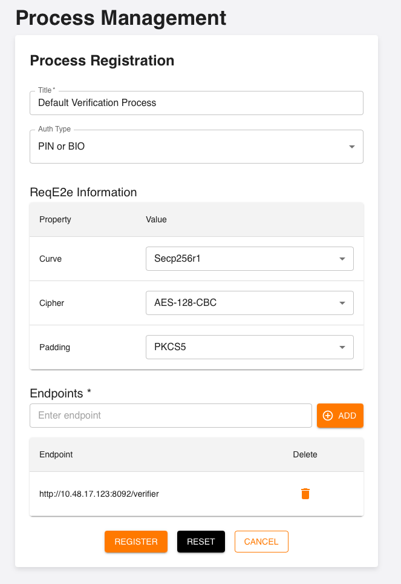

<br/>

> **상세한 등록 절차는 아래 운영 가이드를 참고하세요.**
> - [Verifier Admin 운영 가이드 - 3.2.3.1. Process Register](https://github.com/OmniOneID/did-verifier-server/blob/release/QA-v2.0.0/docs/admin/OpenDID_VerifierAdmin_Operation_Guide_ko.md#3231-process-register)

<br/><br/>

### 6.3.4. VP Profile 등록

Profile Management 메뉴에서는 VP 프로파일 정보를 관리할 수 있습니다.  
프로파일은 앞서 구성한 Filter 및 Process 정보를 참조하여, 특정 검증 목적에 맞는 VP 처리 정책을 구성합니다.

Demo 테스트에서는 아래 두 가지 프로파일을 등록합니다:

<br/>

**[신분증 VP Profile 등록]**

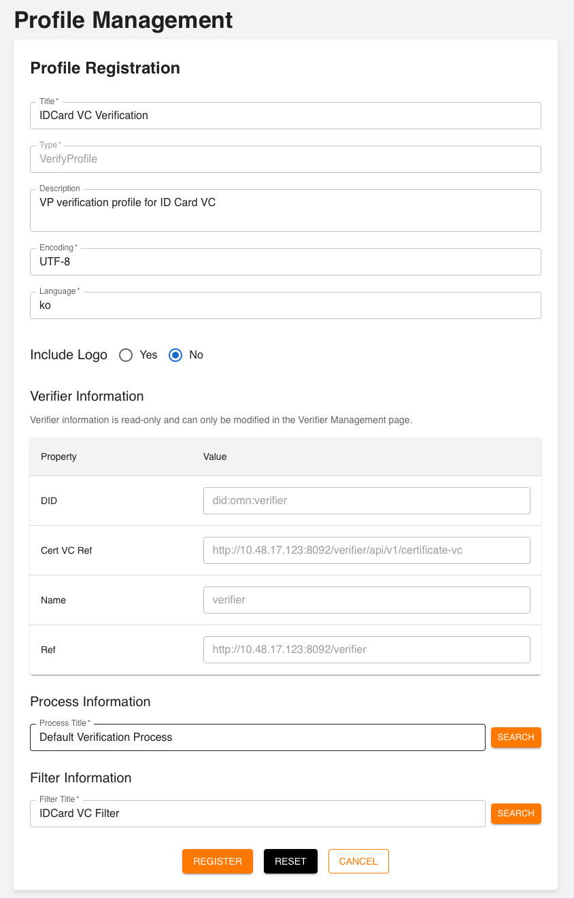

<br/>

**[운전면허증 VP Profile 등록]**

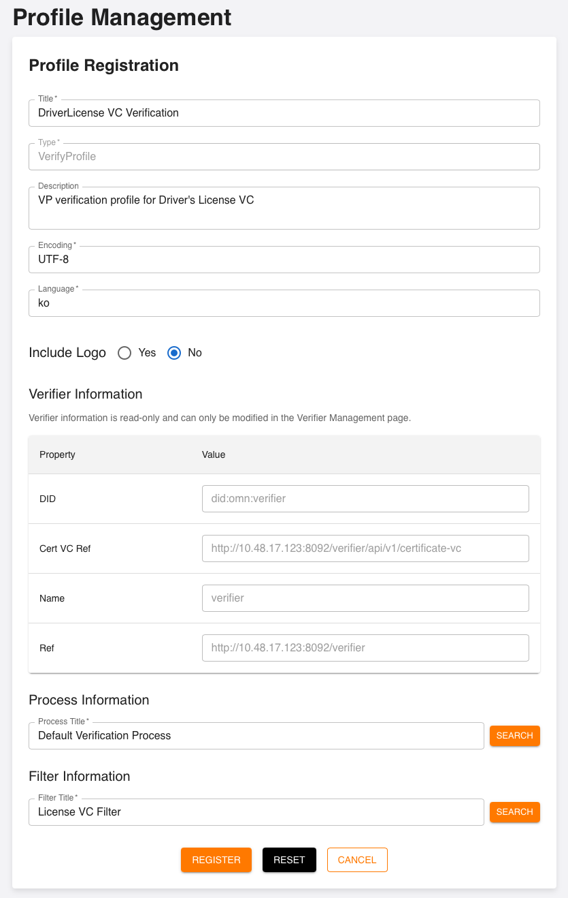

<br/>

> **상세한 등록 절차는 아래 운영 가이드를 참고하세요.**
> - [Verifier Admin 운영 가이드 - 3.2.4.1 Profile Register](https://github.com/OmniOneID/did-verifier-server/blob/release/QA-v2.0.0/docs/admin/OpenDID_VerifierAdmin_Operation_Guide_ko.md#3241-profile-register)

<br/><br/>

### 6.3.5. VP Policy 등록

Policy Management 메뉴에서는 전체 VP 정책을 통합 관리할 수 있습니다.  
VP 제출 시 적용할 프로파일과 서비스 설정을 연결하여, 실질적인 검증 정책으로 구성합니다.

Demo 테스트에서는 신분증과 운전면허증 제출을 위한 다음 두 가지 정책을 등록해야 합니다:

<br/>

**[신분증 VP Policy 등록]**

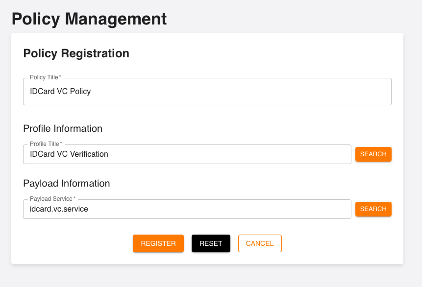

<br/>

**[운전면허증 VP Policy 등록]**

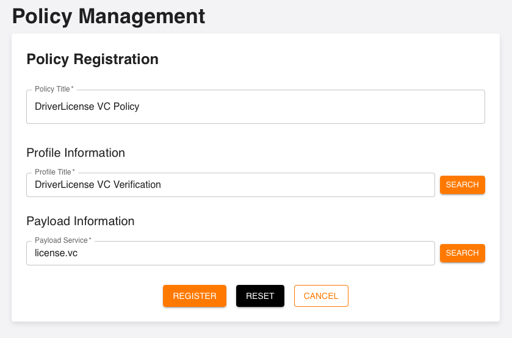

<br/>

> **상세한 등록 절차는 아래 운영 가이드를 참고하세요.**
> - [Verifier Admin 운영 가이드 - 3.2.5.1 Policy Register](https://github.com/OmniOneID/did-verifier-server/blob/release/QA-v2.0.0/docs/admin/OpenDID_VerifierAdmin_Operation_Guide_ko.md#3251-policy-register)

<br/><br/>

### 6.3.6. ZKP Proof Requeset 등록

Proof Request는 검증자가 증명자(사용자)에게 요구하는 증명 조건을 정의하는 항목입니다.  
ZKP Credential의 속성(Attributes)이나 조건(Predicates)에 기반하여 필요한 증명을 요청할 수 있습니다.

Demo 테스트에서는 신분증 ZKP Credential을 검증하기 위한 Proof Request를 아래와 같이 등록해야 합니다:

<br/>

**[신분증 ZKP Credential Proof Request 등록]**

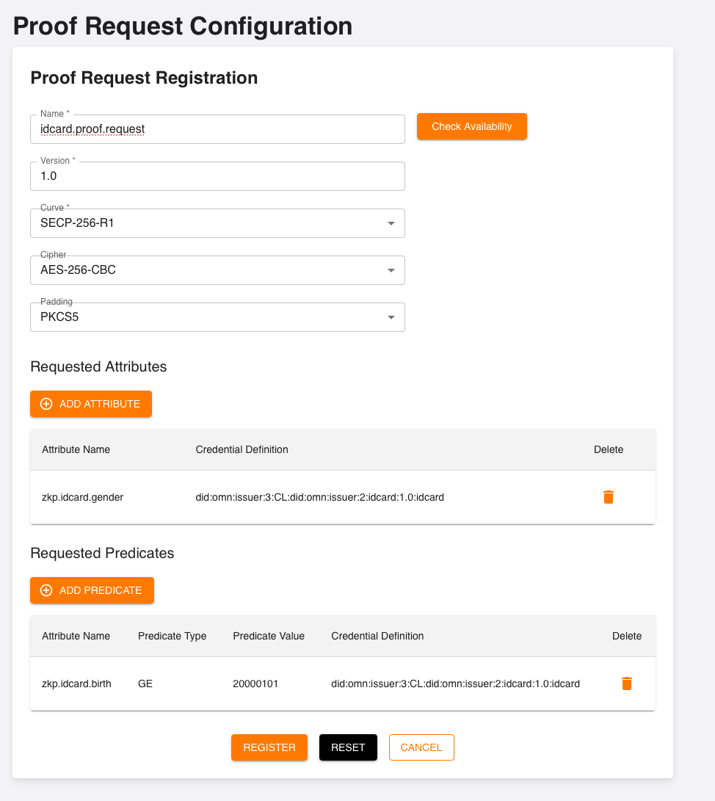

<br/>

> **상세한 등록 절차는 아래 운영 가이드를 참고하세요.**
> - [Verifier Admin 운영 가이드 - 3.3.1.1 Proof Request Register](https://github.com/OmniOneID/did-verifier-server/blob/release/QA-v2.0.0/docs/admin/OpenDID_VerifierAdmin_Operation_Guide_ko.md#3311-proof-request-register)


<br/><br/>

### 6.3.7. ZKP Profile 등록

ZKP Profile은 Verifier가 ZKP 기반 증명을 검증할 때 사용할 **검증 프로파일**입니다.  
해당 프로파일에는 사용할 Proof Request와 출력 형식(언어, 인코딩 등)에 대한 정보가 포함되며,  
ZKP 기반의 VP 제출 시 이 프로파일을 참조하여 검증을 수행합니다.

Demo 테스트에서는 신분증 ZKP Profile을 아래와 같이 등록해야 합니다:

<br/>

**[신분증 ZKP Profile 등록]**

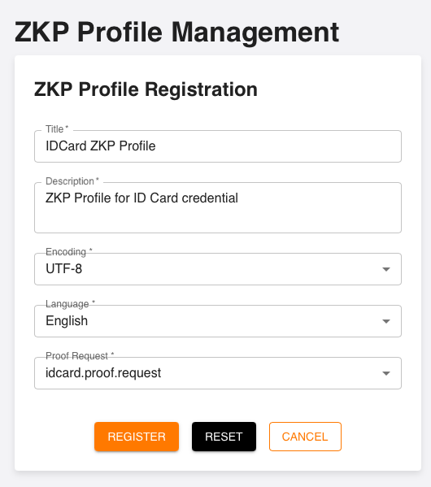

<br/>

> **상세한 등록 절차는 아래 운영 가이드를 참고하세요.**
> - [Verifier Admin 운영 가이드 - 3.3.1.1 Proof Request Register](https://github.com/OmniOneID/did-verifier-server/blob/release/QA-v2.0.0/docs/admin/OpenDID_VerifierAdmin_Operation_Guide_ko.md#3321-zkp-profile-register)

<br/><br/>


### 6.3.8. ZKP Policy 등록

**ZKP Policy Management** 메뉴에서는 ZKP 기반 VP 제출에 대한 최종 검증 정책을 등록할 수 있습니다.  
ZKP Policy는 하나의 ZKP 프로파일과, 해당 증명을 적용할 서비스(Payload)를 연결하여 구성됩니다.  
Demo 테스트에서는 ZKP 방식으로 제출되는 신분증 Credential의 검증을 위한 정책을 등록해야 합니다.

Demo 테스트에서는 신분증 ZKP Profile을 아래와 같이 등록해야 합니다:

<br/>

**[신분증 ZKP Policy 등록]**

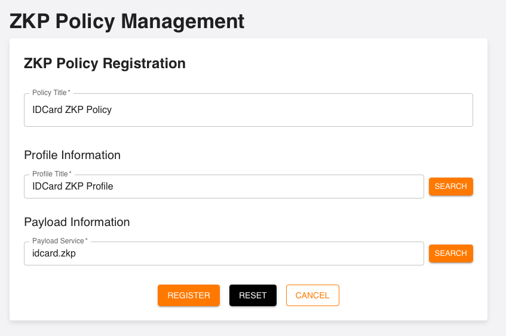

<br/>

> **상세한 등록 절차는 아래 운영 가이드를 참고하세요.**
> - [Verifier Admin 운영 가이드 - 3.3.1.1 Proof Request Register](https://github.com/OmniOneID/did-verifier-server/blob/release/QA-v2.0.0/docs/admin/OpenDID_VerifierAdmin_Operation_Guide_ko.md#3331-zkp-policy-register)

<br/><br/>

# 7. OpenDID 테스트 가이드

이 장에서는 OpenDID의 주요 기능인 사용자 등록, VC 발급, VP 제출 과정을 Demo 환경에서 테스트하는 방법을 안내합니다.  
테스트는 Web 기반의 **OpenDID Demo 페이지**와 모바일 **OpenDID App**을 함께 사용하여 진행됩니다.

Demo 페이지를 통해 다양한 VC 발급 시나리오와 VP 제출 흐름을 직접 확인할 수 있으며,  
이를 통해 OpenDID 시스템의 전체 동작 과정을 직관적으로 이해할 수 있습니다.

> **주의**   
> 본 장의 테스트는 **6장의 Admin 설정이 모두 완료된 상태**를 전제로 합니다.  
> Admin 설정이 미완료되었거나 일부 VC Plan/Policy가 누락되었을 경우, 테스트가 정상적으로 진행되지 않을 수 있습니다.

아래는 Demo 메인 화면입니다.

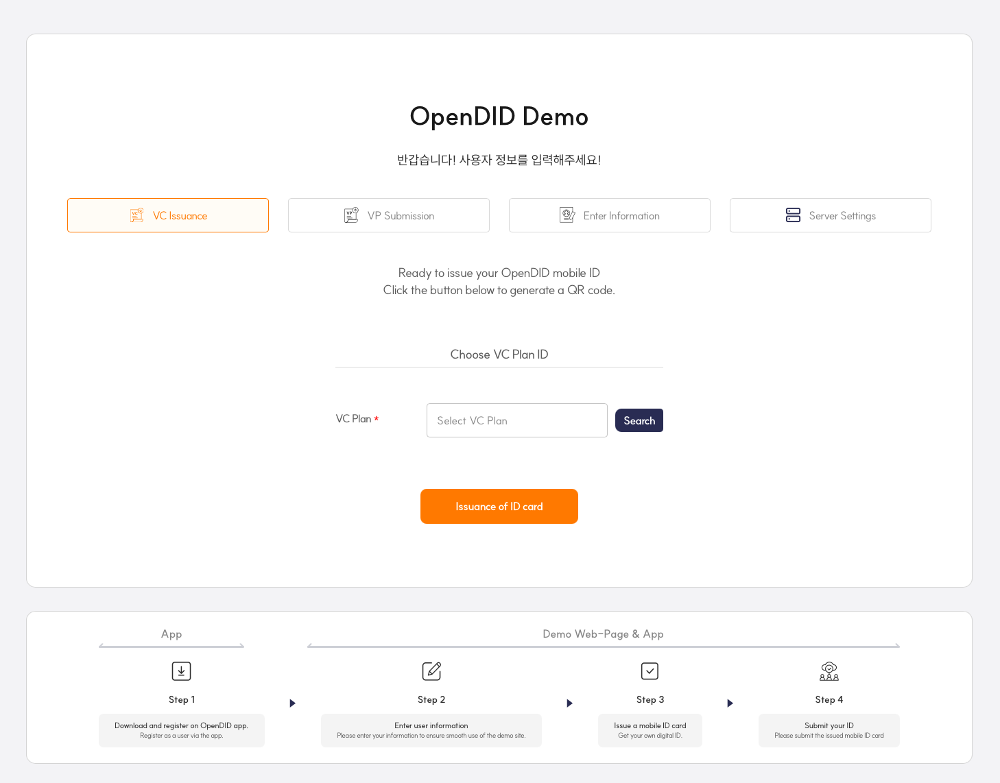

<br/>

## 7.1. 데모 환경 설정

Demo 페이지를 통해 VC 발급 및 VP 제출 기능을 테스트하기 위해서는, 
해당 페이지에서 **서버 정보** 및 **사용자 정보**를 먼저 설정해야 합니다.  

이 장에서는 Demo 테스트를 위한 기본 환경 구성 절차를 안내합니다.  
설정 저장 후에는 Demo 서버를 반드시 재시작해야 정상적으로 동작합니다.

### 7.1.1. 서버 정보 설정

Demo 환경에서 VC 발급 및 VP 제출을 정상적으로 테스트하려면, **TAS / Issuer / CA / Verifier 서버의 주소를 정확히 입력**해야 합니다.  
해당 정보는 Demo 페이지의 **Server Settings** 탭에서 설정할 수 있습니다.

> **주의사항**  
> - 서버 정보를 저장한 후에는 Demo 서버를 **재구동**해야 설정이 적용됩니다.  
>   (향후에는 재구동 없이 적용될 수 있도록 개선 예정입니다.)

아래는 모든 서버 정보를 입력한 화면입니다.

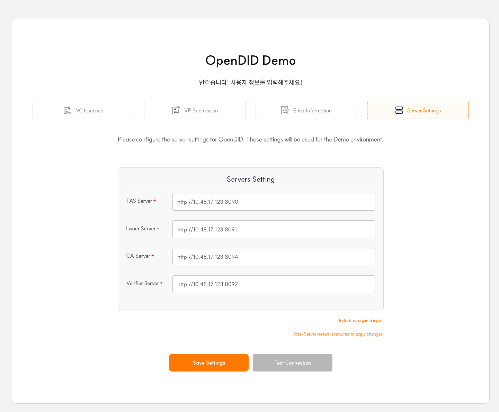

<br/><br/>

### 7.1.2. 사용자 정보 입력  

VC 및 ZKP Credential 발급을 위해 Demo 페이지에서는 사용자 정보를 먼저 입력해야 합니다.  
이 정보는 이전에 Issuer Admin Console에서 설정한 **VC 스키마** 및 **ZKP Credential 스키마**의 구조를 기반으로 구성되며,  
각 클레임에 해당하는 값을 사용자가 직접 입력합니다.

아래는 모든 사용자 정보 및 클레임을 입력한 화면입니다:

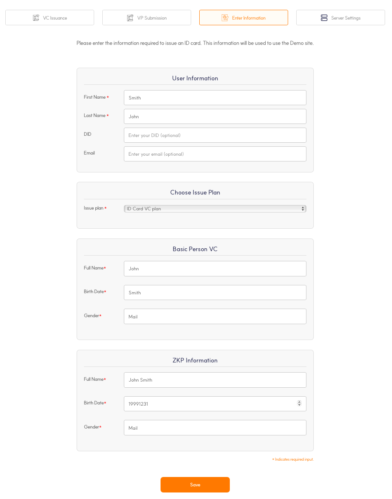

<br/><br/>

## 7.2. 사용자 등록 테스트

사용자 등록은 DID CA 앱을 처음 실행할 때 자동으로 수행되는 과정입니다. 이 과정에서는 두 가지 등록이 순차적으로 이루어집니다:

1. 월렛 등록: 사용자가 사용할 디지털 월렛의 DID Document를 OpenDID 시스템에 등록
2. 사용자 등록: 사용자의 DID Document를 OpenDID 시스템에 등록

각각의 등록 과정에서 해당하는 DID Document가 생성되어 Open DID 시스템에 등록됩니다.


### 7.2.1. 테스트 방법

1. `DID CA` 앱을 실행합니다.
   
2. ‘setting up your wallet’ 문구가 표시되며, 앱이 자동으로 월렛을 생성하고 OpenDID 시스템에 등록하는 과정이 시작됩니다.  
   이 과정은 사용자 입력 없이 자동으로 완료됩니다.


<br/>

3. 'Open DID Wallet' 화면이 나타나며, 사용자의 등록 과정을 단계별로 안내해 줍니다. 현재 Step 1을 진행 중임을 확인하고, `Next` 버튼을 클릭합니다.

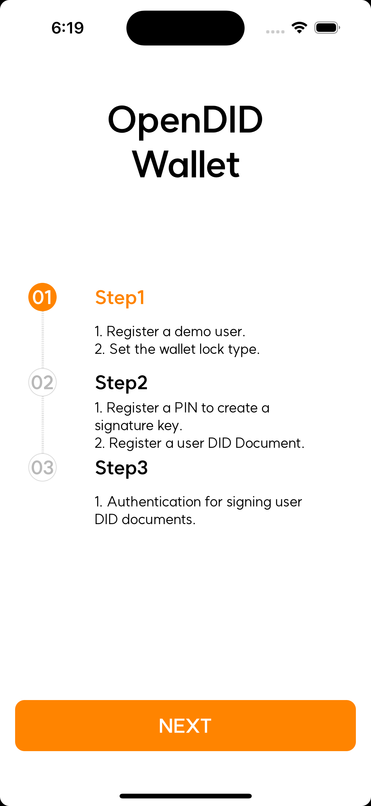

<br/>

4. ‘User Information’ 화면에서 사용자의 정보를 입력합니다.  
   이때, [7.1.2. 사용자 정보 입력](#712-사용자-정보-입력)에서 설정한 이름과 동일하게 입력해야 합니다.

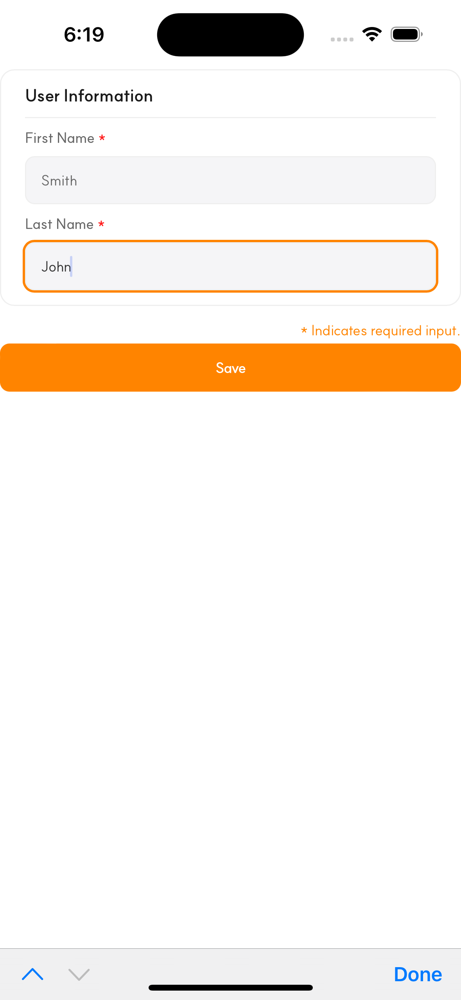

<br/>

5. 사용자의 정보를 입력하고 `Save` 버튼을 클릭합니다.

6. 'Would you like to set the Wallet for lock type?' 라는 문구의 팝업이 화면에 나타나며, 월렛을 잠금 모드로 설정할지 물어봅니다. 여기에서는 `YES` 버튼을 클릭합니다.

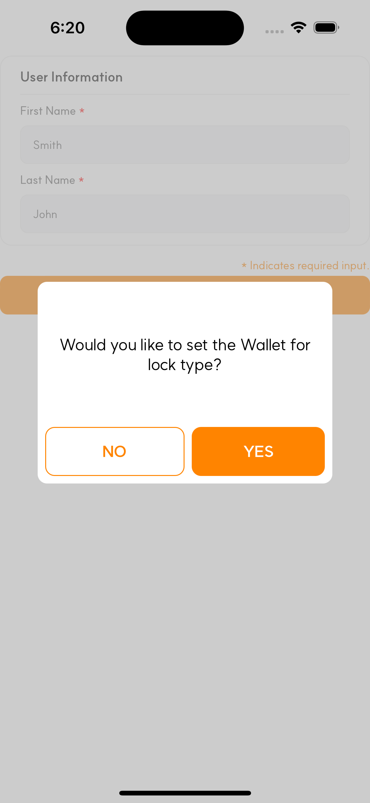

<br/>

7. 'Please register a Lock/Unlock PIN' 문구가 표시되며 월렛 잠금 비밀번호를 입력하는 화면이 나타납니다. 6자리의 숫자를 입력하며, 확인을 위해 한 번 더 동일한 6자리 숫자를 입력합니다.

8. 'Open DID Wallet' 화면이 나타나며 현재 Step 2가 진행 중임을 확인합니다. `Next` 버튼을 클릭합니다.

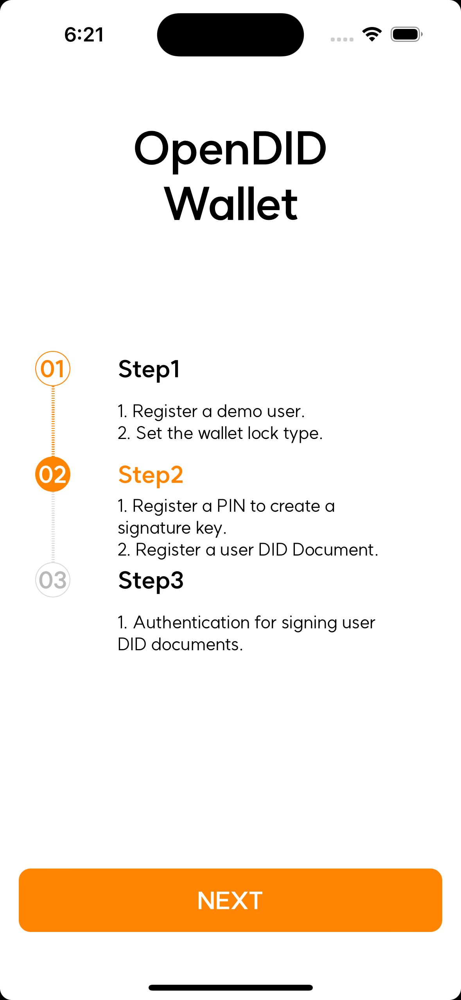

<br/>

9. 'Please input a PIN' 문구가 표시되며 PIN을 등록하는 화면이 나타납니다. 6자리의 숫자를 입력하며, 확인을 위해 한 번 더 동일한 6자리 숫자를 입력합니다.

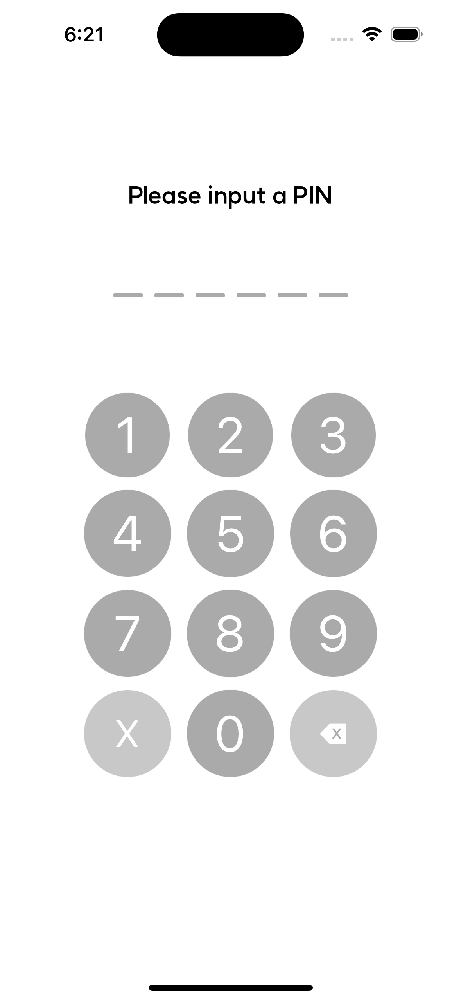

<br/>

10.  'Would you like to additionally register biometric authentication?' 문구의 팝업이 화면에 나타나며, 추가로 생체인증을 등록할지 물어보니다. 여기에서는 `YES` 버튼을 클릭합니다.

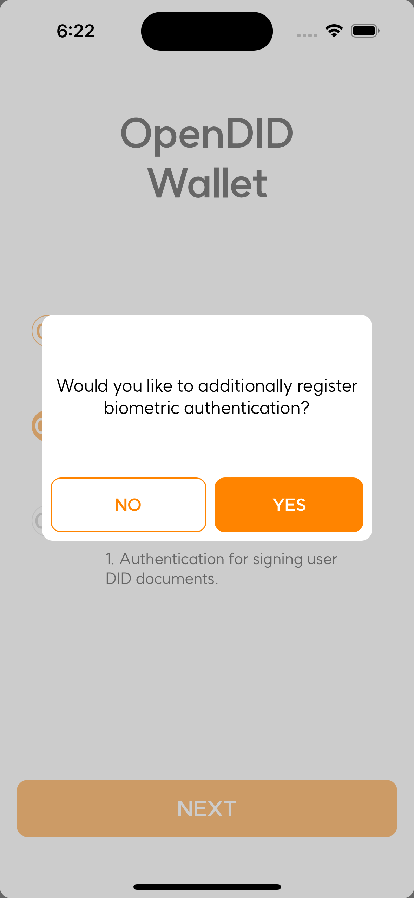

<br/>

11. 앱 OS에서 지문을 입력하는 팝업이 나타납니다. 지문을 입력하여 등록합니다.

12. 'Open DID Wallet' 화면이 나타나며 현재 Step 3가 진행 중임을 확인합니다. `Next` 버튼을 클릭합니다.

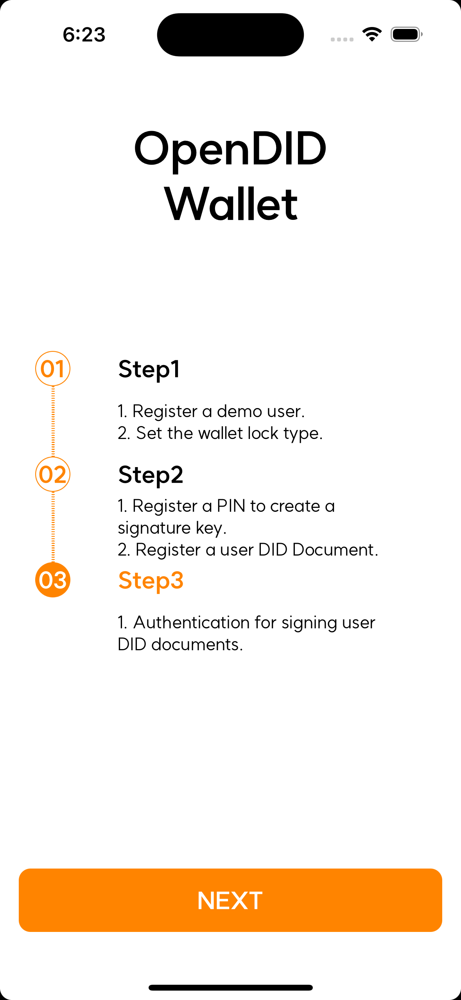

<br/>

13. 'Please input a PIN' 문구가 표시되며 PIN 키를 입력하는 화면이 나타납니다. 6자리의 숫자를 입력합니다.


15. 앱 OS에서 지문을 입력하는 팝업이 나타납니다. 지문을 입력합니다.
    
16. 메인 페이지로 이동한 후, 아직 등록된 VC가 없음을 확인합니다. 화면에는 'No certificate has been issued.'라는 문구가 출력됩니다.
   
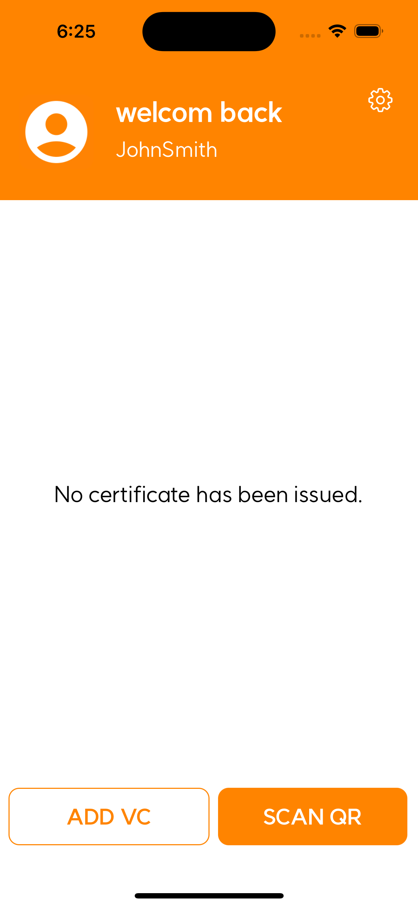

<br/><br/>

## 7.2. VC 발급 테스트

OpenDID 시스템에서는 Verifiable Credential(VC)을 발급받는 방식이 두 가지로 나뉩니다.

- **Issuer 시작 방식**: VC 발급이 Issuer 측에서 시작되며, 사용자는 App으로 Issuer가 제공하는 QR 코드를 스캔하여 VC 발급을 시작합니다.
- **User 시작 방식**: VC 발급이 사용자 측에서 시작되며, 사용자가 앱에서 직접 VC 발급을 시작합니다.

이번 장에서는 데모 환경에서 사용되는 대표 VC 두 가지를 각각 다른 방식으로 발급받는 과정을 테스트합니다.

- **신분증 VC**는 **Issuer 시작 방식**으로 발급됩니다. 데모에서는 관리자가 Admin Console에서 발급용 QR을 생성하여 사용자에게 제공합니다.
- **운전면허증 VC**는 **User 시작 방식**으로 발급됩니다. 사용자는 앱에서 운전면허증 VC를 선택하고 직접 발급을 요청합니다.

> 참고: 신분증 VC를 발급받는 과정에서는 해당 VC를 기반으로 하는 **ZKP Credential**도 함께 발급되며, 이는 이후 ZKP 기반 검증에 사용됩니다.

이제 각각의 VC에 대한 발급 절차를 테스트해보겠습니다.

<br/>

### 7.2.1. 운전면허증 VC 발급 테스트

1. `DID CA` 앱을 실행합니다. 월렛이 잠금모드로 설정되어 있는 경우, PIN 입력 화면이 나타납니다. 잠금을 해제하기 위해 6자리의 숫자를 입력합니다.

2. 화면 하단의 `ADD VC` 버튼을 클릭합니다.


<br/>

3. 'Add Verifiable Credentials' 화면이 나타나며, 발급 가능한 VC를 선택할 수 있습니다. 'Drivier License VC plan'를 선택합니다.

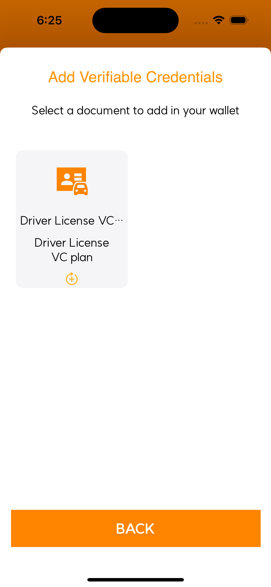

<br/>

4. 'Issuance certificate Information' 화면이 나타나며 발급받을 VC에 대한 정보가 출력됩니다. `OK` 버튼을 클릭합니다.</br>

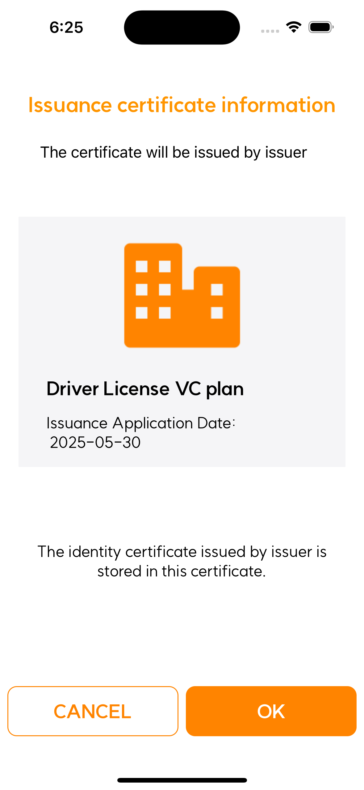

<br/>

5. 'Driver License VC' 화면이 나타나며 클레임을 직접 입력할 수 있습니다. 모든 클레임을 입력한 후 `Save` 버튼을 클릭합니다.

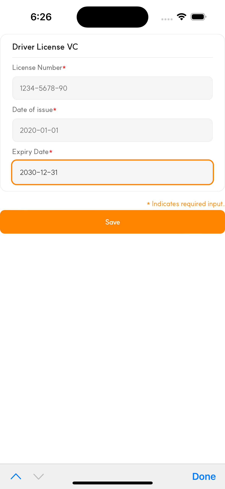

<br/>

6. 지문 인증 또는 'Please input a PIN' 문구가 표시되며 PIN 키를 입력하는 화면이 나타나며, 사용자 인증을 진행합니다.

7. 'Success" 문구가 표시되며 VC가 발급 성공했음을 확인합니다. `OK` 버튼을 클릭합니다.


<br/>

8. 메인 페이지로 이동한 후, 등록한 Driver License ID VC가 화면에 표시된 것을 확인합니다.

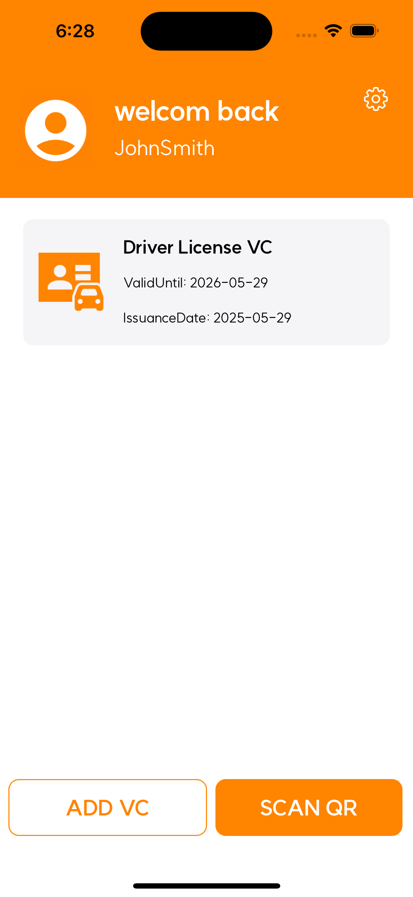

<br/>

9. 해당 운전면허증 VC를 클릭하여 상세 클레임 정보를 확인할 수 있습니다.

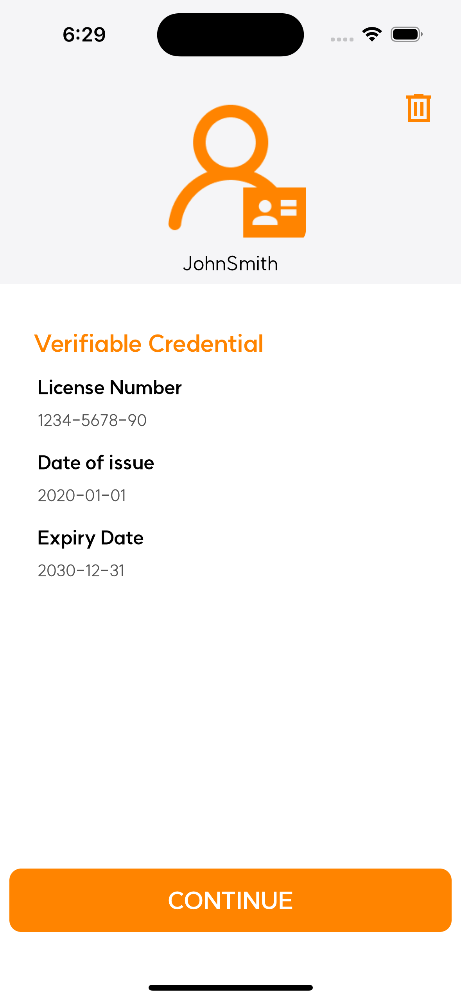

<br/><br/>

### 7.2.2. 신분증 VC 발급 테스트

1. 웹 브라우저에서 데모 서버의 메인 페이지에 접속하고, `VC Issuance` 탭 메뉴를 선택합니다.

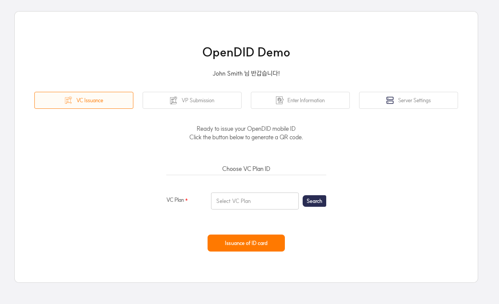

<br/>

2. `Search` 버튼을 클릭하고 Select VC Plan 팝업에서 `ID Card VC plan`을 서택한 후 `Select` 버튼을 클릭합니다.

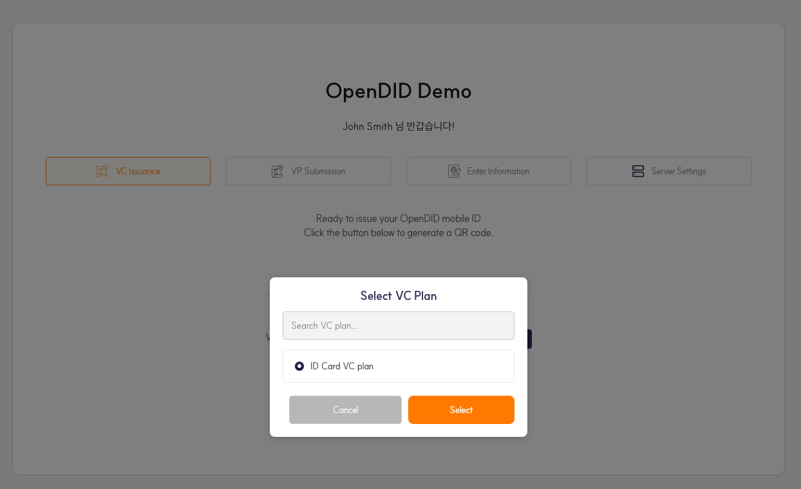

<br/>

3. `Issuance of ID card` 버튼을 클릭합니다.

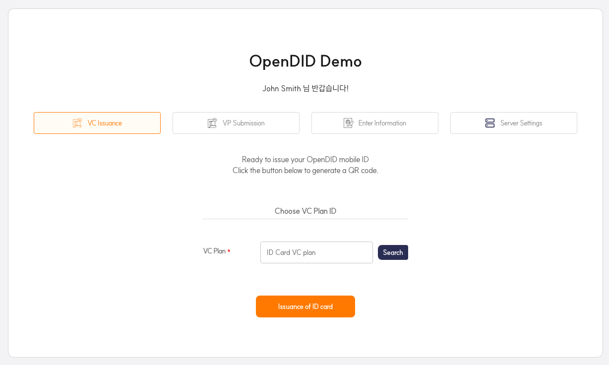

<br/>

4. `Issue with QR` 팝업이 나타난 것을 확인합니다.

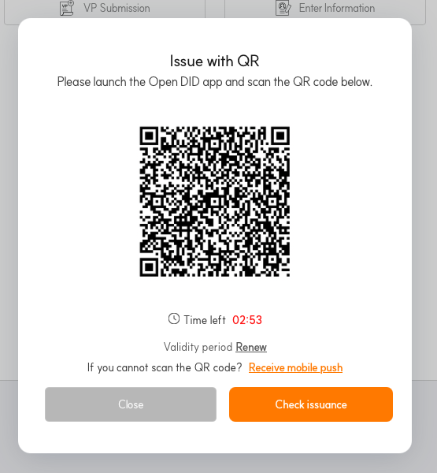

<br/>

5. `DID CA` 앱을 실행합니다. 월렛이 잠금모드로 설정되어 있는 경우, PIN 입력 화면이 나타납니다. 잠금을 해제하기 위해 6자리의 숫자를 입력합니다.

6. 화면 하단의 SCAN QR 버튼을 클릭합니다.


<br/>

7. 휴대폰의 카메라 화면이 활성화되면, QR 코드를 스캔합니다.

8. 'Issuance certificate Information' 화면이 나타나며 발급받을 VC에 대한 정보가 출력됩니다. `OK` 버튼을 클릭합니다.

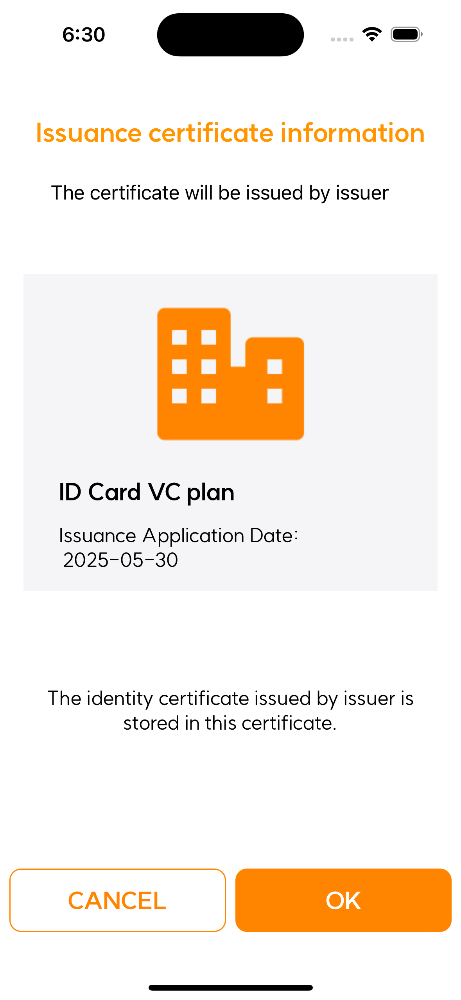

<br/>

9. 지문 인증 또는 'Please input a PIN' 문구가 표시되며 PIN 키를 입력하는 화면이 나타나며, 사용자 인증을 진행합니다.

10. 'Success" 문구가 표시되며 VC가 발급 성공했음을 확인합니다. `OK` 버튼을 클릭합니다.

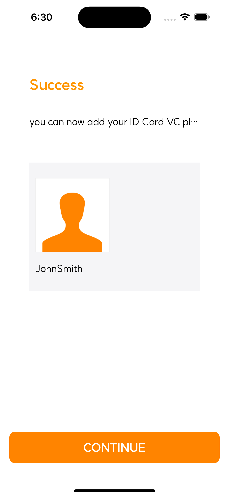

<br/>

11.  메인 페이지로 이동한 후, 등록한 신분증 VC가 화면에 표시된 것을 확인합니다. `ZKP included`라는 문구가 함께 표시되며, ZKP Credential도 같이 발급된 것을 확인할 수 있습니다.

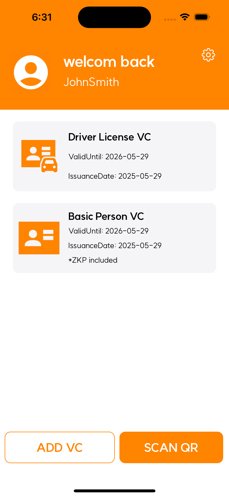

<br/>

12. 해당 신분증 VC를 클릭으로 상세 클레임 정보를 확인할 수 있습니다.

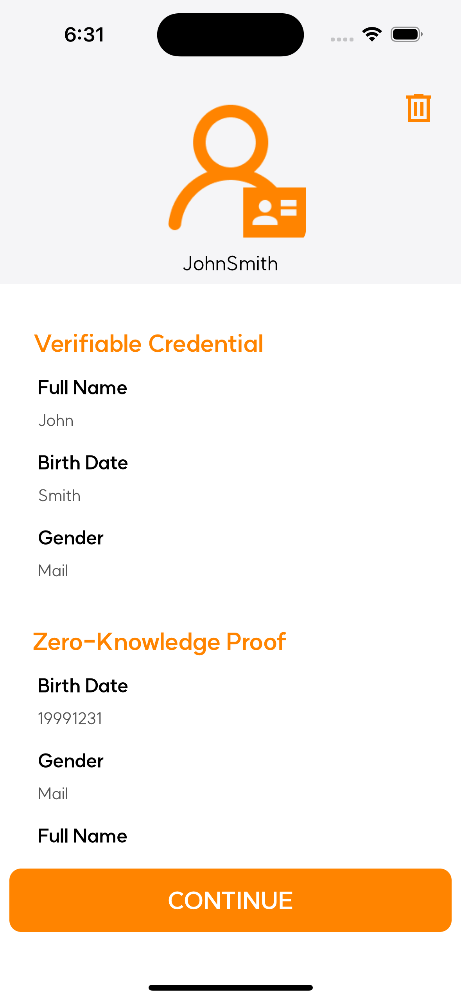

<br/>

13. 데모 서버의 'Issue with QR' 팝업에서 Check issuance 버튼을 클릭합니다.

14. 발급이 완료되었다는 팝업이 나타납니다. `확인` 버튼을 클릭합니다.

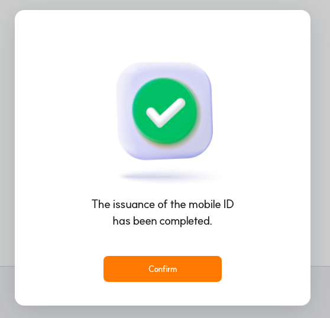

<br/><br/>


## 7.3. VP 제출 테스트

Verifiable Presentation(VP)은 사용자가 소지하고 있는 Verifiable Credential(VC)을 제3자에게 제출하는 방식으로, 인증이나 검증 등의 상황에서 사용됩니다.

이 장에서는 앞서 발급받은 세 종류의 VC를 사용하여 VP를 제출하는 과정을 테스트합니다:

- 신분증 VC
- 신분증 ZKP Credential
- 운전면허증 VC

현재 데모 환경에서는 **데모에서 제공한 QR 코드를 앱에서 스캔하는 방식으로만 VP 제출이 가능합니다**.  
따라서, 사용자는 앱에서 QR을 스캔한 후, 요구된 VC나 ZKP Credential을 선택하여 VP를 생성하고 제출하게 됩니다.

<br/>

### 7.3.1. 신분증 ZKP Credential 제출

1. 웹 브라우저에서 데모 서버의 메인 페이지에 접속하고, `VP Submission` 탭 메뉴를 선택합니다.

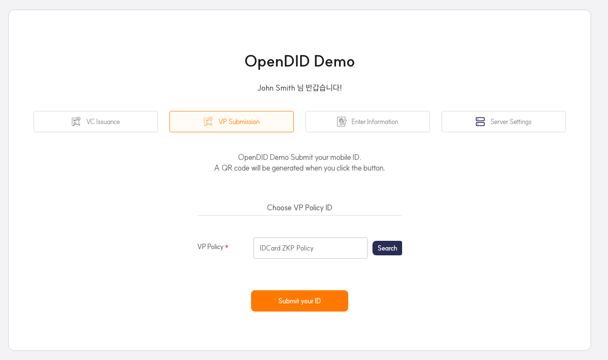

<br/>

2. `Search` 버튼을 클릭하고 Select VC Plan 팝업에서 `IDCard ZKP Policy`을 서택한 후 `Select` 버튼을 클릭합니다.

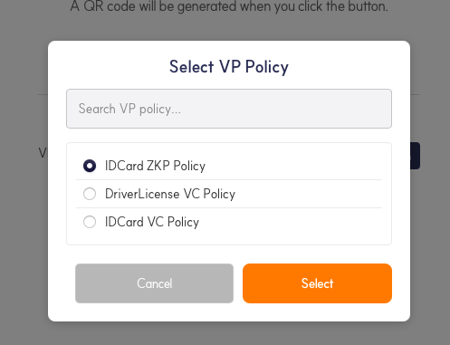

<br/>

3. `Submit your ID` 버튼을 클릭합니다.

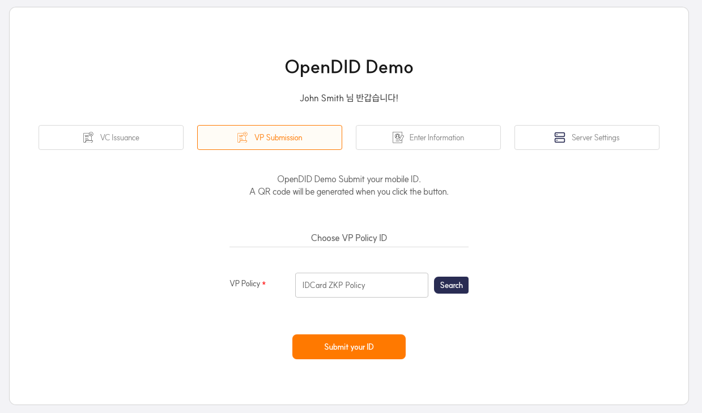

<br/>

4. `Submit a certificate` 팝업이 나타난 것을 확인합니다.

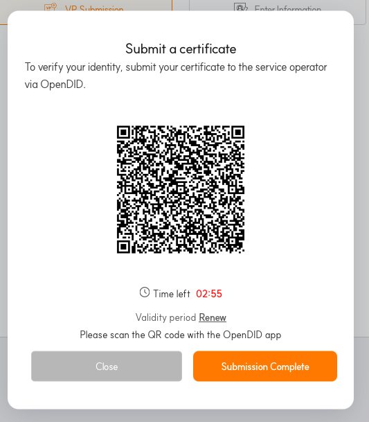

<br/>

5. `DID CA` 앱을 실행합니다. 월렛이 잠금모드로 설정되어 있는 경우, PIN 입력 화면이 나타납니다. 잠금을 해제하기 위해 6자리의 숫자를 입력합니다.

6. 화면 하단의 SCAN QR 버튼을 클릭합니다.


<br/>

7. 휴대폰의 카메라 화면이 활성화되면, QR 코드를 스캔합니다

8. 'Certificate submission guide' 화면이 나타나며 발급받은 VC에 대한 정보가 출력되고 하단에는 요구받은 Claim에 대한 목록이 노출됩니다. `OK` 버튼을 클릭합니다.

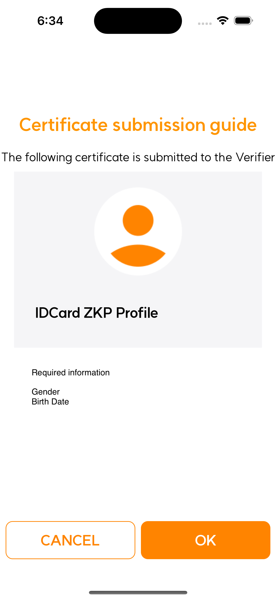

<br/>

9. 각 클레임을 선택하여 제출 여부를 설정합니다. `눈` 아이콘을 클릭하면 해당 항목을 숨길 수 있습니다. 

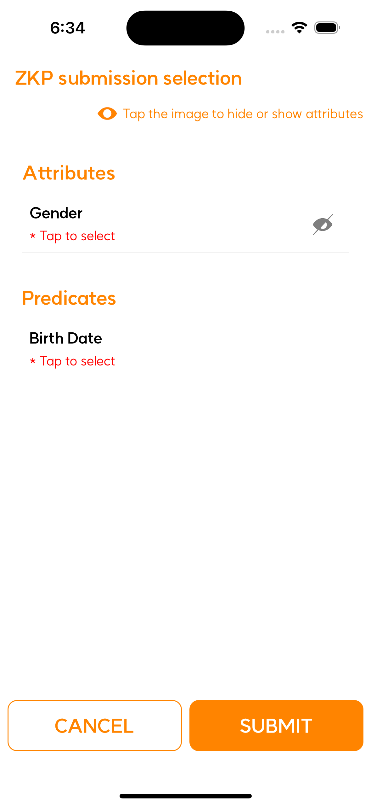

<br/>

10. 제출할 클레임을 선택하면 해당 항목의 실제 값을 확인할 수 있는 선택 창이 나타납니다.

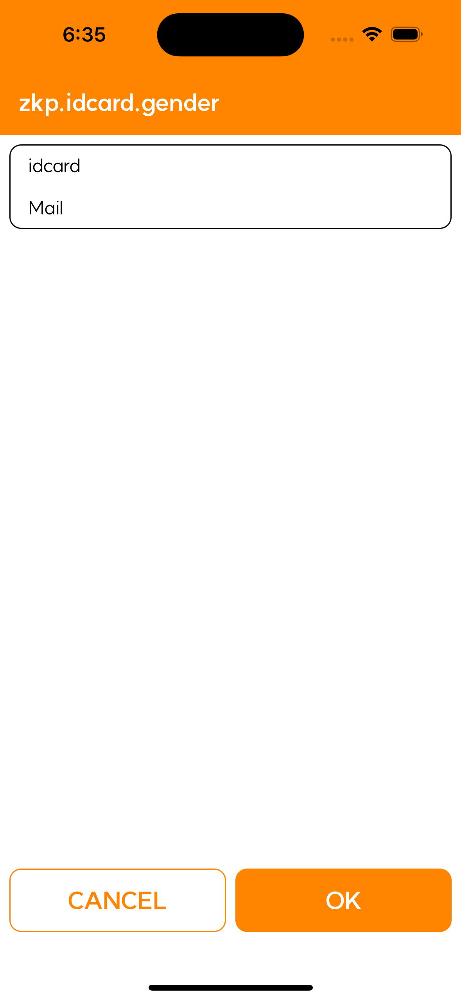

<br/>

11.  제출할 모든 클레임을 선택했다면, 화면 하단의 `SUBMIT` 버튼을 클릭하여 VP를 제출합니다.


<br/>


12. 'Select submission verification method' 화면이 나타나고, PIN, BIO를 선택하여 방식에 맞는 인증방식에 인증을 시도합니다.

13. 제출을 완료하면 `Certificate submitted` 화면이 표시됩니다.  


14. 데모 서버의 `Submittion a certificate` 팝업에서 `Submittion Complete` 버튼을 클릭합니다.

15. 제출이 완료되었다는 팝업이 나타납니다. `Confirm` 버튼을 클릭합니다.

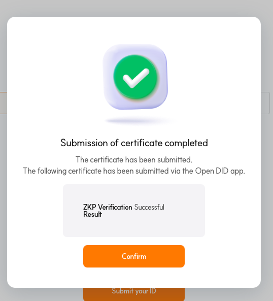

<br/><br/>

### 7.3.2. 신분증 VP 제출

1. 웹 브라우저에서 데모 서버의 메인 페이지에 접속하고, `VP Submission` 탭 메뉴를 선택합니다.

2. `Search` 버튼을 클릭하고 Select VC Plan 팝업에서 `IDCard VC Policy`을 서택한 후 `Select` 버튼을 클릭합니다.

3. `Submit your ID` 버튼을 클릭합니다.

4. `Submit a certificate` 팝업이 나타난 것을 확인합니다.

5. `DID CA` 앱을 실행합니다. 월렛이 잠금모드로 설정되어 있는 경우, PIN 입력 화면이 나타납니다. 잠금을 해제하기 위해 6자리의 숫자를 입력합니다.

6. 화면 하단의 SCAN QR 버튼을 클릭합니다.

7. 휴대폰의 카메라 화면이 활성화되면, QR 코드를 스캔합니다

7. 휴대폰의 카메라 화면이 활성화되면, QR 코드를 스캔합니다

8. `Certificate submission guide` 화면이 나타나며 발급받은 VC에 대한 정보가 출력되고 하단에는 요구받은 Claim에 대한 목록이 노출됩니다. `OK` 버튼을 클릭합니다.

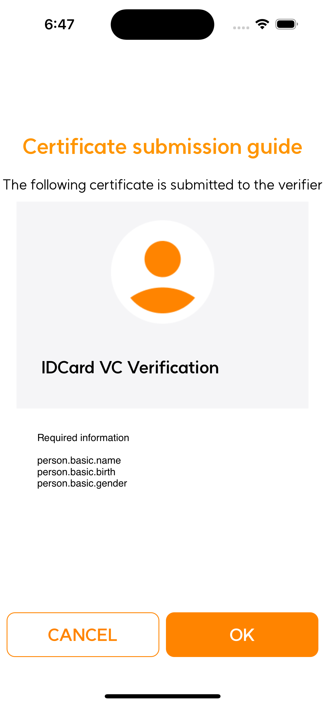

<br/>

9. `Select submission verification method` 화면이 나타나고, PIN, BIO를 선택하여 방식에 맞는 인증방식에 인증을 시도합니다.

10. 제출을 완료하면 `Certificate submitted` 화면이 표시됩니다.  

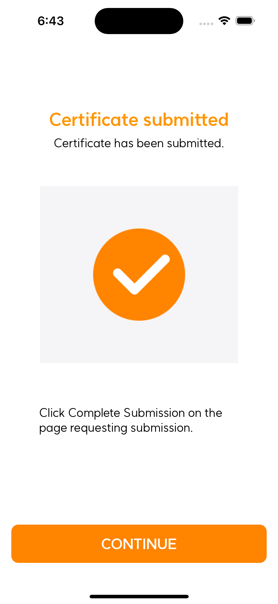

11. 데모 서버의 `Submittion a certificate` 팝업에서 `Submittion Complete` 버튼을 클릭합니다.

15. 제출이 완료되었다는 팝업이 나타납니다. `Confirm` 버튼을 클릭합니다.

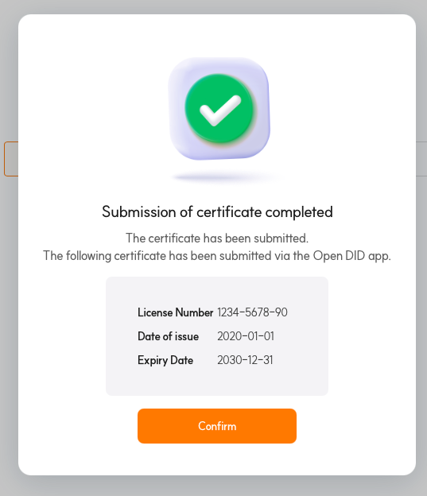

<br/><br/>

### 7.3.3. 운전면허증 VP 제출

1. 웹 브라우저에서 데모 서버의 메인 페이지에 접속하고, `VP Submission` 탭 메뉴를 선택합니다.

2. `Search` 버튼을 클릭하고 Select VC Plan 팝업에서 `DriverLicense VC Policy`을 서택한 후 `Select` 버튼을 클릭합니다.

3. `Submit your ID` 버튼을 클릭합니다.

4. `Submit a certificate` 팝업이 나타난 것을 확인합니다.
   
5. `DID CA` 앱을 실행합니다. 월렛이 잠금모드로 설정되어 있는 경우, PIN 입력 화면이 나타납니다. 잠금을 해제하기 위해 6자리의 숫자를 입력합니다.

6. 화면 하단의 SCAN QR 버튼을 클릭합니다.

7. 휴대폰의 카메라 화면이 활성화되면, QR 코드를 스캔합니다

8. `Certificate submission guide` 화면이 나타나며 발급받은 VC에 대한 정보가 출력되고 하단에는 요구받은 Claim에 대한 목록이 노출됩니다. `OK` 버튼을 클릭합니다.

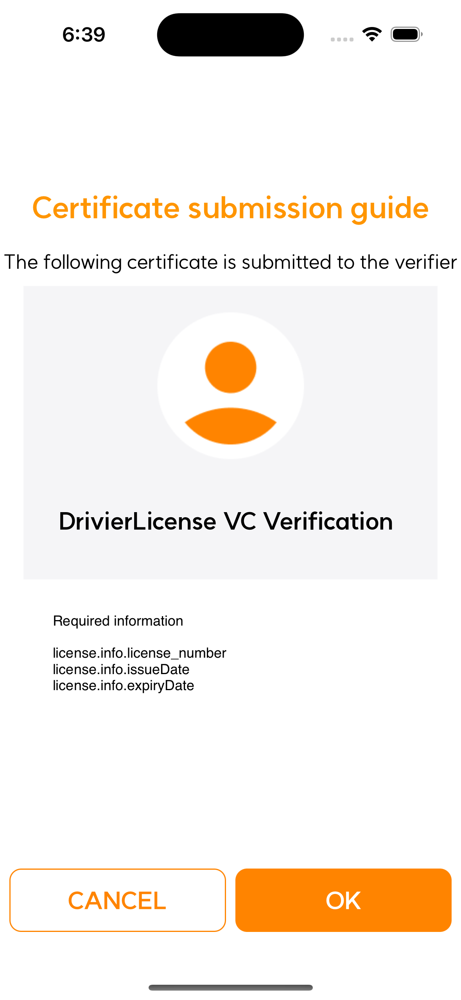

<br/>

9. `Select submission verification method` 화면이 나타나고, PIN, BIO를 선택하여 방식에 맞는 인증방식에 인증을 시도합니다.

10. 제출을 완료하면 `Certificate submitted` 화면이 표시됩니다.  


<br/>

11. 데모 서버의 `Submittion a certificate` 팝업에서 `Submittion Complete` 버튼을 클릭합니다.

15. 제출이 완료되었다는 팝업이 나타납니다. `Confirm` 버튼을 클릭합니다.


<br/><br/>
