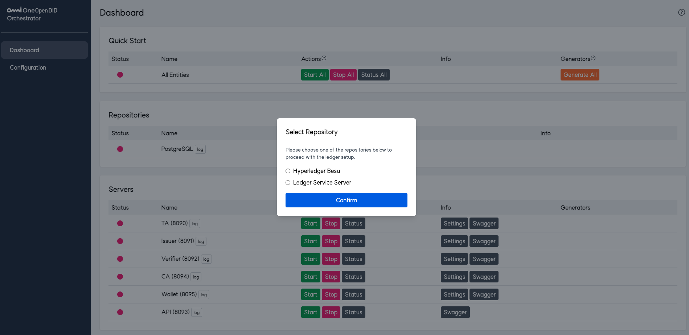
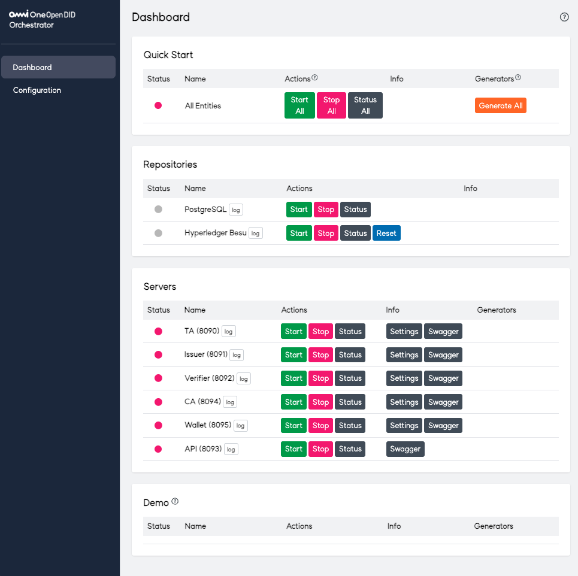
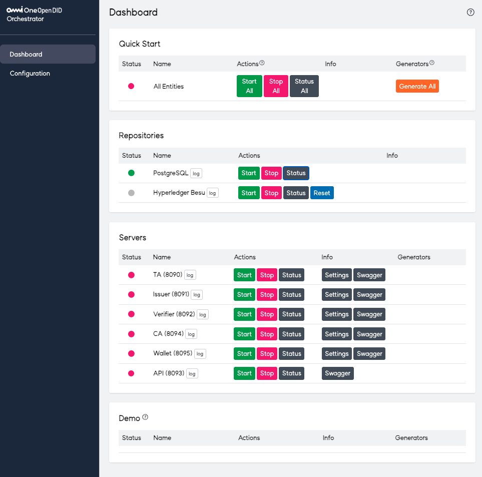

---
puppeteer:
    pdf:
        format: A4
        displayHeaderFooter: true
        landscape: false
        scale: 0.8
        margin:
            top: 1.2cm
            right: 1cm
            bottom: 1cm
            left: 1cm
    image:
        quality: 100
        fullPage: false
---

Open DID Installation Guide with Orchestrator
==

- Date: 2025-05-30
- Version: v2.0.0

목차
==

<!-- TOC tocDepth:2..3 chapterDepth:2..6 -->

- [Open DID Installation Guide with Orchestrator](#open-did-installation-guide-with-orchestrator)
- [목차](#목차)
- [1. OpenDID 소개](#1-opendid-소개)
- [2. 설치 개요](#2-설치-개요)
- [3. 시스템 요구사항](#3-시스템-요구사항)
  - [3.1. Server](#31-server)
  - [3.2. App](#32-app)
- [4. 사전 준비](#4-사전-준비)
  - [4.1. Git 설치](#41-git-설치)
  - [4.2. Gradle 설치](#42-gradle-설치)
  - [4.3. Node.js 설치](#43-nodejs-설치)
- [5. 설치 및 등록](#5-설치-및-등록)
  - [5.1. Step 1: Orchestrator 설치](#51-step-1-orchestrator-설치)
    - [5.1.1. Orchestrator 설치](#511-orchestrator-설치)
    - [5.1.2. Repository 선택](#512-repository-선택)
    - [5.1.3. Orchestrator 메뉴 구성](#513-orchestrator-메뉴-구성)
  - [5.2. Step 2: PostgreSQL 설치](#52-step-2-postgresql-설치)
    - [5.2.1. PostgreSQL 설치](#521-postgresql-설치)
  - [5.3. Step 3: TA 설치 및 등록](#53-step-3-ta-설치-및-등록)
  - [5.4. Step 4: API Gateway 설치](#54-step-4-api-gateway-설치)
  - [5.5. Step 4: Entity 설치 및 등록](#55-step-4-entity-설치-및-등록)
  - [5.5.1. Issuer 설치 및 등록](#551-issuer-설치-및-등록)
  - [5.5.2. Verifier 설치 및 등록](#552-verifier-설치-및-등록)
  - [5.5.3. CA 설치 및 등록](#553-ca-설치-및-등록)
  - [5.5.4. Wallet 설치 및 등록](#554-wallet-설치-및-등록)
  - [5.6. 데모 설치](#56-데모-설치)
  - [5.7. App 설치](#57-app-설치)
  - [5.7.1. Android App 설치](#571-android-app-설치)
  - [5.7.2. iOS App 설치](#572-ios-app-설치)
  - [6. 어드민 설정](#6-어드민-설정)
    - [6.1. TA 어드민 설정](#61-ta-어드민-설정)
    - [6.2. Issuer 어드민 설정](#62-issuer-어드민-설정)
    - [6.3. Verifier 어드민 설정](#63-verifier-어드민-설정)
  - [7. 테스트](#7-테스트)
    - [7.1. 사용자 등록 테스트](#71-사용자-등록-테스트)
    - [7.1. VC 발급 테스트](#71-vc-발급-테스트)
    - [7.2. VP 발급 테스트](#72-vp-발급-테스트)

<!-- /TOC -->


# 1. OpenDID 소개

Open DID의 세계에 오신 것을 환영합니다! 

Open DID를 간략히 정의하면, 디지털 신원 인증 시스템을 제공하는 플랫폼이라고 할 수 있습니다. Open DID 플랫폼을 통해서 사회적 비용을 감소시키고, 인프라로부터 소외된 계층에게는 "인류 가치 실현을 위한 사회적 책임"을 다하고자 하는 멋진 목적을 가지고 있습니다.

본 문서는 Open DID의 구성요소의 설치 과정부터 주요 기능에 대한 종합적인 검증까지의 관계를 단계별로 안내합니다. 여러분은 각 장을 순서대로 따라가면 Open DID 플랫폼을 쉽게 설치할 수 있습니다.

Open DID 플랫폼을 설치한 후에는 어떤 기능을 확인할 수 있을까요?

**첫 번째,** Open DID의 각 구성요소(서버, 월렛, 사용자)를 안전하고 신뢰할 수 있는 저장소에 등록할 수 있습니다. 좀 더 자세히 설명하면, DID(Decentralized Identifier, 분산 신원 식별자)를 사용해 블록체인 저장소에 Open DID 구성요소의 정보를 저장합니다. DID는 중앙화된 기관에 의존하지 않고, 사용자 자신이 신원 정보를 관리할 수 있도록 하는 개념이며, 블록체인은 이러한 정보를 분산된 네트워크에 기록하여, 데이터의 무결성과 보안을 보장합니다.

<br/>

**두 번째,** 사용자에게 VC(Verifiable Credential)를 발급할 수 있습니다. VC를 쉽게 설명하자면, 온라인에서 발급받아 실제 생활에서도 사용할 수 있는 디지털 신분증이라고 생각하면 됩니다. 마치 학교의 학생증이나 회사의 사원증처럼, VC는 사용자의 신원이나 자격을 증명할 수 있습니다.

<br/>

**세 번째,** 사용자가 VC를 바탕으로 VP(Verifiable Presentation)을 생성하여 제출할 수 있습니다. VP는 VC에서 특정 정보만 추출하여 제시하는 방식으로, 사용자가 자신의 자격이나 신원을 검증할 때 최소한의 정보를 안전하게 공유할 수 있게 합니다. 예를 들어, 사용자가 나이를 증명해야 하는 상황에서 VP를 사용하면, 전체 신원 정보를 노출하지 않고도 나이 정보만을 선택적으로 제공할 수 있습니다. 

위에서 DID, VC, VP와 같은 개념들이 생소하게 느껴질 수 있지만, 너무 걱정하지 마세요. 본 문서를 따라가는 것만으로도, Open DID의 주요 기능을 충분히 확인할 수 있습니다.  이러한 개념들은 사용하면서 자연스럽게 익숙해질 것입니다.

> **참고 링크**
> - [DID(Decentralized Identifier)](https://www.w3.org/TR/did-core/)
> - [블록체인](https://en.wikipedia.org/wiki/Blockchain)
> - [VC(Verifiable Credential)](https://www.w3.org/TR/vc-data-model/)
> - [VP(Verifiable Presentation)](https://www.w3.org/TR/vc-data-model/#presentations)

<br/>

아래는 각 장에서 다루는 주요 내용입니다.

1. **Installation Overview**: Open DID 플랫폼의 전체 설치 과정을 안내합니다.

2. **System Requirements**: 프로젝트를 실행하기 위해 필요한 시스템 요구사항을 설명합니다. 
    - Open DID의 구성요소 (블록체인, 서버, App)를 설치하기 위한 시스템 요구사항을 설명합니다.

3. **Prerequisites**: 설치를 시작하기 전에 필요한 준비 작업을 안내합니다.
    - Git 설치 방법을 안내합니다.
    - Gradle 설치 방법을 안내합니다.

4. **Installation and Registration**: Orchestrator를 통하여 Open DID의 각 구성 요소를 설치하고, 설치된 서버를 Open DID 시스템에 등록하는 방법을 설명합니다. 
    - 블록체인 설치 방법을 설명합니다.
    - Database 설치 방법을 설명합니다.
    - 각 서버를 설치 및 구동하는 방법을 설명합니다.
    - 설치한 서버를 OpenDID 시스템에 등록하는 방법을 설명합니다.
    - Demo 서버의 설치 방법을 설명합니다.
    - App (Android, iOS) 설치 방법을 설명합니다.

<br/><br/>

# 2. 설치 개요

> ⚠️ 주의  
> 본 설치 가이드는 **Orchestrator 기반 설치 절차만을 다룹니다.**  
> 설치는 반드시 Orchestrator 서버 설치부터 시작해야 하며, 이후 모든 구성요소는 Orchestrator 웹 콘솔을 통해 자동으로 설치 및 등록됩니다.

이 장에서는 OpenDID 프로젝트의 구성 요소와 설치 순서를 안내합니다.

OpenDID 플랫폼은 반드시 정해진 순서를 따라서 설치해야만 제대로 작동할 수 있습니다.

**첫 번째,** Orchestrator 서버를 설치합니다. Orchestrator는 OpenDID 시스템의 모든 구성 요소를 자동으로 설치, 등록, 관리할 수 있는 통합 관리 도구입니다. 관리자는 Orchestrator 웹 콘솔을 통해 블록체인, 서버, 데모 환경, 앱 등 모든 구성 요소의 설치와 상태를 손쉽게 제어할 수 있습니다. OpenDID 2.0부터는 Orchestrator를 통한 설치가 가능하며, 모든 설치 과정은 Orchestrator를 통해 시작할 수 있습니다.

**두 번째,** OpenDID 구성요소(서버, 앱)의 정보를 저장할 저장소인 블록체인을 설치합니다. 블록체인은 모든 구성 요소의 신원 정보와 트랜잭션 기록을 분산된 네트워크에 저장하여, 데이터의 무결성과 변조 방지 기능을 제공합니다. 이는 OpenDID 플랫폼의 신뢰성을 보장하는 핵심 인프라입니다. 현재 OpenDID는 Hyperledger Besu 기반 퍼블릭 블록체인을 지원합니다.

**세 번째,** 각 구성 요소들의 정보를 블록체인에 등록하여 신뢰체인을 구축할 수 있는 역할을 하는 TA(Trust Agent) 서버를 설치합니다. TA 서버는 구성 요소들이 요청한 데이터를 검증하고, 검증이 통과된 데이터를 서명하여 블록체인에 등록합니다. 이를 통해 신뢰할 수 있는 데이터가 블록체인에 저장되며, TA 서버는 이러한 신뢰 체인을 구축하는 핵심적인 역할을 수행합니다.

**네 번째,** 블록체인과 앱 간의 중계 역할을 하는 API Gateway 서버를 설치합니다. OpenDID 2.0에서는 현재 Ethereum 기반의 퍼블릭 블록체인인 Hyperledger Besu를 지원합니다. 퍼블릭 블록체인이라 하더라도, 앱이 직접 블록체인과 통신하는 구조는 다양한 문제를 야기할 수 있습니다. 예를 들어, 블록체인마다 상이한 인터페이스를 지원하거나, 트랜잭션 처리 방식이 다를 수 있으며, 불필요한 노출이나 과도한 네트워크 비용이 발생할 수 있습니다. 이러한 문제를 해결하기 위해 OpenDID는 API Gateway 서버를 통해 블록체인과 앱 간의 상호작용을 추상화합니다.  
API Gateway는 블록체인에 대한 접근을 표준화하고, 다양한 블록체인 연동 시 필요한 인터페이스를 일관되게 제공하며, 내부 시스템의 확장성과 효율성을 보장합니다.

**다섯 번째,** Entity 서버들을 설치합니다. Entity 서버는 OpenDID 구성 요소 중에서 핵심적인 역할을 수행하는 구성 요소를 말하며, Issuer, Verifier, CA, Wallet 서버가 포함됩니다.

- Issuer 서버는 신원 증명서(Verifiable Credential)를 발급하는 역할을 하며, 사용자에게 신뢰할 수 있는 디지털 신분증을 제공합니다.
- Verifier 서버는 제출된 신원 증명서(Verifiable Presentation)를 검증하여, 정보의 진위 여부를 확인하고 신뢰할 수 있는 인증을 제공합니다.
- CA (Certificate App) 서버는 앱의 신뢰성을 보증하는 역할을 수행합니다. 앱은 주요 기능을 요청하기 전에 토큰을 발급 받아야 하며, CA 서버는 앱이 이 토큰을 발급 받을 수 있도록 신뢰성을 보장합니다.
- Wallet 서버는 앱이 보유하고 있는 월렛의 신뢰성을 보증하는 역할을 수행합니다. 앱이 사용하는 월렛도 블록체인에 등록되어야 하는데, 이 과정에서 Wallet 서버가 월렛의 신뢰성을 보장합니다.

**여섯 번째,** 데모 서버를 설치합니다. Demo 서버는 웹 서버로, OpenDID의 주요 기능인 VC 발급과 VP 제출 기능을 테스트할 수 있는 화면을 제공합니다. 이를 통해 사용자는 실제 환경과 유사한 조건에서 기능을 검증할 수 있습니다.

**일곱 번째,** 앱을 설치합니다. 앱은 사용자가 OpenDID 플랫폼과 상호작용하는 핵심 인터페이스로, Android와 iOS 앱을 지원합니다. 사용자는 이 앱을 통해 신원 정보 관리, VC(Verifiable Credential) 발급 및 저장, VP(Verifiable Presentation) 생성 및 제출과 같은 다양한 기능을 수행할 수 있습니다. 

<br/>
위의 내용을 표로 정리하면 다음과 같습니다.

<br/>

| 구성 요소            | 구성 요소 역할                                                                                                                                               | 설치 순서 |
|----------------------|---------------------------------------------------------------------------------------------------------------------------------------------------------------|------------|
| **Orchestrator**      | OpenDID의 모든 구성 요소를 통합적으로 설치·관리하는 웹 기반 오케스트레이션 도구입니다. 설치는 Orchestrator에서 시작됩니다.                                     | 1          |
| **블록체인**         | Hyperledger Besu 기반의 퍼블릭 블록체인을 설치하고, DID/VC 관련 스마트 계약을 배포합니다.<br/>OpenDID의 모든 구성 요소는 이 블록체인을 신뢰 저장소로 사용합니다. | 2          |
| **TA 서버**          | Trust Agent 서버로, OpenDID 내에서 서버와 사용자의 신뢰 관계를 구축하는 중추적인 역할을 합니다.                                                             | 3          |
| **API Gateway 서버** | 다양한 블록체인과 앱 간 상호작용을 표준화하고 중계하여, 확장성과 효율성을 보장합니다.                                                                       | 4          |
| **Issuer 서버**      | 발급 기관 서버로, 사용자가 요청한 VC(Verifiable Credential)를 발급합니다.                                                                                    | 5          |
| **Verifier 서버**    | 검증 기관 서버로, 사용자가 제출한 VP(Verifiable Presentation)를 검증합니다.                                                                                  | 6          |
| **CA 서버**          | 인가 앱 서버로, 인가 앱을 OpenDID 내에서 사용할 수 있도록 보증하는 역할을 합니다.                                                                           | 7          |
| **Wallet 서버**      | Wallet 서버로, 월렛을 OpenDID 내에서 사용할 수 있도록 보증하는 역할을 합니다.                                                                               | 8          |
| **Demo 서버**        | VC 발급, VP 제출 기능을 테스트할 수 있는 환경을 제공합니다.                                                                                                  | 9          |
| **Android 앱**       | OpenDID의 Android 클라이언트 앱입니다.                                                                                                                       | 10         |
| **iOS 앱**           | OpenDID의 iOS 클라이언트 앱입니다.                                                                                                                           | 11         |

<br/>

위의 과정을 도식화하면 다음과 같습니다.

```text
+---------------------------------------------------------------+
| 1. Install Orchestrator                                       |
|    +------------------------------------------------------+   |
|    | - Orchestrator Configuration                         |   |
|    +------------------------------------------------------+   |
+---------------------------------------------------------------+
                              |
                              v
+---------------------------------------------------------------+
| 2. Install Blockchain and Deploy Chaincode                    |
|    +------------------------------------------------------+   |
|    | - Install Hyperledger Besu                           |   |
|    | - Deploy Chaincode                                   |   |
|    +------------------------------------------------------+   |
+---------------------------------------------------------------+
                              |
                              v
+---------------------------------------------------------------+
| 3. Install and Register TA Server                             |
+---------------------------------------------------------------+
                              |
                              v
+---------------------------------------------------------------+
| 4. Install API Gateway                                        |
+---------------------------------------------------------------+
                              |
                              v
+---------------------------------------------------------------+
| 5. Install and Register Entity Server                         |
|    +-----------------------------+                            |
|    | - Issuer Server              |                           |
|    | - Verifier Server            |                           |
|    | - CA Server                  |                           |
|    | - Wallet Server              |                           |
|    +-----------------------------+                            |
+---------------------------------------------------------------+
                              |
                              v
+---------------------------------------------------------------+
| 6. Install Demo Server                                        |
+---------------------------------------------------------------+
                              |
                              v
+---------------------------------------------------------------+
| 7. Install Apps                                               |
|    +-----------------------------+                            |
|    | - Android App                |                           |
|    | - iOS App                    |                           |
|    +-----------------------------+                            |
+---------------------------------------------------------------+
```

<br/><br/>


# 3. 시스템 요구사항
이 장에서는 Open DID 플랫폼을 설치하기 위해 필요한 요구사항을 설명합니다. 서버와 앱을 실행하기 위해서는 각 항목에서 요구하는 환경을 충족해야 합니다.

## 3.1. Server
- 언어: OpenJDK 21
- 프레임워크: Spring Boot 3.2
- 데이터베이스: PostgreSQL 16.4
- 빌드 및 의존성 관리 도구: Gradle 8.8
- Node.js 22.12.0 이상

## 3.2. App

**■ Android**
- 언어: OpenJDK 17
- 프레임워크: Android 13.0 (API 33)
- 데이터베이스: Room 2.2.5
- 빌드 및 의존성 관리 도구: Gradle 8.2

**■ iOS**
- 언어: Swift 5
- 프레임워크: iOS 15
- 데이터베이스: Core Data
- 빌드 및 의존성 관리 도구: Xcode 15.4 이상, CocoaPods

<br />

# 4. 사전 준비

이 장에서는 Open DID 프로젝트의 구성요소를 설치하기 전, 사전에 필요한 준비 항목들을 안내합니다.

## 4.1. Git 설치

`Git`은 분산 버전 관리 시스템으로, 소스 코드의 변경 사항을 추적하고 여러 개발자 간의 협업을 지원합니다. Git은 Open DID 프로젝트의 소스 코드를 관리하고 버전 관리를 위해 필수적입니다. 

설치가 성공하면 다음 명령어를 사용하여 Git의 버전을 확인할 수 있습니다.

```bash
git --version
```

> **참고 링크**
> - [Git 설치 가이드](https://git-scm.com/book/en/v2/Getting-Started-Installing-Git)

<br/>

## 4.2. Gradle 설치

`Gradle`은 빌드 자동화 도구로, 다양한 프로그래밍 언어와 플랫폼을 지원합니다. Gradle은 Open DID 구성요소 중 서버의 코드를 컴파일하고 필요한 라이브러리를 관리하는 작업을 쉽게 처리해주기 때문에 필요합니다.

설치가 성공하면 다음 명령어를 사용하여 Gradle의 버전을 확인할 수 있습니다.

```bash
gradle --version
```

> **참고 링크**
> - [Gradle 설치 가이드](https://gradle.org/install/)

<br/>

## 4.3. Node.js 설치

`Node.js`는 JavaScript 런타임 환경으로, OpenDID 프로젝트의 일부 구성요소(예: Admin Console, 데모 앱)의 프론트엔드 개발 및 빌드 작업에 사용됩니다. 또한, Hyperledger Besu용 스마트 계약을 배포할 때 사용하는 `Hardhat` 도구도 Node.js 기반으로 동작하므로, 블록체인 초기 설정을 위해서도 필요합니다.

설치가 완료되면 아래 명령어로 Node.js와 npm의 버전을 확인할 수 있습니다.

```bash
node -v
npm -v
```

> **참고 링크**
> - [Node.js 공식 다운로드 페이지](https://nodejs.org/)

<br/><br/>

# 5. 설치 및 등록

이 장에서는 Orchestrator를 통해서 Open DID의 각 구성 요소를 설치하고, 설치된 서버를 Open DID 시스템에 등록하는 방법을 설명합니다. 

'Open DID 시스템 등록'이란, 설치된 서버의 DID Document를 생성하여 블록체인에 등록한 후, TA 서버를 통해 가입 증명서를 발급받는 과정을 말합니다. 이 과정은 Open DID 시스템 내에서 서버의 신뢰성을 보장하고, 안전한 통신과 인증을 위해 필수적입니다. 가입 증명서는 TA가 서명하여 VC(Verifiable Credential)로 발급되며, 이를 통해 해당 서버가 Open DID 시스템 내에서 TA 서버에 의해 보증된 신뢰 가능한 Entity임을 나타냅니다.

'Open DID 시스템 등록'이 필요한 서버 목록은 다음과 같습니다.

| 서버                   | Open DID 시스템 등록 필요 여부 |
| ---------------------- | ------------------------------ |
| **TA Server**          | O                              |
| **Issuer Server**      | O                              |
| **Verifier Server**    | O                              |
| **CA Server**          | O                              |
| **Wallet Server**      | O                              |
| **API Gateway Server** | X                              |
| **Demo Server**        | X                              |

## 5.1. Step 1: Orchestrator 설치

Orchestrator는 OpenDID 구성 요소의 설치, 실행, 상태 확인, 시스템 등록 과정을 통합적으로 제어할 수 있는 웹 기반 관리 도구입니다.  
OpenDID 2.0부터는 Orchestrator를 통해 대부분의 설치 절차를 자동화할 수 있으며, 블록체인과 각 서버의 상태도 한눈에 확인할 수 있습니다.

### 5.1.1. Orchestrator 설치

Orchestrator 서버의 리포지토리를 사용자의 로컬 컴퓨터로 복사한 후, 서버를 구동하는 과정입니다. 보다 더 자세한 설치 방법은 아래 링크를 참고해 주세요.
이 가이드에서는 Orchestrator 서버의 접속 주소를 'http://192.168.1.1:9001' 으로 가정하여 설명하겠습니다.

> [Orchestrator 설치 가이드](https://github.com/OmniOneID/did-orchestrator-server/tree/feature/develop/docs/installation)

<br/>

### 5.1.2. Repository 선택

처음 웹 페이지에 접속하면 다음과 같은 **Repository 선택 팝업**이 표시되며, OpenDID에서 사용할 신뢰 저장소를 선택하는 단계가 시작됩니다.




- `Hyperledger Besu`  
  - OpenDID 2.0에서 현재 공식적으로 지원하는 퍼블릭 블록체인입니다.  
  - **반드시 이 항목을 선택해야 합니다.**

- `Ledger Service Server`  
  - 내부 개발용 DB 기반 저장소로, 테스트 환경에서만 사용됩니다. 
  - 추후 지원될 예정이며, 현재는 선택할 수 없습니다.

아래는 Repository 선택 후 기본적으로 표시되는 **Dashboard 화면 예시**입니다.



<br/>

### 5.1.3. Orchestrator 메뉴 구성

Orchestrator의 왼쪽 사이드 메뉴에는 다음과 같은 항목이 있습니다.

| 메뉴 | 설명 |
|------|------|
| **Dashboard** | 전체 서버 및 블록체인, 앱 상태를 확인하고 실행/중지/등록 작업을 수행할 수 있는 메인 화면입니다. |
| **Configuration** | 각 구성 요소의 설정 파일 경로, 환경 변수 등을 수정할 수 있는 메뉴입니다. 기본 설정으로 진행합니다. |

<br/>

## 5.2. Step 2: PostgreSQL 설치

OpenDID의 각 서버는 내부 데이터를 저장하기 위해 데이터베이스를 필요로 합니다. 일반적인 설치 환경에서는 서버마다 개별적인 DBMS를 설치하는 방식이 권장되지만, Orchestrator 기반 설치에서는 효율성을 위해 하나의 PostgreSQL 인스턴스를 공통으로 사용합니다. 이때 각 서버는 동일한 PostgreSQL 인스턴스 내에서 고유한 DATABASE를 분리하여 사용하도록 구성됩니다.

### 5.2.1. PostgreSQL 설치

Orchestrator 대시보드의 Repositories 영역에서 PostgreSQL 데이터베이스를 설치하고 실행할 수 있습니다. PostgreSQL은 OpenDID의 모든 서버가 공통으로 사용하는 데이터베이스 인스턴스로, 가장 먼저 설치해야 하는 구성요소입니다.

아래 절차에 따라 PostgreSQL을 설치하고 실행하세요:

1. **Orchestrator 웹 페이지 접속**  
   - 브라우저에서 `http://192.168.1.1:9001`에 접속합니다.

2. **PostgreSQL 항목 확인**  
   - 대시보드의 **Repositories** 영역에서 `PostgreSQL` 항목을 찾습니다. 
   - 초기 상태에서는 상태 표시등이 회색으로 표시됩니다.

3. **PostgreSQL 시작**  
   - PostgreSQL 행의 `Start` 버튼을 클릭합니다.

4. **설치 완료 확인**  
   - 설치가 진행되면서 상태 표시등이 **회색에서 녹색**으로 변경됩니다.  
   - 녹색 표시등은 PostgreSQL이 정상적으로 실행 중임을 의미합니다.

> **참고사항**
> - PostgreSQL 설치 및 초기화에는 몇 분 정도 소요될 수 있습니다.
> - 일정 시간이 지나도 상태가 녹색으로 변경되지 않으면 `Status` 버튼을 클릭하여 현재 상태를 확인하세요.
> - 설치 중 문제가 발생하면 `log` 버튼을 클릭하여 로그를 확인할 수 있습니다.

아래는 PostgreSQL이 정상적으로 실행된 후의 대시보드 화면입니다:



<br/><br/>

## 5.3. Step 3: TA 설치 및 등록

blah blah

<br/><br/>

## 5.4. Step 4: API Gateway 설치

blah blah

<br/><br/>

## 5.5. Step 4: Entity 설치 및 등록

blah blah

## 5.5.1. Issuer 설치 및 등록

blah blah
<br/><br/>

## 5.5.2. Verifier 설치 및 등록

blah blah
<br/><br/>

## 5.5.3. CA 설치 및 등록

blah blah
<br/><br/>

## 5.5.4. Wallet 설치 및 등록

blah blah
<br/>

## 5.6. 데모 설치

blah blah
<br/><br/>

## 5.7. App 설치

blah blah

## 5.7.1. Android App 설치

blah blah
<br/><br/>

## 5.7.2. iOS App 설치

blah blah
<br/><br/>

## 6. 어드민 설정

blah blah

### 6.1. TA 어드민 설정

blah blah
<br/><br/>

### 6.2. Issuer 어드민 설정

blah blah
<br/><br/>

### 6.3. Verifier 어드민 설정 

blah blah
<br/><br/>

## 7. 테스트

blah blah

### 7.1. 사용자 등록 테스트

### 7.1. VC 발급 테스트

- VC 발급 (Issuer, User)
- ZKP 발급 (Issuer)

<br/><br/>

### 7.2. VP 발급 테스트

- VP 제출 
- ZKP 제출

<br/><br/>


